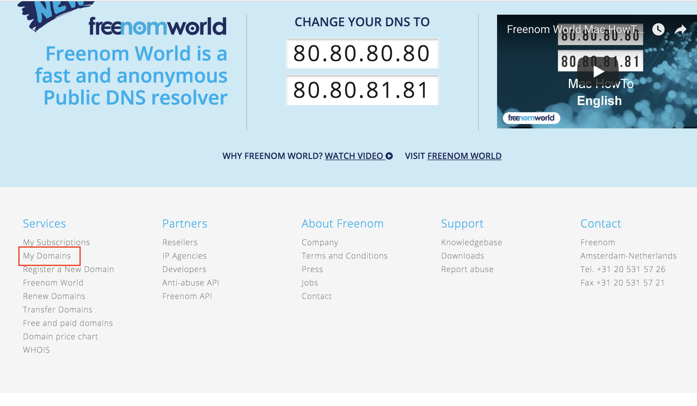
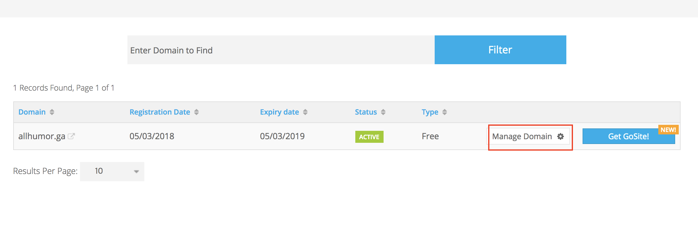
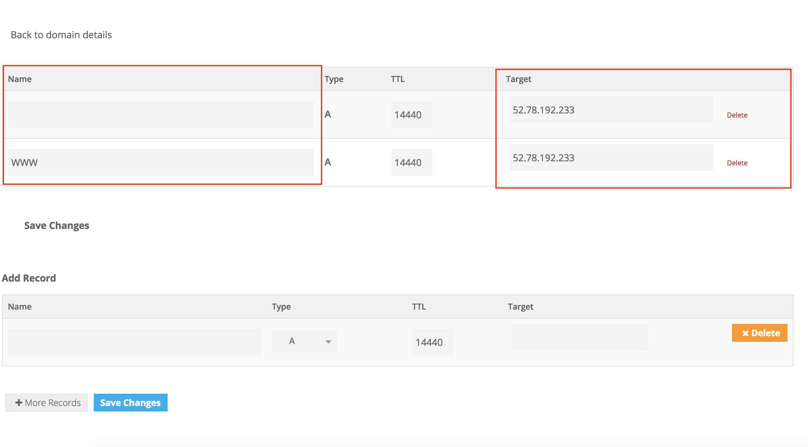
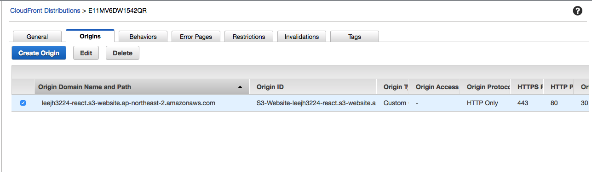
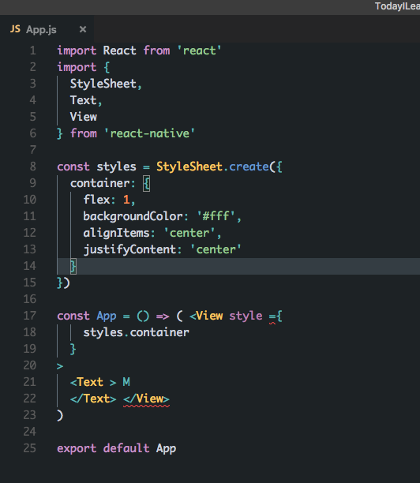
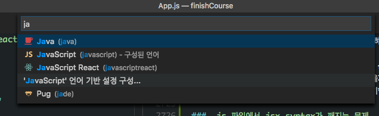

# Today I Learned (2018-01-29 ~ 2018. 03. 24)

## 2018-01-29

### date ISO(ISO 8601) 형태로 변환

[참조 1](https://stackoverflow.com/questions/10645994/node-js-how-to-format-a-date-string-in-utc)

요약:

```js
// current time to ISO string
new Date().toISOString()
```

### lifeCycle method 가 두 번 불림

[참조 1](https://github.com/reactjs/redux/issues/1646)

[참조 2](https://stackoverflow.com/questions/35136836/react-component-render-is-called-multiple-times-when-pushing-new-url)

요약:

```
  The lifecycle books are managed by React. If you see that componentWillMount runs twice it means the component was unmounted between those calls for some reason. You can set a breakpoint in componentWillIUnmount and check the stack trace to see what is causing the component to unmount.

  shouldComponentUpdate를 이용해서 컨트롤함
```

### 댓글의 페이지네이션 로직

[참조 1](https://stackoverflow.com/questions/4421207/mongodb-how-to-get-the-last-n-records/4425163)

[참조 2](https://docs.mongodb.com/manual/reference/operator/aggregation/limit/)

요약:

```
Ascending order = 1 = 예전 ~ 최순 순
Descending order = -1 = 최신 ~ 예전 순
```

### document body 에 event 붙이기

[참조 1](https://stackoverflow.com/questions/32485520/how-can-i-add-a-click-handler-to-body-from-within-a-react-component)

```js
var Component = React.createClass({
  componentDidMount: function() {
    document.body.addEventListener('click', this.myHandler)
  },
  componentWillUnmount: function() {
    document.body.removeEventListener('click', this.myHandler)
  },
  myHandler: function() {
    alert('click')
  },
  render: function() {
    return <div>Hello {this.props.name}</div>
  },
})
```

### mongoose update query 시 updated document 가져오기

[참조 1](https://davidburgos.blog/return-updated-document-mongoose/)

```js
var query = { id: 8 }
var update = { title: 'new title' }
var options = { new: true }
MyModel.findOneAndUpdate(query, update, options, function(err, doc) {
  // Done!
  // doc.title = "new title"
})
```

## 2018.1.30

### cURL

[참조 1](https://bakyeono.net/post/2016-05-02-rest-api-client-for-cli.html)

curl post examples
[참조 2](https://gist.github.com/subfuzion/08c5d85437d5d4f00e58)

js FormData 객체

[참조 3](https://developer.mozilla.org/ko/docs/Web/API/FormData)

```
  cURL은 명령줄 인터페이스 상에서 http 요청을 보내기 위한 언어.
  몇 가지 옵션을 정리하면
  -X method
  -H header
  -d data
  --data-urlencode 엔코딩된 데이터
```

### markdown to pdf

[참조 1](https://marketplace.visualstudio.com/items?itemName=yzane.markdown-pdf)

요약: 마크다운 문서를 pdf 로 바꿔주는 vscode extension, 화질구지가 되는게 흠이긴 하지만 사용하기 간편.

## 2018.01.31

### js fetch

[알리고](https://smartsms.aligo.in/main.html)라는 문자 서비스를 wix 에서 사용하기 위해 계속 삽질을 해봤지만 끝내 실패했다.

그래서 wix 의 wix-fetch 대신 js 의 fetch 를 사용해봤다. 결과적으론 성공.

그리고 native fetch 의 중요한 속성 중 하나를 파악했다.

mode 에서 'no-cors' 모드를 설정할 수 있다는 것.

단순히 Access-Control-Allow-Origin: \* 헤더를 request 헤더에 설정해도 안 되던 게 갑자기 잘 작동했다. 정확한 원인은 파악 x

## 2018.02.06

### 접속 IP 주소 제한이 있는 Third party API 사용하기

* 포스타입 블로그에 글 작성!

## 2018.02.07

### image file 크기를 효과적으로 줄이기

* Sprite 이미지를 사용하면 하나의 이미지만 로드하기 때문에 http request 수가 줄어들고 더 효율적으로 이미지를 로딩할 수 있음. 사용시에는 backround-position property 를 사용해서 위치를 불러옴.

## 2018.02.11

### image src 태그에 허용되는 글자

* encodeURIComponent 에서 예외로 처리하는 글자, 즉 알파벳, 0~9 의 숫자, - \_ . ! ~ \* '()를 제외하고는 모든 글자가 이미지 태그에 들어가면 이미지가 깨진다.

다만 이미지를 요청할 때는 encodeURI 함수를 이용해서 한글이나 공백같은 문자를 처리해줘야 제대로 이미지를 다운로드 받을 수 있다.

## 2018.02.13

### AWS 람다 간헐적 타임아웃 현상 발생

* aligo 서비스를 aws lambda 를 이용해 사용하던 중 간헐적으로 timeout error 가 발생하기 시작했다.

이 문제에 대해서 aws forum 에 대한 글도 있었다.

[AWS Forum - 504 errors - Endpoint request timed out](https://forums.aws.amazon.com/thread.jspa?threadID=216006)

문제에 대해서 뚜렷한 해결책은 없었고 다만 람다가 시동을 하기 위한 시간이 필요하다는 답변과 timeout 시간을 늘려보라는 정도의 조언밖에 없었다.

해결:

람다는 기본적으로 함수 컨테이너이다.

그리고 이 함수 컨테이너는 일정 시간(일반적으로 40 분 가량) 호출되지 않으면 'cold' 상태로 접어드는데, 만약 직접적으로 lambda 와 연결되지 않은 경우 가령 vpc 를 통해 연결되는 경우 cold 상태에서 hot 상태로 넘어가는데 추가적인 시간이 발생한다.

[fix lambda cold behavior - for serverless framework](https://serverless.com/blog/keep-your-lambdas-warm/)

[resolving cold start in aws lambda](https://medium.com/@lakshmanLD/resolving-cold-start%EF%B8%8F-in-aws-lambda-804512ca9b61)

그러나 만약 람다를 주기적으로 호출해준다면 이러한 현상을 방지할 수 있다. 그러기 위해서는 먼저 람다를 호출하는 다른 람다를 생성할 필요가 있다.

[람다를 호출하는 다른 람다 생성하기](https://stackoverflow.com/questions/31714788/can-an-aws-lambda-function-call-another)를 참조.

기본적인 개념은 aws-sdk 를 이용해서 functionName 과 payload(이벤트 인자)를 넘겨주고 실행값을 받아오는 것.

이 때 람다를 호출하는 다른 람다를 실행하려면 람다실행권한이 필요한데 이는 IAM 에서 람다정책(AWSLambdaRole)을 추가해주면 된다.

이 과정없이 람다를 호출하면 다른 람다를 호출할 권한이 없다는 에러메시지를 받게 된다.

이제 람다를 호출하는 다른 람다를 생성했으니 주기적으로 이 람다를 호출하는 이벤트를 트리거해보자.

aws 는 기본적으로 scheduled event 를 지원한다. [참조](https://docs.aws.amazon.com/lambda/latest/dg/with-scheduled-events.html)

그리고 이벤트를 생성하는 법 또한 상당히 간단한데 람다 콘솔에서 [트리거추가]-[CloudWatch Events]탭을 누르고

간단한 이름/규칙 설명을 적어준 후 예약표현식만 기입하면 된다.

[Rate / Cron expression examples](https://docs.aws.amazon.com/systems-manager/latest/userguide/sysman-cron.html)

예를 들어 매 20 분마다 실행되는 람다를 만들고 싶다면

rate(20 minutes) 혹은 cron(0/20 \* \* _ ? _) 이런 식으로 기입하면 된다.

여기까지 완료되었다면 이제 cold 람다가 hot 람다가 될 때까지 기다리느라 timeout 될 걱정없이 람다를 사용할 수 있다.

람다는 기본적으로 요금 자체가 저렴하므로 추가 호출에 대한 비용문제는 거의 걱정할 필요가 없다고 봐도 무방하다.

### 추가단말서비스 경고 메시지 우회

* U+, KT 등 통신사에서 인터넷을 특정 대수 이상 연결하려면 추가단말서비스를 신청해야한다는 경고 페이지에 대한 우회법.

1.  기본적으로 이들 통신사는 모바일 트래픽에 대해서는 검열을 실시하지 않는다.

2.  그러므로 browser 의 user-agent 를 mobile browser 로 바꿔주면 검열이 원천 차단된다.

3.  크롬 확장 프로그램 중 [user-agent-swithcer for chrome]을 설치하고 아무 모바일 브라우저나 선택해준다. 석세스!

### 바벨 알아보기

* [바벨의 preset 과 plugin 이 어떤 것인가를 설명한 글](https://www.fullstackreact.com/articles/what-are-babel-plugins-and-presets/)

* [바벨 공식 문서 - env preset](https://babeljs.io/docs/plugins/preset-env/)

* [바벨 공식 문서 - stage-3 preset](https://babeljs.io/docs/plugins/preset-stage-3/)

요약: env preset 은 별다른 설정이 없다면 공식 지원되는 es5, 6, 7 등에 따라 트랜스파일을 지원하며, 특정 브라우저 환경 혹은 노드 환경에 맞게 설정해줄 경우 그에 맞게 트랜스파일한다.

```json
{
  "presets": [
    [
      "env",
      {
        "targets": {
          "browsers": ["last 2 versions", "safari >= 7"]
        }
      }
    ]
  ]
}
```

위와 같을 경우 사파리는 7 이상, 다른 브라우저는 최신 2 버전을 지원.

두 번째로 stage-x 는 실험적인 기능, 즉 공식 es 스펙에 들어가지 못한 기능을 지원하는 플러그인이다.

stage-0 부터 stage-4 까지 있으며, stage-4 는 이미 스펙에 들어간 기능, stage-0 는 제안 단계에 머무는 기능이다.

일반적으로 stage-3 이상을 사용할 것을 권장한다.

현재(2018.02.13) stage-3 에 포함된 기능은

```
  transform-object-rest-spread
  transform-async-generator-functions // async/await과 generator를 함께 쓰는 경우
```

의 두 가지다.

그러므로 만약 코드베이스에서 async generator 나 ...(spread operator)를 쓸 일이 있다면 필수 설치.

## 2018.02.20

### AWS NAT gateway 와 NAT instance

NAT gateway 는 aws 에서 관리되는 "플랫폼"이며, 좀더비싸고(한 달에 약 42 달러) 속도가 빠르다. 또 서버를 따로 관리해줄 필요가 없다.

반면 NAT instance 는 NAT 기능을 하는 서버 인스턴스다.

굉장히 저렴하지만(약 NAT gateway 의 1/10) OS update 등은 따로 해주어야한다.

속도나 여러 요청을 처리하는데는 문제가 있을 수 있다.

기능(private subnet 에서 이뤄지는 요청을 igw 에 전달)은 둘 모두 동일하다.

### Invalid end of json input / unexpected token at json

SendGrid 서비스를 사용하던 중 발생했는데

이는 response 객체가 202 반응에 따라 빈 응답을 내어놓았기 때문이다.

아무것도 돌아오지 않았기 때문에 이를 json() 형태로 변환하던 중 에러가 발생한 것.

참고로 sendGrid 의 202 에러는 개발진들의 계정 제한에 의해 발생하는 것 같다.

[참조](https://stackoverflow.com/questions/42214048/sendgrid-returns-202-but-doesnt-send-email)

### JSON invalid characters

[JSON Invalid characters](http://support.backendless.com/topic/json-invalid-characters)

일반적으로 "이나 ' 혹은 \n 등의 특수문자는 escape 처리(\ 추가) 되어야한다.

### node test 환경에서 axios network error

jest 는 package.json 에서 테스트 환경이 node 라고 명시되어야 제대로 작동한다.

요약:

It can be a Jest configuration issue. I solved forcing "node" as jest environment in package.json:

"jest": { "testEnvironment": "node" }

[참고](https://stackoverflow.com/questions/42677387/jest-returns-network-error-when-doing-an-authenticated-request-with-axios/44366115#44366115)

## 2018.02.22

### AWS 람다 간헐적 timeout error 해결

람다의 cold start 가 게속 trigger 되는 이유를 찾아 해메다 의외로 간단한 해결책을 찾았다.

알고보니 람다의 VPC 설정이 잘못된 것.

```
  AWS Lambda uses the VPC information you provide to set up ENIs that allow your Lambda function to access VPC resources. Each ENI is assigned a private IP address from the IP address range within the Subnets you specify, but is not assigned any public IP addresses. Therefore, if your Lambda function requires Internet access (for example, to access AWS services that don't have VPC endpoints, such as Amazon Kinesis), you can configure a NAT instance inside your VPC or you can use the Amazon VPC NAT gateway. For more information, see NAT Gateways in the Amazon VPC User Guide. You cannot use an Internet gateway attached to your VPC, since that requires the ENI to have public IP addresses.

  Important
  If your Lambda function needs Internet access, do not attach it to a public subnet or to a private subnet without Internet access. Instead, attach it only to private subnets with Internet access through a NAT instance or an Amazon VPC NAT gateway.
```

예부터 도큐먼트 잘 읽으라는 말이 괜히 있는게 아니다...

아래 중요 부분을 살펴보면 람다가 인터넷 접속이 필요하다면 "절대" 퍼블릭 서브넷이나 인터넷 접속이 불가능한 프라이빗 서브넷에 연결하지 말라고 되어 있다.

그러나 나는 이것을 간과하고 VPC 설정에서 퍼블릭/프라이빗 서브넷을 같이 집어넣는 우를 범햇다.

어떤 시간대에는 되고 또 어떤 시간대에는 되지 않던 현상은 바로 이 때문이다.

람다가 어떤 서브넷을 선택해서 요청을 보내느냐에따라 요청이 timeout 되거나 잘 되거나 했던 것.

람다는 "무조건" 프라이빗 서브넷에만 연결되어 있어야한다.

### Error: Max redirects exceeded

axios 로 이미지에 대한 get 요청을 보내던 중 발생했다.

문제행동: Error: Max redirects exceeded 라는 메시지와 함께 데이터가 돌아오지 않음

[참조](https://productforums.google.com/forum/#!topic/webmasters/xPfb4Sbf_bs)

내 경우 요청 url 에 www 가 빠져있었음.

예를 들어 https://xxx.com/은 에러를 발생시킬 수 있음.

https://www.xxx.com은 에러없이 요청이 원활히 이뤄졌음.

이는 www 가 없는 url 의 경우 redirect 를 시도하기 때문인듯함.

답변 원문

```
  If enter http://theCondo.rent into http://www.redirect-checker.org/

  it shows that redirects to http://www.thecondo.rent/ - which redirects to https://www.thecondo.rent/, which THEN loops.

  https://theCondo.rent/ (httpS and NON-www) doesn't loop.


  Its https://www.theCondo.rent (httpS and WWW) that DOES loop.
```

## 2018.02.23

### AWS api gateway 에서 api 호출 시 { message: "Forbidden" / "Missing authentication token" } 발생

api gateway 에서 api 호출 시 저런 메시지가 발생하면 api key 가 제대로 발생되지 않았다는 증거다.

그리고 다른 하나의 가능성은


그래서 API gateway 좌측 사용량 계획에서 미리 생성해둔 api key 를 적절한 스테이지에 연결해주고,

x-api-key 헤더를 넣어주었더니 정상적으로 요청이 되었다.

[참고](https://stackoverflow.com/questions/40988051/getting-message-forbidden-reply-from-aws-api-gateway)

추가 만약에 { message: "Missing authentication token" } 이 발생할 경우

[참고](http://www.awslessons.com/2017/aws-api-gateway-missing-authentication-token/)

그리고 만약에 api gateway 에 어떤 수정을 가했다면 무조건 다시 배포를 해야한다.

설정이 저장될 수 있게 말이다.

## 2018.03.01

### sort after populate

populate 에 옵션을 주면 간단하게 정렬할 수 있다.

```js
Group.find({}).populate({
  path: 'Members',
  options: { sort: { created_at: -1 } },
})
```

[참고](https://stackoverflow.com/questions/16352768/how-to-sort-a-populated-document-in-find-request)

### stay animated state

css 의 animation 중 timing 부분을 forwards 로 해주면 마지막 상태를 지속한다.

[참고](https://stackoverflow.com/questions/12991164/maintaining-the-final-state-at-end-of-a-css3-animation)

### 좀 더 부드러운 전환 효과

기본적으로 width 나 height 혹은 포지션을 animate 시키면 부드러운 모션이 나오지 않는다.

대신 transform: translateY(2px)을 사용하자.

[mdn tranform](https://developer.mozilla.org/ko/docs/Web/CSS/transform)

## 2018. 03. 03 토요일

### Docker / Docker-compose 설정 관련

기본적으로 docker-compose 시 mongodb 는 localhost 가 아닌 다른 호스트(도커 컨테이너)에 바인딩되어있기 때문에 mongo uri 에 localhost 가 들어가면 작동이 안된다. 그러므로

```yaml
  version: '3'
  services:
    allhumor:
      container_name: allhumor
      restart: always
      build: .
      image: 1227800d434b
      ports:
        - "3000:3000"
      environment:
        - NODE_ENV=development
      volumes:
        - .:/usr/src/app
        - /usr/src/app/node_modules
      depends_on:
        - db
      links:
        - db
      tty: true
  db:
    image: mongo:latest
    volumes:
      - ./data:/data/db
    ports:
      - "27017:27017"
```

저런 식으로 yml 파일이 구성되어 있다면 db 라고 되어 있는 부분을 주목하자.

mongo uri 를 쓸 때 mongo//db:27017/allhumor 이런 식으로 사용하면

Network Error 를 피할 수 있다.

그리고 image 부분에 docker file 로 빌드한 이미지를 넣어줘야한다.

만약 node 이미지나 다른 이미지를 넣어주면 아예 작동하지 않고

server exited with code 0 이런 식으로 작업이 종료되어 버린다.

다음으로 Dockerfile 적는 방법

FROM 이미지(node, alphine)

RUN 커맨드
COPY 기본적으로 도커는 작업 디렉토리에 있는 파일들을 도커 컨테이너에 옮기는 개념이기 때문에 copy 작업을 통해 package.json 과 다른 파일들을 복사한다.

그 뒤에 RUN npm install 을 통해 필요한 디펜던시를 모두 다운로드 받고

EXPOSE 3030(포트명)

CMD ["npm", "start"] 쌍따옴표를 안쓰면 ./bin/sh ['npm] not found 에러가 발생한다.

### docker remove all unnamed images

```bash
docker rmi -f $(docker images | grep "<none>" | awk "{print \$3}")
```

### docker-compose: no such image

docker-compose 는 한 번 빌드된 이미지를 caching 하기 때문에 다시 up 커맨드를 부르면 caching 된 이미지를 기반으로 빌드한다.

그러므로 모든 이미지를 먼저 지운 다음 다른 이미지를 불러와야 한다.

```bash
  docker-compose rm
```

그리고 docker-compose 에 이미지 파일을 명시할 때는 태그 네임 혹은 이미지 ID 를 넣으면 된다.

```bash
  docker build . -t TAG_NAME

  // -t flag는 태그네임 지정
```

그리고

```yml
  # 이런 식으로 tag name을 사용하거나
  allhumor:
    container_name: allhumor
    image: allhumor:latest

  # 이런 식으로 image Id를 사용할 수 있다.
  allhumor:
    container_name: allhumor
    image: 9c76be05b83f
```

## 2018. 03. 04 토요일

### pm2 npm start 로 앱 실행하기

```bash
  pm2 start npm -- start
```

-- 다음에 한 칸 띄우고 start 를 써야됨.

### ec2 인스턴스에서 node/mongo app 배포하기

중요 waypoint

1.  ec2 instance 에 nginx/node/mongodb 설정하기

먼저 sudo apt-get update && sudo apt-get upgrade -y 명령어를 통해 ubuntu 를 최신버전으로 업그레이드.

만약 보라색 바탕의 안내창이 나오면

```bash
install the package maintanier\'s version (첫 번째 옵션)을 눌러줌
```

nginx 설정하기

```bash
// 설치
sudo apt-get install nginx -y

// 상태 확인
sudo systemctl status nginx

// nginx 시작
sudo systemctl start nginx

// 시작할 시 바로 동작할 수 있게 함.
sudo systemctl enable nginx
```

node js 설정하기

nvm(노드 버전 매니져)을 이용하면 손쉽게 노드 버전을 관리할 수 있음.

```bash
// 업데이트
sudo apt-get update

// curl을 이용 install.sh를 다운
curl -o- https://raw.githubusercontent.com/creationix/nvm/v0.33.8/install.sh | bash

// 아래 커맨드를 입력해야 nvm 커맨드를 쉘에 쓸 수 있음
export NVM_DIR="$HOME/.nvm"
[ -s "$NVM_DIR/nvm.sh" ] && \. "$NVM_DIR/nvm.sh"

// 노드 인스톨(최신버전)
nvm install node

// 노드 사용
nvm use node
```

mongodb 설정

```bash
sudo apt-key adv --keyserver hkp://keyserver.ubuntu.com:80 --recv EA312927

echo "deb http://repo.mongodb.org/apt/ubuntu xenial/mongodb-org/3.2 multiverse" | sudo tee /etc/apt/sources.list.d/mongodb-org-3.2.list

sudo apt-get update

sudo apt-get install -y mongodb-org

sudo service mongod start

// mongod 상태 확인
sudo service mongod status

// 서버 로그인 시마다 자동으로 mongod 실행
sudo systemctl enable mongod && sudo systemctl start mongod

// 이제 유저를 생성하고 보안 접속을 설정
mongo

use [db 이름]

db.createUser({
  user: "USER_NAME",
  pwd: "PASSWORD"
  roles: [
    {
      role: "readAnyDatabase",
      db: "admin"
    },
    "readWrite"
  ]
})

db.auth("USER_NAME", "PASSWORD")

// 몽고디비 설정 바꾸기
sudo nano /etc/mongodb.conf

이 중 auth=true로 된 부분을 주석 해제처리한다.
```

git 공개키 설정

```bash
기본적으로 공개키는 구비되어 있지 않다. 그러므로 ssh-keygen 을 통해 만들어야 한다.

cd ~/.ssh

ssh-keygen

// 키 보기
cat id_rsa.pub

이제 키를 git 저장소의 settings-deploy keys에 추가해준다.

이후에는 git clone [repo name]명령어를 사용할 수 있다.
```

pm2 설정

```bash
npm install pm2 -g

// npm start 스크립트 실행
pm2 start npm -- start

// 현재 실행 중인 앱 리스트
pm2 list

// 앱 제거
pm2 delete [app]
```

도메인 설정

```bash
// 기본 설정 삭제
sudo rm /etc/nginx/sites-available/default

// 새 설정 생성
sudo nano /etc/nginx/sites-available/default

server {
    listen 80;
    server_name your_domain.com www.your_domain.com;
    location / {
        proxy_pass http://127.0.0.1:8080; // 포트를 헷갈리지 말고 잘 써줘야함.
        proxy_http_version 1.1;
        proxy_set_header Upgrade $http_upgrade;
        proxy_set_header Connection 'upgrade';
        proxy_set_header Host $host;
        proxy_cache_bypass $http_upgrade;
        proxy_redirect off;
     }
}

// 설정 적용
sudo systemctl reload nginx
```

## 2018. 03. 05. 월

### 도메인 연결하기

도메인을 연결하기 전에 먼저 ec2 인스턴스에 필요한 eleastic IP 를 연결해놓고, 그 IP 주소를 등록하도록 하자.

이번에는 무료 도메인 연결을 시도했다. 도메인 구입은 [freenom](http://www.freenom.com/en/index.html?lang=en)에서 했고, 도메인 관리는 하단의 `my domains`를 눌러 들어가면 된다.



그 다음엔 해당되는 도메인의 `manage domain`메뉴를 누른다.



상단의 네 개 메뉴 중 Manage Freenom DNS 를 누른다.


아래에 보면 name/target 을 입력할 수 있는데,

name 에는 도메인이름 ex) allhumor.ga / www.allhumor.ga
target 에는 IP 주소 ex) 52.78.233.72



참고로 https 설정을 위해 www 버전과 일반 버전 모두를 등록해주는 것이 좋다.

또 등록에는 시간이 조금 걸리므로 등록 후 바로 접속이 안 돼도 이상하게 생각하지 말자.

### 처음부터 끝까지 따라하는 aws ec2 deploy and nigx settup

[medium link](https://medium.com/@Keithweaver_/setting-up-mern-stack-on-aws-ec2-6dc599be4737)

## 2018. 03. 07. 수

### 테스트 환경 setup 하기

현재 (2018. 03. 07. 기준) jest-cli@20.0.4 버전을 사용하는게 좋다.

```bash
  yarn add --dev jest-cli@20.0.4 enzyme enzyme-to-json
```

snapshotSerializers 옵션은 jest snapshot 을 찍을 경우 간략하게 dom 정보만 보여주도록 바꿈.

collectCoverageFrom 옵션은 테스트 커버리지 검사 시 포함/미포함 항목을 설정함.

앞에 !싸인을 붙이면 테스트 커버리지 검사에서 제외함

```json
  "jest": {
    "snapshotSerializers": [
      "enzyme-to-json/serializer"
    ],
    "collectCoverageFrom": [
      "src/**/*.(js|jsx)",
      "!src/index.js",
      "!src/setupTests.js"
    ]
  }
```

마지막으로 src 폴더에 setupTest.js 를 추가해주자.

```js
import { configure } from 'enzyme'
import Adapter from 'enzyme-adapter-react-16'

configure({ adapter: new Adapter(), disableLifecycleMethods: true })
```

만약 typescript 를 사용 중이라면 여기에다가 package.json 의 jest 옵션에

```json
"setupTestFrameworkScriptFile": "<rootDir>/src/setupTests.ts"
```

와 같이 추가해준다.

```bash
  // 테스트 커맨드
  yarn jest --watchAll

  // 커버리지 확인
  yarn jest -- --coverage

  // 스냅샷 업데이트
  u
```

기본적인 use case

```js
import React from 'react'
import { shallow } from 'enzyme'

const props = { headerText: 'hi' }
const app = shallow(<App {...props} />)

describe('App', () => {
  // 스냅샷 테스트
  it('renders properly', () => {
    expect(app).toMatchSnapshot()
  })

  describe('when clicked', () => {
    // 동작을 simulate
    beforeEach(() => {
      app.find('button').simulate('click')
    })

    it('renders text', () => {
      expect(app.find('h1').text()).toEqual('sample text')
    })

    it('creates empty input field', () => {
      // Input -> React.Element.
      // 만약 connected component 라면?
      // Connect(App) 이런 식으로 검사
      expect(app.find('Input').exists()).toBe(true)
    })
  })
})
```

### docker 명령어 / 플래그 해설

```bash
  // 이미지 제거
  docker rmi IMAGE_NAME or ID

  // kill and remove docker container
  // 여러 개를 제거할 때는 공백으로 구분함.
  docker rm -f CONTAINER_ID or NAME

  // -d 백그라운드 앱으로 실행
  // -e 환경변수 설정
  // -p 포트 바인딩
  // --name 컨테이너명
  // server: 이미지 명
  docker run -d -e "NODE_ENV=development" -p 3001:3030 --name server server
```

### Redis use cases

Redis 는 API 기반의 마이크로서비스를 사용할 경우 거의 필수적으로 사용된다.

그 이유는 redis 가 in-memory 기반의 데이터저장소 이기 때문에 굉장히 빠른 반응속도를 보여주기 때문이다.

Redis 의 다양한 use case 는 아래 블로그의 글처럼 정리된다.

[참고](https://www.objectrocket.com/blog/how-to/top-5-redis-use-cases)

```text
  1. session cache
  2. full page cache
  3. queues
  4. leaderboards/counting
  5. pub/sub
```

그 중에서도 application 의 caching layer 로써 사용될 수 있는데, 이 경우 직접 api 를 호출하는 것보다 탁월한 반응속도를 보여준다.

[Redis 로 caching layer 만들기 example](https://coligo.io/nodejs-api-redis-cache/)

차이가 적게는 3 배에서 많게는 10 배까지 난다. API caching 은 필수적인듯.

### Redis - docker compose 에서 설정하기

[참고](https://stackoverflow.com/questions/41427756/error-redis-connection-to-127-0-0-16379-failed-connect-econnrefused-127-0-0/41428342#41428342)

기본적으로 redis 는 redis-server 서비스를 호출함으로써 이용할 수 있다. 이 경우 호스트는 당연히 로컬호스트(127.0.0.1), 포트는 기본 포트인 6379 에 연결된다.

그러나 도커는 컨테이너 환경이다. 그러므로 호스트가 달라진다.

그래서 만약 redis.conf 설정으로 호스트나 엔트리포인트를 설정하지 않은 경우 또는 network 설정을 통해 redis 와 앱을 묶어주지 않은 경우 `connection ERROR 127.0.0.1` 을 볼 수 있다.

도커 컨테이너는 로컬호스트가 아니다라는 개념이 중요하다.

추가)
docker-compose 2.x 버전 이후로 links 는 deprecated 되었으며 network 를 통해 연결하는 방법이 더 타당하다.

network 설정 예시)

```yaml
version: "3.5"
services:
  server1:
    container_name: server1
    build: .
    ports:
      - "3001:3030"
    environment:
      - MESSAGE=halo
      - HOST=mongo
      - DB=test
      - REDIS_PORT=6379
      - REDIS_HOST=redis
    volumes:
      - ./:/usr/src/app
      - ./node_modules:/usr/src/app/node_modules
    networks:
      - backend

  nginx:
    container_name: nginx
    restart: always
    build: ./nginx/
    ports:
      - "3030:80"
    networks:
      - backend

  mongodb:
    container_name: mongo
    image: mvertes/alpine-mongo
    ports:
      - "27017:27017"
    networks:
      - backend

  redis:
    container_name: redis
    image: redis:4.0.8-alpine
    networks:
      - backend

networks:
  backend:
    driver: bridge
```

모두 같은 backend 네트워크로 연결되어 있으며, 직접 서비스를 연결할 때는(mongo 디비 연결이나 redis 클라이언트 연결) 서비스의 이름(mongodb/redis)이나 별칭(컨테이너 명)을 호스트 명으로 넘겨줘야한다.

ex)

```text
  mongodb://HOST:27017/dbname
  이 경우 HOST는 서비스 명인 mongodb거나
  컨테이너명이 정해져있는 경우 컨테이너 명인 mongo임
```

### docker compose volume

볼륨은 방대한 파일을 어떤 식으로 처리할까라는 고민에 대한 답을 담고 있다. 일반적으로 도커 컨테이너는 일회성이기 때문에 컨터이너 간에 파일을 공유한다거나 하는 일은 불가능하다.

그러나 적절히 volume 설정을 해준다면 호스트 컴퓨터의 path 에 파일을 저장시켜놓고 컨테이너 간에 공유를 할 수 있다.

이는 쉽게 생각하면 창고 개념으로 볼 수 있다. 창고에 자료를 넣어두면 아무나 가져가서 볼 수 있듯이 도커도 볼륨을 설정해두면 볼륨에 해당하는 파일은 컨테이너 간에 공유도 가능하고, 호스트 컴퓨터의 공간에 저장된다.

### docker image 용량 줄이기

기본적으로 docker image 들은 용량이 제법 큰 편이다.

최소 300 ~ 600mb 쯤 나가는 이미지들이 대다수다.

그러나 alpine 버전을 사용하면 1/3 ~ 1/5 의 용량으로도 해당 이미지를 사용할 수 있다.

## 2018. 03. 10. 토

### mongodb replica set 설정하기

먼저 docker-compose.yml 파일에 두 개의 secondary mongod 인스턴스를 추가해준다. 이 때 컨테이너 포트는 다르게 바인딩 해준다. (27017:27017, 27018:27017)

다음으로 `docker exec -it mongo<컨테이너명> mongo` 명령어를 통해 primary mongod 인스턴스의 mongo shell 에 접속한다.

이제 replica set 을 생성하자.

```js
// 시작
rs.initiate()

// secondary instance 추가
rs.add('<hostname or container name>:<port>')

// 상태 확인
rs.status()
```

만약 상태를 확인했을 때 host 명이 localhost 로 되어있다면 적절한 컨테이너 명으로 바꿔줘야한다.

```bash
cfg = rs.conf()
cfg.members[1].host = "mongodb1.example.net:27017"
rs.reconfig(cfg)
```

이제 각 인스턴스의 커맨드는

```bash
mongod --smallfiles --replSet <SET이름>
```

이 되어야한다.

다음 단계는 keyfile 을 이용해서 access control 을 해야한다.

먼저 keyfile 을 생성해주자.

```bash
openssl rand -base64 756 > <path-to-keyfile>
chmod 400 <path-to-keyfile>
```

다음으로 각 인스턴스의 볼륨 옵션에 이 키파일을 추가해주자.

```yml
secondary:
  container_name: secondary
  image: mvertes/alpine-mongo
  ports:
    - "27018:27017"
  volumes:
    - mongo1:/data/db
    # 이런 식으로 keyfile을 넘겨준다.
    - ./keyfile:/opts/mongors/keyfile
  # keyfile 옵션을 추가
  command: mongod --smallfiles --replSet test --keyFile /opts/mongors/keyfile --auth
  networks:
    - backend
```

이제 primary 에 localhost(no auth 상태)로 mongo shell 에 접속한다.

다음으로 admin 유저를 생성한다.

```js
admin = db.getSiblingDB('admin')
admin.createUser({
  user: 'fred',
  pwd: 'changeme1',
  roles: [{ role: 'userAdminAnyDatabase', db: 'admin' }],
})
```

이제 몽고쉘에 들어가 인증하려면

```js
db.getSiblingDB('admin').auth('fred', 'changeme1')
```

끝!

### non primary instance 에서 query 하기(not master 에러)

replset 에서 PRIMARY 가 아닌 다른 mongod 인스턴스에서 query 를 시도하면 다음과 같은 에러가 발생한다.

```bash
test:SECONDARY> db.users.find()
Error: error: {
        "operationTime" : Timestamp(1520689840, 1),
        "ok" : 0,
        "errmsg" : "not master and slaveOk=false",
        "code" : 13435,
        "codeName" : "NotMasterNoSlaveOk",
        "$clusterTime" : {
                "clusterTime" : Timestamp(1520689840, 1),
                "signature" : {
                        "hash" : BinData(0,"AAAAAAAAAAAAAAAAAAAAAAAAAAA="),
                        "keyId" : NumberLong(0)
                }
        }
}
```

이 경우

```bash
rs.slaveOk() 를 통해서 slave에서 query를 할 수 있다.

혹은 PRIMARY instance의 hostaname을 알아보려면

rs.status() 를 실행한다.

그리고 terminal에서

docker exec -it container_name mongo --host container_name을 시도
```

## 2018. 03. 12. 월

### Elasticsearch: "No living connections" 에러 해결

docker 환경에서 elasticsearch 를 사용하기 위해 아래와 같이 설정을 세팅했다.

```yml
version: "3.5"
services:
  server1:
    container_name: server1
    build: .
    ports:
      - "3001:3030"
    environment:
      ...
      - ES_HOST=elasticsearch
    volumes:
      - ./:/usr/src/app
      - ./node_modules:/usr/src/app/node_modules
    networks:
      - backend

  elasticsearch:
    container_name: elasticsearch
    image: docker.elastic.co/elasticsearch/elasticsearch:6.2.2
    volumes:
      - esdata:/usr/elasticsearch/data
    environment:
      - bootstrap.memory_lock=true
      - ES_JAVA_OPTS=-Xms512m -Xmx512m
      - discovery.type=single-node
    ports:
      - "9300:9300"
      - "9200:9200"
    ulimits:
      memlock:
        soft: -1
        hard: -1

networks:
  backend:
    driver: bridge

volumes:
  esdata:
```

그러나 지속적으로 elasticsearch 에서는 No living connection 에러만이 발생했다.

그래서 깃헙 등을 돌아다니며 몇 가지 솔루션을 제안받았지만 실패했다.

그러다 로컬에서 다운받고 실행을 시키니 정상적으로 작동하는 것이었다.

connection 이 성립하지 못하는 것은 host 나 port 와 관련이 있을 것같아서

```bash
docker inspect <container_name>
```

아래 명령어를 입력하니

```json
[
    {
        "Id": "62a0886daf9965fc59c592c8c5892405a1ac1216a86bf00babaae9761020f816",
        "Created": "2018-03-11T15:01:40.471293562Z",
        "Path": "/usr/local/bin/docker-entrypoint.sh",
        "Args": [
            "eswrapper"
        ],
        ...
            "Networks": {
                "dockercomposeexample_default": {
                    "IPAMConfig": null,
                    "Links": null,
                    "Aliases": [
                        "elasticsearch",
                        "62a0886daf99"
                    ],
                    "NetworkID": "4b88c92cdd8ba431fb81e0e6d1953dc0200770c0372f0b72d27ad0a03c2ec300",
                    "EndpointID": "102654655a687c055494120323e131a45796505347beb569ef0178233ac54099",
                    "Gateway": "172.24.0.1", #gateway
                    "IPAddress": "172.24.0.2", #privateIP
                    "IPPrefixLen": 16,
                    "IPv6Gateway": "",
                    "GlobalIPv6Address": "",
                    "GlobalIPv6PrefixLen": 0,
                    "MacAddress": "02:42:ac:18:00:02",
                    "DriverOpts": null
                }
            }
        }
    }
]
```

Network 항목에서 Gateway 와 IPAddress 항목이 보였다.

나는 IPAddress 를 host 로 설정했다. 그러나 마찬가지로 작동하지 않았다.

그래서 host 값을 172.24.0.1 즉 gateway 의 IP 로 바꾸었더니 잘 작동했다.

docker container 나 daemon 이 어떤 식으로 작동하는지 파악할 필요가 있을 것 같다.

[stackoverflow 질문](https://stackoverflow.com/questions/38467036/no-living-connections-error-while-elasticsearch-connections-in-nodejs/49229143#49229143)

## 2018. 03. 17 토

### 맥용 엑셀 .csv 한글 깨짐 현상

맥용 엑셀에서 한글 파일을 열 경우 일본어로 깨져보이는 경우가 있다.

이는 기본 인코딩이 utf-8 이 아니기 때문이며, 이 경우 엑셀 상단의 [데이터]-[텍스트에서]

를 선택하고, Mac(한글) 옵션을 선택하면 미리보기에서 정상적으로 출력된다.

그러나 이는 문서를 읽을 때에만 해당되는 것으로, 만약 그 상태에서 다시 .csv 확장자로 문서를 저장할 경우 모든 non-ascii 글자가 \_(underscore)로 표시된다.

이 때 해결 방법은 파일을 UTF-16 유니코드 텍스트로 저장한 뒤 확장자를 .csv 로 다시 바꿔주는 방법이다. 이렇게 하면 파일을 읽을 때, 쓸 때 모두 안전하게 non-ascii 글자를 사용할 수 있다.

## 2018. 03. 18 일

### �(question mark inside black cube/diamond)

위 글자가 발생하는 이유는 어떤 글자를 UTF-8 로 인코딩하려다가 실패할 경우 강제로 저 글자로 대체하기 때문에 생겨난다.

[참고](https://discuss.elastic.co/t/logstash-invalid-character-for-utf-16-unicode-encoding/56702/5)

```text
// 답변 원문
The question-mark-in-black-diamond character is a replacement character that is used when the UTF16 -> UTF8 character conversion fails.

This piece of config codec => plain { charset => "UTF-16" } says to Logstash "Treat all text as UTF16 and convert it to UTF8"

There may be some illegal surrogates http://unicode.org/faq/utf_bom.html#utf16-716
or maybe the charset conversion library we use does not deal with noncharacters http://www.unicode.org/faq/private_use.html#noncharacters15 very well.
```

## 2018. 03. 19. 월

### logstash 에 저장한 파일이 logging 되지 않아요 ㅜ

logstash 는 event 를 통해 읽어들인다. 이 말은 파일이 변경되거나 혹은 처음 logstash 에 저장되는 것이 아닌 이상 새로 읽어들이지 않는다는 것이다. 그러므로 파일이름을 바꾸거나 아니면 파일을 새로 수정해야 다시 읽어들인다. 또한 logstash 는 한 번 실행되고 종료되지 않는다. 지속적으로 실행된 상태를 유지한다.

### Logstash csv 파일 다루기

맥/윈도우 액셀 모두 csv 파일을 기본적으로 저장할 경우, \_\_\_ 와 같이 언더스코어만 계속 보이거나 한자/일본어만 계속해서 보이는 상황이 일어난다.

이는 인코딩 문제의 영향으로 다른이름으로 저장 - UTF-16 텍스트로 저장을 통해 언더스코어로 저장되는 일을 방지할 수 있다.

그러나 logstash 의 codec 을 UTF-16 으로 지정하더라도 \\u000 와 같은 텍스트가 뜨는 에러가 발생한다.

또 다른 codec 의 인코딩을 다른 것으로 지정하더라도 � 와 같이 utf-8 변환이 실패했을 때 나오는 텍스트가 나오기 때문에 찾아낸 유일한 방법은

```text
1. 엑셀 위쪽 탭에서 [데이터]-[텍스트에서 가져오기]
2. utf-16 텍스트로 저장하기
3. 윈도우에서 엑셀 파일을 한 번 연다.(이 때 저장을 통해 cp949 인코딩으로 저장된다.)
4. 윈도우 노트패드를 통해 연다. (이때 인코딩은 ANSI)로 지정.
5. utf-8 형식으로 저장한다.
```

3 단계에서 엑셀 파일을 굳이 열어서 한 번 더 저장해주는 이유는 utf-16 텍스트로 저장한 파일을 노트패드로 열어서(이 때는 인코딩을 유니코드로 지정해야 열림) 저장할 경우 기껏 지정해놓은 delimeter(구분자)가 사라져 한 칼럼에 모든 데이터가 들어가게 되기 때문에 logstash 에서 seperator 를 지정할 수 가 없기 때문이다.

3 단계를 하고 나면 노트패드를 통해 열었을 때 ,(delimeter)가 살아있게 되어 utf-8 형식으로 바꾸더라도 제대로 칼럼이 나눠져 있다.

만약 위의 절차를 하나라도 어길 시 logstash 를 통해서 한글 데이터를 저장할 수 없다.

```conf
input {
  file {
    # path는 절대 경로를 사용하기 않으면 에러가 발생함.
    path => "/Users/leejunhyung/Downloads/auft.csv"
    start_position => "beginning" # 파일을 처음부터 읽어들인다.
    sincedb_path => "/dev/null"
  }
}

filter {
  csv {
    separator => "," # 기본 seperator
    columns => ["id", "name", "branch", "old_address", "new_address", "latitude", "longitude"]
  }
  mutate {
    # elasticsearch에서 location은 geo_point타입이다.
    # 그리고 아래와 같이 먼저 latitude, longitude 칼럼을 float 타입으로 바꿔주고
    # 그 다음에 아래와 같이 location 아래에 위치시킨다.
    convert => { "latitude" => "float" }
    convert => { "longitude" => "float" }
    rename => [
      "latitude",
      "[location][lat]",
      "longitude",
      "[location][lon]"
    ]
  }
}

output {
  elasticsearch {
    hosts => ["http://localhost:9200"]
    index => "csv" # 미리 index가 생성되어 있어야 도큐먼트가 저장됨.
  }
  stdout {
    codec => rubydebug # 데이터를 json 형태의 읽기 좋은 형태로 보여줌.
  }
}
```

## 3028. 03. 20. 화

### Node.js 버전 충돌 문제 해결

Node.js 를 사용하다보면 자연스럽게 여러 버전의 node.js 를 다운로드 받게 됩니다.

때로는 공식 홈페이지에서 다운로드 받을 수도 있고, 맥 유저라면 homebrew 를 통해 다운로드 받을 수도 있죠.

이런 상황이 지속되다보면 node --version 명령어를 쳤을 때 이전 버전이 출력되는 일이 일어나기도 합니다.

이는 여러군데서 node.js 를 다운로드 받았기 때문에 발생하는 문제인데, 다음과 같이 해결할 수 있습니다.

1.  Node.js 공식 홈페이지에서 다운로드 받은 경우(http://nodejs.org)

이 경우 명령어 한 방으로 정리 가능

```bash
rm -fr /usr/local/bin/{node,npm} /usr/local/lib/node_modules/
```

[참조](https://github.com/nodejs/node-v0.x-archive/issues/4058)

2.  Homebrew 를 통해 다운로드 받은 경우

먼저 `brew list`를 통해 node.js 를 다운로드 받았는지부터 확인하자

만약 node.js 가 확인된다면 `brew uninstall node --force`을 통해 지워주세요.

--force 를 붙여야만 여러 버전의 node.js 를 지울 수 있습니다.

Node.js 는 보통 여러 경로를 통해서 다운로드 받을 수 있기 때문에 이처럼 버전 충돌 문제가 꽤 자주 발생합니다. 그러므로 한 경로를 통해서만 Node.js 를 다운로드 받는 것이 좋습니다.

그리고 많은 경우 가장 추천드리는 방법은 nvm 을 이용하는 것입니다.
nvm 은 Node Version Manager 의 약자로 node.js 의 버전 관리를 도와주는 bash script 입니다.

[링크](https://github.com/creationix/nvm)

사용법은 아래와 같습니다. (출처: nvm 공식문서)

```bash
# 설치(curl 혹은 wget을 이용)
curl -o- https://raw.githubusercontent.com/creationix/nvm/v0.33.8/install.sh | bash

wget -qO- https://raw.githubusercontent.com/creationix/nvm/v0.33.8/install.sh | bash

# nvm 명령어 불러오기
export NVM_DIR="$HOME/.nvm"
[ -s "$NVM_DIR/nvm.sh" ] && \. "$NVM_DIR/nvm.sh" # This loads nvm

만약 nvm 명령어를 정상적으로 불러올 수 없다면 직접 .bashrc를 켜서 위와 같이 추가해줍니다.

open ~/.bashrc # .bashrc 열기

위의 내용을 추가했다면 source ~/.bashrc를 통해 내용을 불러옵니다.

# node.js 설치
nvm install node # 최신버전 설치
nvm use node # 최신버전 사용

혹은

nvm install --lts # LTS(장기 지원) 버전 다운로드
nvm install 9.8.0 # 특정 버전 사용
```

마무리:

nvm 자체 버전 업데이트

```bash
set -e

cd ~/.nvm

git fetch --tags
TAG=$(git describe --tags `git rev-list --tags --max-count=1`)
echo "Checking out tag $TAG..."
git checkout "$TAG"

source ~/.nvm/nvm.sh
```

[참조](https://github.com/creationix/nvm/issues/400)

이제 즐거운 node.js 라이프를 즐겨봅시다!

### 생활코딩 리눅스 강의 중 왜 CLI 인가'?'

linux 에서는 각 프로세스의 출력을 다른 프로세스의 입력으로 전환할 수 있다.

예를 들면 파일의 내용을 보여주는 cat 명령어와 특정 단어가 포함된 열을 보여주는 grep 명령어를 조합하면

```bash
# 특정 파일에서 keyword가 들어간 행만 찾을 수 있음
cat [directory] | grep [keyword] | other_commands
```

### 생활코딩 리눅스 강의 중 IO Redirection

리눅스 환경에서는 명령어 프로세스를 통해서 출력된 결과를 수동으로 ctrl c + ctrl v 하지 않더라도 파일로 볼 수 있다.

예시:

```bash
# 이 명령어는 앞선 명령어의 결과, 즉 sometext.txt를 복사해서 copy.txt 파일을 출력할 것이다.
cat sometext.txt > copy.txt
```

이러한 IO Redirection 은 stdinput/stdoutput/stderror 를 대상으로 한다.

즉, 어떤 프로세스의 에러 출력도 리다이렉션이 가능한 것이다.

예를 들면

```bash
rm notexists.txt
# no such file: notexists error!

rm notexists.txt 2> error.log
# 이제 error.log에 에러가 저장됩니다.

rm notexists.txt 1> result.txt 2> error.log
# 이런 식으로 결과가 있다면 result.txt에,
# 에러가 발생하면 error.log에 저장하는 것도 가능합니다.
```

+추가

만약 >> 로 리다이렉션을 하면 기본적인 행동방식이 overwrite 에서 append 로 바뀐다. 즉 기존 아웃풋을 덮어쓰지 않고 추가만 한다.

```bash
nano hello.txt # hello

# 결과를 덮어씀
cat hello.txt > manyhellos.txt # hello
cat hello.txt > manyhellos.txt # hello

# 이미 존재하는 결과에 덧붙임
cat hello.txt >> manyhellos.txt # hello
cat hello.txt >> manyhellos.txt # hello hello
```

번외) /dev/null => unix 계열 os 의 휴지통 개념

## 2018. 03. 22 목

### 유저 디렉토리로 한 방에 이동

유닉스 계열의 운영체제는 일반적으로 /home 디렉토리 아래에 유저명의 디렉토리를 가진다.

ex) /home/user1

이 때 유저명의 디렉토리로 한 방에 이동하려면 위의 경로를 치는 것 대신 `cd ~`을 치면 한 방에 이동할 수 있다.

## 2018. 03. 23 금

### http/2, spdy

http/1.1 보다 속도 면에서 많은 성과를 이뤄냄.

주요한 특징으로는 multiplexed stream, stream prioritization, server push, header compression 등이 있으며, 성능면에서 많은 개선이 이뤄짐.

또 http/2 는 https 기반에서만 작동하므로 암호화의 이점까지 가져감.

spdy: http/2 이전에 구글이 개발한 개선 프로토콜

구현

```js
import fs from 'fs'
import path from 'path'

import express from 'express'
import spdy from 'spdy'

import db from './db'

require('dotenv').config()

const options = {
  key: fs.readFileSync(path.resolve(process.cwd(), 'src/api.nodejs.com.key')),
  cert: fs.readFileSync(path.resolve(process.cwd(), 'src/api.nodejs.com.crt')),
  // 보안키(.pem) 생성 중 passphrase를 입력했다면 그 값을 넣어야함.
  passphrase: '10rhrnak',
}

const port = process.env.PORT || 3030
const app = express()

db.connect()

const server = spdy.createServer(options, app)

server.listen(port)
```

### Node.js 보안 모듈들

1.  csurf

[csrf 이해하기](https://github.com/pillarjs/understanding-csrf/pull/10/files?short_path=2c41220)

CSRF 혹은 XSRF 공격을 방어하기 위한 수단으로 csrf 토큰을 사용할 수 있다. 이 경우 동작 방식은

```text
1. 서버가 클라이언트로 토큰을 전송합니다. (쿠키의 형태로 전달)
2. 클라이언트가 폼을 토큰과 함께 제출합니다. (react app에서는 credential 옵션을 통해 헤더로 전달)
3. 토큰이 올바르지 않으면 서버에서 요청을 거부합니다.
```

이 때 공격자가 토큰을 얻으려할 것이며, CORS 를 허용하지 않음으로써 토큰 획득을 원천적으로 차단할 수 있습니다. 또 쿠키를 httpOnly 로 설정하면 XSS(자바스크립트 조작)을 막을 수 있습니다.

2.  rate limiting

DDOS(Distributed Denial Of Service): 분산 서비스 거부 공격은 보통 서버 컴퓨터에 막대한 연산을 초래하는 api 요청을 지속적으로 보내거나 혹은 단순히 많은 요청을 보내 서버의 응답 지연이나 응답 시간 초과를 유도하여 서비스를 마비시킨다. 이를 막으려면 어떤 ip 에서 어느 정도의 요청을 보내는지를 기억해야하며, 이 경우 redis 등의 저장소를 통해 요청 횟수를 기록하고, 이 숫자를 상회할 경우 에러를 띄울 수 있다.

3.  safe-regex

regex 중에는 막대한 연산을 필요로 하는 경우가 있다. 이 경우 DDOS 공격의 표적이 되기 쉬우며, 그렇기 때문에 안전한 regex 만을 사용해야 한다. 이 때 "Safe regex"와 같은 모듈을 사용할 수 있다.

[safe-regex](https://github.com/substack/safe-regex)

4.  helmet

helmet 은 express 앱을 위한 보안장치이다. 기본적인 보안조치들이 갖춰져 있으며, 사용법도 간단해서 사용하기 좋다. 필수!

5.  user parameter validation

유저가 입력한 값은 언제나 믿을 수 없는 값이다. 특히나 인풋 텍스트 같은 경우 SQL 인젝션이나 위험한 자바스크립트 공격이 언제든 시도될 수 있으므로 입력값을 검증하고 필요하다면 escape 시켜야한다. 또 가능한한 JSON 형태로 정보를 주고 받는 것이 좋다. 이 때 사용할 수 있는 것이 express-validator 이다. 입력 검증 미들웨어 중에서는 가장 star 가 많다.

[express-validator](https://github.com/ctavan/express-validator)

6.  XSS

XSS 방어는 주로 entity 를 escape 하는 것으로 이뤄진다. 또 다른 방법은 httpOnly cookie 를 사용하는 것으로 이를 통해 공격자가 자바스크립트로 cookie 를 제어할 수 없게 한다.

### cookie/session 기반 인증

http 는 기본적으로 두 가지 특성이 있다. 첫 번째는 상태가 없다는 것이고(stateless), 두 번째는 연결이 일회성이라는 것이다.

이 두 가지 특성 때문에 상태를 저장할 공간이 필요했는데, 일반적으로 현재는 쿠키와 세션이 사용되고 있다.

유저가 성공적으로 로그인하면 그 정보를 담은 세션을 서버에 저장하고 브라우저에는 쿠키를 넘긴다. 성공적으로 로그인된 유저는 이후 요청을 보낼 때는 쿠키와 함께 요청을 보낸다. 만약 쿠키가 올바르다면 세션과 대조를 한 후 서버는 응답한다.

vs. JWT

jwt 방식은 쿠키/세션과 달리 서버쪽에 세션을 생성하지 않는다. 대신 유저의 로그인 정보 등을 토큰 안에 담아 직접 전달한다. 그러므로 쿠키/세션 방식에 비해 서버에 부담이 적다. 그러나 세션을 관리할 수 없으므로 토큰을 임의로 폐기할 방법이 없다.

### nginx 서버 기본적인 proxy, load-balancing 과 caching

1.  Proxy

proxy 설정은 proxy_pass 옵션을 통해 설정한다.

```conf
server {
  listen 80; # http 기본 포트
  server_name localhost # 서버의 호스트명

  location / {
    # 이 경우 proxy_pass는 WAS(웹앱 서버의 주소를 적어준다.)
    proxy_pass http://127.0.0.1:3001;
  }
}

이 경우 모식도는

유저 -> localhost:80 혹은 localhost로 접속 -> nginx 프록시 서버 -> WAS(node.js 애플리케이션 서버)
```

2.  Load-balancing

여러 서버 인스턴스 간에 부하를 조절할 수 있다.

가장 기본적인 방식은 round-robin(순차적으로 부하를 부담), least-conn(가장 부하가 적은 서버에 부하를 넘김), weight(부하의 정도를 설정)이 있다.

```conf
upstream react {
  least_conn; # least_conn 방식
  server 127.0.0.1:3001 weight=3; # weight 설정
}
server {
  listen 80; # http 기본 포트
  server_name localhost # 서버의 호스트명

  location / {
    # 이 경우 proxy_pass는 WAS(웹앱 서버의 주소를 적어준다.)
    proxy_pass http://react;
  }
}
```

3.  Caching

웹앱의 성능에 가장 큰 영향을 미치는 요소는 캐싱이다.

일반적으로 많이 변하지 않는 정적 자산에 대해 캐싱을 시도한다.

캐싱을 위한 설정을 아래와 같다.

```conf
server {
  listen 80; # http 기본 포트
  server_name localhost # 서버의 호스트명

  location / {
    # 이 경우 proxy_pass는 WAS(웹앱 서버의 주소를 적어준다.)
    proxy_pass http://react;
  }

  # ~*은 case-insensitive를 의미, 이런 식으로 regex도 활용가능하다.
  location ~* \.(jpe?g)$ {
    # 애플리케이션의 정적 자산이 들어있는 디렉토리
    root /Users/leejunhyung/ssr/public/img;
    expires 168h; # 만료기간
  }
}
```

### React SSR

서버사이드 렌더링은 크게 두 가지 이점이 있다.

1.  SEO 향상서버측에서 html 을 렌더링해서 넘겨주므로 크롤링 봇들이 내용을 바로 확인할 수 있다.

2.  초기 로딩속도 개선클라이언트측에서 렌더링하는 대신 서버에서 넘겨주므로 초기 로딩속도가 빨라진다.

3.  단점:
    서버의 부하가 증가한다.
    구조가 복잡해진다.

구현

React 16 의 renderToNodeStream 을 사용

```js
import express from 'express'
import React from 'react'
import { renderToNodeStream } from 'react-dom/server' // react 16
import App from '../src/App'
import { ServerStyleSheet } from 'styled-components'
import { StaticRouter as Router } from 'react-router-dom'
import { Provider } from 'react-redux'
import { createStore } from 'redux'
import reducer from '../src/reducers'
import serialize from 'serialize-javascript' // json 데이터 escape
import path from 'path'

const port = 3001
const server = express()

server.use(express.static(path.resolve(process.cwd(), 'public/img')))

server.get('/', (req, res) => {
  const store = createStore(reducer)
  const preloadedState = store.getState() // 미리 상태를 불러옴

  res.write(
    `<!DOCTYPE html>
      <html>
        <meta charset="UTF-8" />
        <meta
          name="viewport"
          content="width=device-width, initial-scale=1.0"
        />
        <meta http-equiv="X-UA-Compatible" content="ie=edge" />
        <title>Document</title>
        <body>
          
          <div id="root">
          <script>
            window.__PRELOADED_STATE__ = ${serialize(preloadedState)}
          </script>
    `,
  )
  const sheet = new ServerStyleSheet()
  const body = sheet.collectStyles(
    <Provider store={store}>
      <Router context={{}} location={req.url}>
        <App />
      </Router>
    </Provider>,
  )
  const stream = sheet.interleaveWithNodeStream(renderToNodeStream(body))

  stream.pipe(res, { end: false })
  stream.on('end', () => res.end('</div></body></html>')) // html을 닫아줌
})

server.listen(port)
```

## 2018. 03. 24. 토

### html5 모바일 전용 기능들

1.  Media Capture

사진 촬영, 비디오 촬영, 녹음 기능이 존재.

## 2018. 03. 25 일

### Typescript / SSR

* Typescript 와 React

주의점: .ts 파일에서는 jsx 문법을 사용할 수 없다. 무조건 .tsx 인지 확인할 것!
장점: 런타임에서 에러를 잡아줌 / IDE 의 자동 완성 기능을 최대치로 사용할 수 있음

* SSR 적용하기

typescript 와 server side rendering 을 적용하며 배운 것들을 기록.

Server side rendering

장점: 서버에서 html 을 미리 렌더링한 후 클라이언트에게 넘겨주므로 초기 로딩 시간이 짧아진다.
그리고 SEO 를 향상시킨다. (미리 결과물을 렌더링해서 넘겨주므로)

단점: 서버의 부하가 늘어난다, 프로젝트가 복잡해질 수 있다, 번들의 규모가 작으면 큰 이점이 없을 수 있다.

commonjs/esnext

적용방법:

* create-react-app 의 typescript 버전을 다운로드 ([링크](https://github.com/wmonk/create-react-app-typescript))

* 그 다음으로 express 서버를 만들어준다.

```jsx
import * as express from 'express'
// 타입스크립트의 type definitions
import { Application, Request, Response } from 'express'
import * as React from 'react'
// React 16의 기능
import { renderToNodeStream } from 'react-dom/server'
import { StaticRouter as Router } from 'react-router-dom'
import { Provider } from 'react-redux'
import { createStore } from 'redux'
// styled-components의 ssr 유틸리티
import { ServerStyleSheet, injectGlobal } from 'styled-components'
import * as path from 'path'

import reducer from 'store/reducers'
import globalStyle from 'styles/global-style'

import App from './App'
import html from './html'

const port = process.env.PORT || 3001
const server: Application = express()

server.use(express.static(path.resolve(process.cwd(), 'public/img')))

server.get('/', (req: Request, res: Response) => {
  const store = createStore(reducer)
  // head의 script tag안에 들어감
  const preloadedState = store.getState()
  const sheet = new ServerStyleSheet()

  /* tslint:disable:no-unused-expression */
  injectGlobal`
    ${globalStyle}
  `

  const body = sheet.collectStyles(
    <Provider store={store}>
      <Router context={{}} location={req.url}>
        <App />
      </Router>
    </Provider>,
  )

  res.write(
    html({
      title: 'GPS NOREABANG FINDER',
      state: preloadedState,
    }),
  )

  const stream = sheet.interleaveWithNodeStream(renderToNodeStream(body))

  stream.pipe(res, { end: false })
  stream.on('end', () => res.end('</div></body></html>'))
})

server.listen(port)
```

* html 파일

```jsx
// JSON.stringify의 대안
import * as serialize from 'serialize-javascript'

export default ({ title, state }: { title: string, state: object }) => `
<!DOCTYPE html>
<html>
  <meta charset="UTF-8" />
  <meta
    name="viewport"
    content="width=device-width, initial-scale=1.0"
  />
  <meta http-equiv="X-UA-Compatible" content="ie=edge" />
  <title>${title}</title>
  <body>
    <div id="root">
    <script>
      window.__PRELOADED_STATE__ = ${serialize(state)}
    </script>
`
```

* index.tsx

```jsx
import * as React from 'react'
import { hydrate } from 'react-dom'
import { consolidateStreamedStyles } from 'styled-components'
import { Provider } from 'react-redux'
import configureStore from 'store/configureStore'

import App from './App'
import registerServiceWorker from './registerServiceWorker'

// as any => 강제 타입 캐스팅
const preloadedState = (window as any).__PRELOADED_STATE__

delete (window as any).__PRELOADED_STATE__

const store = configureStore(preloadedState)

consolidateStreamedStyles()

hydrate(
  <Provider store={store}>
    <App />
  </Provider>,
  document.getElementById('root') as HTMLElement,
)
registerServiceWorker()
```

* 시작하기(with nodemon)

```bash
NODE_PATH=src nodemon src/server.tsx --exec ts-node --watch src
```

** 먼저 ts-node 를 다운로드 (yarn add --dev ts-node)
** tsconfig.json 을 수정

```json
{
  "compilerOptions": {
    "outDir": "build/dist",
    "module": "commonjs", // 기본 설정은 esnext
    "target": "es5",
    "lib": ["es6", "dom"]
    ...
  }
}
```

### styled-components 유틸리티

* style-lint

styled-components 를 위한 linter ([링크](https://github.com/styled-components/stylelint-processor-styled-components))

* styled-system

styled-components 를 위한 디자인 시스템 ([링크](https://github.com/jxnblk/styled-system))

* vscode-styled-components

styled-components syntax highlighting 지원

* 디자인 시스템

[Carbon Design System](http://carbondesignsystem.com/)

[Pricelinelabs Design System](https://github.com/pricelinelabs/design-system)

### Typescript / React snippets

1.SFC (Stateless Functional Component)

먼저 파일의 확장자가 .tsx 인지 확인해보자 아닐 경우 에러가 남

```tsx
import * as React from 'react'
import { Button } from './shared'

interface Props {
  // string literal type 지원
  name: 'hello' | 'world'
  class?: number
}

const HomeButton: React.SFC<Props> = ({ name }) => <Button>{name}</Button>

export default HomeButton
```

2.Component(class)

```tsx
import * as React from 'react'
import { connect } from 'react-redux'

import * as actions from 'store/test/testActions'

interface ClassProps {
  test: typeof actions.test // 이런 식으로 변수로부터 type 지정 가능
  thunk: typeof actions.thunk
}

// <Props, State> 순임
class Class extends React.Component<ClassProps, any> {
  render() {
    return <div onClick={() => this.props.thunk(22)}>a</div>
  }
}

export default connect(state => state, actions)(Class)
```

3.Redux ActionTypes

```ts
// enum 타입 => object 처럼 사용할 수 있다.
export enum ActionType {
  REQUEST = 'actionType/REQUEST',
}

export const EXAMPLE = 'EXAMPLE'
export type EXAMPLE = typeof EXAMPLE

// RootAction type
export type RootAction = ActionType | EXAMPLE
```

4.RootReducer

```ts
import { combineReducers } from 'redux'

import test, { Test } from 'store/test/testReducer'

// 전체 상태를 export
export interface ApplicationState {
  test: Test
}

export default combineReducers<ApplicationState>({
  test,
})
```

5.Example Reducer

```ts
import { createReducer } from 'store/utils'
import { Record } from 'immutable'

import * as types from '../actionTypes'

const TestRecord = Record({
  number: 0,
  a: 12,
})

export class Test extends TestRecord {
  number: number
  a: number
}

// record를 사용하려면 initialize 해야함
const initialState = new TestRecord()

export default createReducer(initialState, {
  // types.Action => 전체 액션 type
  [types.EXAMPLE](state: Test, action: types.Action) {
    return <Test>state
  },
})
```

6.Example Action

```ts
import * as types from 'store/actionTypes'
import { Dispatch, Action } from 'redux'

import { ApplicationState } from 'store/reducers'

export const test = (id: string) => ({
  type: types.ActionType.REQUEST,
  payload: id,
})

/* tslint:disable:no-console */
export const thunk = (t: number) => {
  return async (
    // 전체 state를 generic의 인수로 받음
    dispatch: Dispatch<ApplicationState>,
    getState: () => ApplicationState,
  ): Promise<Action | undefined> => {
    // promise를 반환
    const x = getState()
    console.log(x.test.a)
    try {
      await setTimeout(() => console.log(t), 100)
      return dispatch({ type: types.EXAMPLE })
    } catch (error) {
      console.log(error)
      return
    }
  }
}
```

### xx.defaults is not a function

이 같은 경우는 import 방식 때문에 발생하는데

해결 방법은 import 대신 require 를 사용하는 것이다.

혹은 es 6 의 전체 모듈 가져오기 syntax 를 사용하면 된다.

```js
import * as modules from 'module'

// or

const modules = require('module')
```

## 2018. 03. 27 화

### cannot find name describe

타입스크립트의 경우 export 된 type 이 없을 경우 이런 에러를 뱉는다.

```bash
yarn add --dev @types/jest # 테스팅 프레임워크
```

### Node.js frameworks(프레임워크)

주목할만한 프로젝트:
fastify: [링크](https://github.com/fastify/fastify)
nest: [링크](https://github.com/nestjs/nest)

fastify 의 장점: 요청을 처리하는 속도가 다른 framework 에 비해서 빠르다.

nest 의 장점:
1.typescript 와 함께 나온 node framework
2.angular 스타일의 코드
3.dependency-injection 가 잘 적용되어 사용하기 "굉장히" 편함 4.테스팅도 지원이 잘 돼있음
5.express.js 의 abstraction layer 이기 때문에 기존의 라이브러리와의 공존도 가능함

## 2018. 03. 29 목

### flexbox 와 margin 속성

부모 element 에 flexbox 가 적용돼있다면 margin: auto 가 설정된 자식 element 가 수평 뿐만 아니라 수직 정렬도 된다.
(일반적으로는 수평 정렬만 됨)

### css3 feature query

css3 에는 browser 에서 적용되는 속성인지 아닌지 확인할 수 있는 방법이 있다.

```css
/* grid가 지원되지 않는 브라우저를 위한 fallback style */
@supports not (display: grid) {
  background-color: red;
}
```

다만 feature query 가 지원되는 브라우저의 경우 대부분 최신 기능을 지원하므로, not 보다는 아래와 같이 하는게 좋다.

```css
/*
 * fallback style
 * ie6, firefox 39 등 오래된 브라우저
 */
background-color: red;

/* 최신 브라우저에 적용되는 style */
@supports (display: grid) {
  background-color: red;
}
```

### css3 writing mode

css 에는 다국어 지원을 위해 writing mode 가 있다. writing mode 를 이용해 세로 쓰기나 뒤집은 세로 쓰기 등을 사용할 수 있다.

### css3 grid-auto-flow

grid-auto-flow 를 사용하면 알아서 element 가 위치를 찾아간다.

## 2018. 03. 31 토

### typescript-create-react-app 에서 image(png/jpg 파일) 등 불러오기

typescript 는 적절한 typing 이 없을 경우 경고 메시지를 뿜는다. 그러므로 프로젝트 아래에 typings 폴더를 만들고(이름은 상관 없다) 그 아래에 다음과 같은 파일을 만들어준다.

```ts
// assets.d.ts
declare module '*.gif'
declare module '*.jpg'
declare module '*.jpeg'
declare module '*.png'
declare module '*.svg'
```

불러올 때는

```ts
import * as jpg from 'path/to/img.jpg'
```

[참조](https://github.com/wmonk/create-react-app-typescript/blob/master/packages/react-scripts/template/README.md#adding-images-fonts-and-files)

## 2018. 04. 09 월

### c 와 js 의 overflow/underflow

c 에는 number 가 int/unsigned int/float 등 수많은 타입을 가지고 있으며 각 타입마다 비트가 정해져 있다. 만약 이 비트보다 크거나 작은 값이 대입이 되면 비트 내에서 랜덤한 값이 도출된다. 즉 int 의 최대 값은 65536 인데 실수로 10 을 더하게 되면 65546 이 되는 것이 아니라 범위 내의 랜덤한 값이 된다. 이것을 오버플로우라고 한다. 반대의 경우도 마찬가지다.

js 의 경우 모든 숫자는 number 타입이며, Number.MAX_VALUE 에 10 을 더하든 100 을 더하든 오버플로우가 일어나도 값은 Number.MAX_VALUE 에 고정된다. 반대로 언더플로우는 Number.MIN_VALUE 에 고정된다.

### Live streaming audio/video

현재 크롬과 파이어폭스(웹/모바일)에서 지원되며 WebRTC(web realtime connection) API 를 통해 구현하고 있다.

기본적으로 navigator.mediaDevices.getUserMedia() 함수를 통해 클라이언트의 오디오 혹은 비디오 접근 권한을 묻고, 그 데이터를 다운로드 하거나 socket.io 를 통해 서버로 전송할 수 있다.

이런 데이터를 오디오/비디오로 스트리밍하는 경우 hls(http live streaming)/rtp(real time protocol) 등의 프로토콜을 사용할 수 있다.

### Node.js의 스트림과 비트, 메모리, 인코딩의 개념

비트: 0 혹은 1로 표현되는 숫자 데이터, 데이터의 가장 작은 단위
메모리: 비트 데이터가 존재하는 주소
인코딩: 컴퓨터가 이해할 수 있는 숫자와 인간 언어간의 약속(ASCII 테이블을 생각하면 이해가 쉽다.)
스트림: 스트림은 스트링, 어레이 등과 같은 데이터 콜렉션이다. 스트림의 가장 큰 특징은 chunk 단위로 나눠진다는 것. 일반적인 방식은 모든 데이터를 ram(메모리)에 올려두고 이 작업이 끝난 뒤에야 읽기를 시작하기 때문에 메모리 사용량이 높지만 스트림은 chunk 단위로 데이터를 쪼개서 읽기 때문에 훨씬 더 적인 메모리를 사용한다.

[참조]
[Node.js Streams 당신이 알아야할 모든 것](https://github.com/FEDevelopers/tech.description/wiki/Node.js-Stream-%EB%8B%B9%EC%8B%A0%EC%9D%B4-%EC%95%8C%EC%95%84%EC%95%BC%ED%95%A0-%EB%AA%A8%EB%93%A0-%EA%B2%83)
[A Guide to Faster Web App I/O and Data Operations with Streams](https://www.sitepen.com/blog/2017/10/02/a-guide-to-faster-web-app-io-and-data-operations-with-streams/)

### CORS 다시 이해하기

> 처음 전송되는 리소스의 도메인과 다른 도메인으로부터 리소스가 요청될 경우 해당 리소스는 cross-origin HTTP 요청에 의해 요청됩니다. 예를 들어, http://domain-a.com으로부터 전송되는 HTML 페이지가 \ src 속성을 통해 http://domain-b.com/image.jpg를 요청하는 경우가 있습니다. 오늘날 많은 웹 페이지들은 CSS 스타일시트, 이미지, 그리고 스크립트와 같은 리소스들을 각각의 출처로부터 읽어옵니다.

> 보안 상의 이유로, 브라우저들은 스크립트 내에서 초기화되는 cross-origin HTTP 요청을 제한합니다. 예를 들면, XMLHttpRequest는 same-origin 정책을 따르기에, XMLHttpRequest을 사용하는 웹 애플리케이션은 자신과 동일한 도메인으로 HTTP 요청을 보내는 것만 가능했습니다. 웹 애플리케이션을 개선시키기 위해, 개발자들은 브라우저 벤더사들에게 XMLHttpRequest가 cross-domain 요청을 할 수 있도록 요청했습니다

> W3C Web Applications Working Group은 새로운 Cross-Origin Resource Sharing (CORS) 메커니즘을 권하고 있습니다. CORS는 웹 서버에게 보안 cross-domain 데이터 전송을 활성화하는 cross-domain 접근 제어권을 부여합니다. 모던 브라우저들은 cross-origin HTTP 요청의 위험성을 완화시키기 위해 (XMLHttpRequest와 같은) API 컨테이너 내에서 CORS를 사용합니다.

from MDN cors 문서

즉, cors는 서로 다른 도메인 간에 리소스를 공유하기 위한 메커니즘이 된다.

이를 해결하는 방법에는 두 가지가 있는데 첫 번째는 서버에서 응답에 "Access-Contorl-Allow-Origin": "*" header를 돌려주는 것으로, 심플하지만 모든 도메인에 대해 요청을 허용하게 되며 서버 리소스를 프론트엔드에서 관리할 수 없는 경우 사용할 수 없다. 또 기본적으로 이는 제한되어 있는 자원에 일부러 예외를 허용하는 것이기 대문에 권장되지 않는다.

두 번째 방법은 프록시를 이용하는 것이다. 프록시를 이용하면 같은 도메인에서 요청하는 것처럼 요청을 보낼 수 있으므로 일부러 오리진 허용을 하지 않더라도 자원을 이용할 수 있다.

## 2018. 04. 12. 목

### 장고(django) 튜토리얼 따라하기

장고에 대한 느낌은 루비랑 언어 스타일이 비슷하고 문법의 간결성이 높다는 점에서 높은 점수를 주고 싶다. 물론 처음 배워보는 프레임워크라 그런지 좀 낯설긴 했지만 django_allauth로 소셜 로그인도 해보고 mysqlclient를 사용해서 적당히 crud 작업도 해봤다. 어드민이 같이 탑재돼있어서 상당히 편하다는 인상이 있다.

다만 django 자체가 rest api 설계를 염두에 두기 보다는 웹앱을 구현하는 데 중점을 맞추었기 때문에 django_rest_framework를 추가로 설치해야 json response를 받아볼 수 있다.

파이썬을 배워야하기 때문에 배우는 것보다는 그냥 느낌만 한 번 봤다고 생각하고 싶다.

## 2018. 04. 14 토

### mysql, sequelize 도커 활용하기

기본적으로 큰 요령은 없었지만 중간에 Host '172.0.0.2' is unable to connect ~ 이런 에러가 지속적으로 발생했다. 문제의 원인은 파악할 수 없지만 컨테이너를 한 번 지우고 다시 돌렸더니 잘 된다;;

```yaml
version: "3.5"
services:
  test:
    container_name: test
    build: .
    ports:
      - "3000:3000"
    environment:
      - NODE_ENV=development
      - DB_HOST=mysql
      - DB_USER=leejh3224
      - DB_PASS=10rhrnak
      - MYSQL_DB=dev
    volumes:
      - .:/usr/src/app
      - /usr/src/app/node_modules
    depends_on:
      - mysql
    networks:
      - backend
    tty:
      true

  mysql:
    container_name: mysql
    restart: always
    image: mysql/mysql-server:latest
    environment:
      - MYSQL_ROOT_PASSWORD=10rhrnak
      - MYSQL_DATABASE=dev
      - MYSQL_USER=leejh3224
      - MYSQL_PASSWORD=10rhrnak
    volumes:
      - db-data:/var/lib/mysql
    ports:
      - "3306:3306"
    networks:
      - backend

volumes:
  db-data:

networks:
  backend:
    driver: bridge
```

## 2018. 04. 14 (토)

### thoughts react testing

> Given a set of props and state, assert on the output of the component
Given an event (like a user interaction), assert on the output of the component

컴포넌트 테스팅의 두 가지 목적은 위와 같다.

1.의 경우에는 스냅샷 테스팅 혹은 하나하나 일일히 값을 assert함으로써 달성할 수 있다.
2.의 경우에는 simulate를 이용할 수 있다.

중요한 것은 테스트가 너무 커지지 않게 하는 것이다. 테스트 또한 컴포넌트와 마찬가지로 관리해야하는 코드 베이스기 때문에 너무 장황한 테스트는 그 자체로 sustainability가 부족하다. 그러므로 너무 잘게 테스트를 쪼개기 보다는 user interaction 단위로 쪼개거나 혹은 snapshot testing을 이용하자.

snapshot testing은 언제나 가독성이 생명이다. serializer을 사용해서 한 눈에 변화를 파악할 수 있게 하자.

테스트를 나눌 때는 context에 따라 나눠라. 실행 context가 다르다면 다른 describe 블락으로 나눠라.

## 2018. 04. 15. 일

### S3에 호스팅

1단계 버킷 생성
2단계 버킷 생성 이후 개요 옆의 속성 탭을 누르면 "정적웹사이트 호스팅"이란 메뉴가 있음. 거기서 인덱스 문서와 오류 문서를 모두 index.html로 함.
3단계 권한 탭으로 넘어가서
버킷 정책에 아래처럼 퍼블렉 읽기 권한을 부여

```json
{
    "Version": "2012-10-17",
    "Statement": [
        {
            "Sid": "PublicReadGetObject",
            "Effect": "Allow",
            "Principal": "*",
            "Action": "s3:GetObject",
            "Resource": "arn:aws:s3:::leejh3224-react/*"
        }
    ]
}
```

4단계 마지막으로 업로드!
업로드할 때는 build 폴더를 통째로 올리지 말고 build 폴더 아래에 있는 파일과 폴더만 올린다!

끝! (url은 아까 정적웹사이트 호스팅 설정할 때 엔드포인트라고 적혀있는 링크가 있다.)

추가) 2018. 04. 28 토: cloudfront setting하기 -> 클라우드 프론트를 통해 서브하는 경우 s3 버킷 명이 아닌 정적 페이지의 url을 클라우드 프론트 origin으로 입력해줘야 403에러를 막을 수 있다.



### css trick(skew with smooth line)

transform 속성을 이용해서 사선 효과를 줄 수 있다.

skewY(x deg)를 이용하면 요소를 Y방향으로 기울일 수 있는데 이때, translateY()를 같이 이용해서 위쪽으로 살짝 이동시키면 사다리꼴 모양을 얻을 수 있다.

또 skewY한 부분이 굴곡져보이는 현상이 발견되는데(크롬: 65버전), 이때는 outline: 1px solid transparent를 이용하면 안티 앨리어싱 효과를 볼 수 있다.

[참조]( https://stackoverflow.com/questions/6492027/css-transform-jagged-edges-in-chrome/36549674#36549674)

## 2018. 04. 19. (목)

### js의 v8엔진과 event loop, call stack, callback queue

기본적으로 자바스크립트는 싱글 쓰레드 런타임이다.

이 말은 작업은 순서대로 진행된다는 말이다. (한 번에 하나의 일만을 처리할 수 있음)

자바스크립트에서 어떤 함수를 실행하면 그 함수는 스택에 쌓이게 된다. 그리고 만약 어떤 함수가 다른 함수를 실행하는 함수라면 그 다른 함수를 자신 위에 스택으로 쌓는다.

ex)

function x() {
  console.log('y')
}

function y() {
  x()
}

y()

1. 가장 먼저 y()를 스택에 쌓는다.
2. y()는 x()를 호출하므로 y()위에 x()를 스택으로 쌓는다.
3. x()는 console.log()를 자신 위에 스택으로 쌓는다.
4. 더 이상 쌓을 스택이 없으므로 console.log('y')를 수행한다.
5. x() 스택이 꺼내진다.
6. y() 스택도 꺼내지면서 스택이 비워진다.

블로킹의 개념

블로킹이란 일반적으로 실행속도가 굉장히 느린 작업을 의미한다. console.log()는 실행시간이 1ms 미만이지만 거대한 while 루프 같은 작업은 몇 십초의 긴 시간을 필요로 한다.

동기적인 작업이 문제가 되는 이유는 블로킹한 작업을 동기적으로 실행할 경우 스택에서 큰 작업을 다 처리할 때까지 다른 일은 아무것도 하지 못하기 때문이다. 
(브라우저의 렌더링 작업 역시 스택에 쌓이지 못하므로 요소를 클릭하거나하는 일은 할 수 없다.)

이제 비동기 콜백을 사용하게 된다.

그렇다면 자바스크립트에서 동시성은 어떻게 이뤄지는 것일까?

자바스크립트는 싱글 쓰레드의 런타임이지만 비동기 콜백을 사용해 마치 여러가지 일을 동시에 처리하는 것과 같은 효과를 낸다.

이러한 작업은 다음과 같이 이뤄진다.

console.log('start')

$.get('/someurl', (result) => {
  console.log(result)
})

$.on('click', () => {
  console.log('button clicked')
})

이제 어떤 식으로 함수가 실행되는지 살펴보자.

1. 동기적인 함수인 console.log()가 실행된다. 즉시 스택에 쌓이며 실행되면서 스택에서 사라진다.

2. 스택에 $.get('/') 작업이 올려지고 바로 webApi에 의해 xhr 요청이 처리되면서 스택에서 제거된다. xhr 요청이 완료되면 콜백함수는 콜백 큐로 이전된다. 콜백큐로 이전된 콜백함수는 이벤트 루프에 의해 "스택이 비어있다면" 스택으로 옮겨져 실행된다.

3. 마지막으로 onClick 핸들러는 유저가 클릭을 할 때마다 $.on('click') 함수를 스택에 쌓고 webApi에게 처리를 넘기면서 스택에서 제거한다. webApi는 콜백 큐에 콜백함수들을 밀어넣는다. 이벤트 루프는 스택을 관찰하다가 스택이 비면 콜백함수를 가져와서 실행하고 스택을 비운다.

결과적으로 setTimeout과 같은 함수의 실행시간은 정확하게 알 수가 없게 된다. 즉, 일정한 딜레이 이후에 콜백 큐로 옮겨지기는 하지만 스택이 비어있지 않다면 스택이 빌 때까지 기다렸다가 실행되기 때문에 딜레이는 최소 딜레이 개념으로 보는 것이 더 바람직하다.

비동기 콜백이 중요한 이유는 브라우저의 렌더링 작업 역시 큐의 하나이기 때문이다. 물론 렌더링 큐는 콜백 큐보다 우선하며, 스택이 비어있을 때 가장 먼저 렌더링 작업부터 한다.

이 때 스크롤 콜백과 같이 1프레임마다 실행되는 이벤트를 등록해버리면 콜백 큐에 과도하게 많은 작업이 몰리고 브라우저의 렌더링이 지연되는 결과를 초래하게 된다. 물론 동기적인 경우보다는 낫겠지만 여전히 렌더링 지연문제를 불러오므로 디바운싱과 같은 테크닉을 사용하여 콜백 큐에 들어가는 콜백의 숫자를 조절하는 것이 바람직하다.

[관련 비디오](https://www.youtube.com/watch?v=8aGhZQkoFbQ)

제목: Philip Roberts: What the heck is the event loop anyway? | JSConf EU 2014
조회수 537,810회

## 2018. 04. 20 (금)

### docker exec -it <id> /bin/bash가 안 될 때

기본적으로 alpine이미지에는 bash가 내장돼있지 않다. sh를 대신해서 시도해보자. 잘 될 것이다.


## 2018. 04. 21. (토)

### docker-swarm workflow

1. Docker-compose 파일 작성

```yml
version: "3"
services:
  web:
    # image는 도커 허브 저장소의 이미지여야함
    # 로컬 이미지는 도커 머신에서 인식할 수 없음
    image: username/repo:tag
    deploy:
      replicas: 5 # 레플리카 개수
      resources:
        limits:
          cpus: "0.1"
          memory: 50M
      restart_policy:
        condition: on-failure
    ports:
      - "80:80"
    networks:
      - webnet
networks:
  webnet:
```

2. Swarm 시작

*** 도커 머신을 사용하는 것은 로컬환경에서 테스트하기 위한 것임 ***
*** 실제 환경에서는 스웜을 사용 ***

도커 머신이 존재한다면 매니져 머신에 접속해서 ```docker-machine ssh myvm1 "docker swarm init --advertise-addr <myvm1 ip>"``` 명령어를 쳐서 시작! 이때 포트는 무조건 2377

다음으로 워커노드를 합류시킨다.

```bash
# 아래의 ip는 매니져 노드의 ip임

docker-machine ssh myvm2 "docker swarm join \
--token <token> \
<ip>:2377"
```

3. 매니져 노드에 접속

eval $(docker-machine env myvm1) 명령어를 친 다음 ```docker-machine ls```를 치면 노드들의 상태를 볼 수 있는데 ACTIVE에 * 표시가 있다면 현재 접속 중인 것이다.

다시 돌아가려면 eval $(docker-machine env -u), -u 태그는 unset이며 이때는 머신의 이름 없이 입력

4. 서비스 디플로이

서비스 업데이트를 하려면 먼저 머신에 접속해야함. 

접속하는 법: 도커 머신 아이콘에서 Swarms - 오른쪽에 초록색 아이콘 클릭하면 터미널이 나옴

이제 도커에 디플로이돼있는 서비스 업데이트: docker stack -c docker-compose.yml app(서비스 이름)

이미지 업데이트: docker build . -t leejh3224/app(허브 저장소 명) 한 다음에 docker push leejh3224/app(저장소)

5. 끝

만약 이때 worker instance에 있는 public dns 주소에 들어갔는데 접속이 안 된다면  보안그룹에서 중간에 Node가 들어가는 그룹의 인바운드 규칙을 바꿔주자. 필요한 포트는 다 열어줘야함.

*** 중요: 스웜은 무조건 매니져 노드 1개, 워커 노드 1개 이상으로 구성해야함 ***

*** 그리고 public dns 접속은 무조건 워커 노드로 들어가야함 ***

6. 워크플로

코드 작성 - 이미지 빌드/푸시(허브) - 머신 접속  - 다시 서비스 디플로이 - Tada!(변경을 확인하려면 인터넷 기록 삭제 후 try)

## 2018. 04. 22. (일)

### hype driven development

최신 기술을 사용하는 일은 분명 흥분되는 일이다.

그러나 그 기술을 사용할 때는 기술을 사용하는 이유가 분명해야 한다.

만약 새로운 기술을 사용할 때 생산성이 더 감소한다면 또 문제를 적절하게 해결해주지 못한다면 오히려 옛날의 솔루션을 쓰는게 더 나을 수도 있다.

후보군들

1. microservice

마이크로서비스를 사용하면 확장성 면에서 분명한 이점을 얻을 수 있다. 그러나 그 정도 부하를 가지는 시스템이 되기 전까지 마이크로서비스 아키텍쳐는 오히려 설계적으로 부담만 가중시킬 뿐이다.

2. NoSQL

마찬가지로 관계가 없는 대규모 json 데이터를 다룬다면 효과적이겠지만 기존의 Relational database로 처리하기에 적절한 데이터를 굳이 몽고디비와 같은 NoSQL 디비로 처리할 필요는 없다.

그러므로 새기술을 사용하고 싶다면 적당한 시간을 들여서 기술을 배우고 그 기술과 기존의 해법을 고려한 후에 분명한 생산성 향상과 문제 해결 가능 여부를 판단하고 사용하자.

### React app with nginx

React app을 호스팅하는 방법은 간단하다. build한 뒤에 index.html만 돌려주면 된다.

각설하고 설정파일을 보자.

```conf
user  nginx;
worker_processes  1;

error_log  /var/log/nginx/error.log warn;
pid        /var/run/nginx.pid;

events {
    worker_connections  1024;
}

http {
  include       /etc/nginx/mime.types;
  default_type  application/octet-stream;

  log_format  main  '$remote_addr - $remote_user [$time_local] "$request" '
                    '$status $body_bytes_sent "$http_referer" '
                    '"$http_user_agent" "$http_x_forwarded_for"';

  access_log  /var/log/nginx/access.log  main;

  sendfile        on;
  #tcp_nopush     on;

  keepalive_timeout  65;

  gzip  on; # gzip 설정
  gzip_disable "msie6";
  gzip_min_length 1100;
  gzip_buffers 16 8k;
  gzip_proxied any;
  gzip_types text/css application/javascript; # 이미지의 경우 이미 gzip된 파일을 사용하므로 굳이 할 필요 x
  gzip_comp_level 6;

  include /etc/nginx/conf.d/*.conf;

  server {
    listen 80; # http 기본 포트
    server_name 127.0.0.1; # 서버의 호스트명

    location ~* \.(css|js)$ {
      expires 30d; # 정적 자산 캐싱 설정
    }

    location / {
      index index.html;
      try_files $uri /index.html;
    }
  }
}
```

저기서 조심할 것은 server_name과 캐싱 설정, 그리고 압축 설정이다.

```Dockerfile
FROM nginx:latest

EXPOSE 80

CMD ["nginx", "-g", "daemon off;"]
```

도커파일은 별로 신경 쓸 부분은 없다.

```yml
version: "3.6"
services:
  web:
    build: .
    ports:
      - "80:80"
    volumes:
      - ./build/:/usr/share/nginx/html/ # 빌드 폴더를 root폴더로 override
      - ./nginx.conf:/etc/nginx/nginx.conf # 기본 설정을 override
```

/usr/share/nginx/html/ 이 폴더를 override해야만 제대로 index.html을 볼 수 있다. 조심하자.

그리고 마찬가지로 기본 설정을 override하는 파일도 /etc/nginx/nginx.conf이다.

## 2018. 04. 25 (수)

### css로 코드 블럭 만들기

Archive 내에 있는 css_codeblock.html 참조

### css background-clip

배경을 잘라서 보여주는 속성 -> 배경을 꾸밀 때 유용하게 사용할 수 있을 듯

[참고](https://developer.mozilla.org/en-US/docs/Web/CSS/background-clip)

### css content 속성 및 before, after

content 속성은 attr()을 이용할 수 있다. 즉, data-label 해놓고

content: attr(data-label) 이런 식으로 부를 수 있다.

그리고 before 나 after를 적절히 활용하면 tooltip같은 것을 훨씬 쉽게 만들 수 있다.

### css 변수 사용

:root {
  --pink: pink;
}

.hi {
  color: var(--pink);
}

### css 번호 매기기

css의 속성 중에는 counter-reset이란 것이 있는데 이는 어떤 html element가 등장할 때마다 번호를 매기는 것으로, 시작은 컨테이너에서 counter-reset을 호출하면서 시작된다.

.container {
  counter-reset: line; // 여기서 line은 임의의 이름
}

.child::before {
  content: counter(line);
  counter-increment: line; // 카운터 숫자 증가
}

## 2018. 04. 27. (금)

### S3 Access Denided 문제 해결하기

s3 api의 경우 local에서 사용할 때는 region 정보만 입력해줘도 작동한다. 그러나 리눅스 환경에서는 accessKey와 secretAccessKey 정보 없이는 access denied 에러가 발생한다.

```js
AWS.config.update({
  accessKeyId: process.env.AWS_ACCESS_KEY,
  secretAccessKey: process.env.AWS_SECRET_ACCESS_KEY,
  region: process.env.S3_BUCKET_REGION,
})

const s3 = new AWS.S3({ apiVersion: '2006-03-01' })

```

그러므로 위와 같이 정확하게 credentials를 모두 입력해주자.

만약 credential을 설정했으나 까먹었다면 ```open ~/.aws/credentials``` 명령어를 통해 확인하자. 이미 credentials을 설정했다면 두 개의 키를 확인할 수 있을 것이다.

[참조](http://www.awskr.org/fb-post/s3-access-denied-%EC%98%A4%EB%A5%98%EB%A5%BC-%EA%B2%AA%EC%96%B4-%EB%B3%B4%EC%8B%A0%EB%B6%84-%EA%B3%84%EC%8B%9C%EB%82%98%EC%9A%94-%EA%B7%B8-%EB%8F%99%EC%95%88-%ED%85%8C%EC%8A%A4%ED%8A%B8%EB%A5%BC/)

## 2018. 04. 30 (월)

## Node.js 경로 이해하기

1. __dirname: 해당 파일이 위치한 디렉토리를 리턴

ex) /src/file.js => /src

2. process.cwd(): 노드 파일이 실행된 디렉토리를 리턴(current working directory)

ex) node src/server.js => /
node server.js => /src

3. path.join(p1, p2, p3 ...)

인자로 받은 path를 단순히 합침, 그러므로 path.join('/a', '/b') => /a/b

4. path.resolve(p1, p2, p3)

마치 터미널에서 cd를 하는 것처럼 사용, 가장 앞선 path를 root 디렉토리로 해서 경로 형성

path.resolve('/server', '../client') => /client (/server 경로를 root로 삼은 것임!!)

[참고](https://stackoverflow.com/questions/9874382/whats-the-difference-between-process-cwd-vs-dirname)

[참고](https://stackoverflow.com/questions/35048686/difference-between-path-resolve-and-path-join-invocation)

## mysql 서버 시작

mysql.server start/stop

## 2018. 05. 01. 화

### Promise.all의 행동

1. Promise.all은 절대로 sequential하지 않다. 그냥 promise들을 parellel하게 처리한다.

2. 만약 순서가 중요하다면 then을 사용하는 것이 맞다.

3. then으로 체인되는 함수들은 iterable.reduce를 사용할 수 있다.

4. syncronous와 asyncronous를 섞지 마라. 실행 순서가 헷갈린다.

### css grid auto-fit (responsive design)

css grid에서 가장 간단하게 column간의 responsiveness를 확보하는 방법은 auto-fit을 사용하는 것이다.

```css
grid-template-columns: repeat(auto-fix, minmax(400px, 1fr));
overflow-wrap: break-word; // 글자가 튀어나오면 break함
```

이런 식으로 하면 가장 작은 너비가 400이 되며 이는 @media(max-width: 400px)을 한 것과 똑같이 작동한다.

## 2018. 05. 03. 목

### Hacker rank: Amazing strings

Amazing strings: 연속적으로 붙어있는 캐릭터가 없으면 amazing string.

ab, abc는 amazing. abaa는 아님.

여기서 amazing이 아닌 string들을 amazing하게 만드는 최소의 operation 횟수는?

단 모든 글자는 영어 소문자임.

해답)

하나씩 해보면 어떤 규칙을 발견할 수 있다.

글자수 i에 따라 분류하면

i = 2: aa => 한 번만 바꿔주면 되므로 최소 operation 횟수는 1회.

i = 3: aaab => 연속된 세 글자 사이의 한 글자만 교체하면 됨. 최소 횟수는 역시 1회.

i = 4: abccccd => 이는 i = 2을 두 번 수행하면 된다고 볼 수 있음. 다이내믹 프로그래밍(적은 횟수의 결과로 부터 많은 횟수의 결과를 도출해내는 방법, 피보나치 수열이 대표적임)

i = 5: absssssg => i = 2와 i = 3를 수행하는 결과와 동일함. 그러므로 2회.

i = 6: abiiiiiib => i = 2를 세 번 수행하는 결과와 동일함. 그러므로 3회.

i = 7: xsqqqqqqq => i = 2 + 2 + 3 => 그러므로 3회.

여기서 i = 2인 경우와 i = 3인 경우의 횟수를 잘 조합하면 i가 몇이더라도 구할 수 있음을 알 수 있다.

즉 Math.floor(i / 2)로 구할 수 있음.

이제 이렇게 연속되는 string만 ransom string에서 추출하는 방법을 고민해봅시다.

string을 다루는 가장 효과적인 방법은 regex입니다.

그리고 연속되는 string을 찾기 위한 regex는 /([a-z])\1+/g 임.

\1은 앞선 그룹 혹은 앞선 글자를 의미함. 그리고 영어 소문자만 나온다고 했으므로 영어 소문자를 캡쳐하고 이어서 같은 글자가 등장하는 경우가 한 번 이상 (+) 등장하면 캡쳐함. 이제 매치된 string들의 글자에 따라 최소 operation의 횟수를 쉽게 구할 수 있다.

```js
function getMinOp(str) {
  const matches = str.match(/([a-z])\1+/g)

  if (!matches) {
    return 0 // 연속되는 글자 없음. 그러므로 0
  } else {
    // match 된 string에 대해 min operation 횟수를 구하고 이를 더함.
    return matches.map(m => Math.floor(m.length/2)).reduce((acc, n) => acc + n)
  }
}
```

## 2018. 05. 20

### javascript: assign by value vs. assign by reference

자바스크립트의 특이한 행동(unexpected behavior)들 중 가장 두드러지는 것은 할당과 관련이 많다.

특히나 자바스크립트 혹은 파이썬 같은 고수준 언어로 처음 프로그래밍을 배우게 되면 reference가 뭔지, copy assignment가 뭔지 모르게 되는 경우가 많다.

그래서 아래와 같은 행동을 이해하기가 어렵다.

```js
const array = [1,2,3,4]
let y = array // y에 array를 할당

y.push(0)

console.log(x) // [1,2,3,4,0]
console.log(y) // [1,2,3,4,0]
```

!!! 왜 두 변수의 값이 같은 것일까? 상식적으로는 y에만 0을 추가했다고 생각하기 쉽지만 자바스크립트가 배열과 객체 할당을 어떤 식으로 수행하는 지 알게 되면 놀라운 일이 아니다.

자바스크립트는 기본적으로 배열과 객체를 제외한 값에는 copy assignment 즉 값을 복사한 다음 할당을 하고,
배열과 객체에 대해서는 assign by reference, 즉 reference를 통해 할당을 한다.

이는 두 변수가 같은 메모리 주소를 참조하게끔 만드는 것, 즉 포인터를 복사하는 개념이다.
두 변수는 같은 메모리 주소를 가르키는 포인터이므로 당연히 다른 한 변수에 대한 조작 결과를 공유하게 된다.

이와 같은 일을 방지하려면 assign by value를 해야하는데 자바스크립트 배열의 slice 함수는 이를 잘 수행한다.

```js
const array = [1,2,3,4]
let y = array.slice() // y에 array의 복사본을 할당

y.push(0)

console.log(x) // [1,2,3,4]
console.log(y) // [1,2,3,4,0]
```

slice() 함수를 이용하면 대상의 값을 복사한다음에 할당하므로 마치 string이나 number를 할당할 때처럼 copy assignment를 진행한다.

항상 유의할 것은 slice() 함수는 unexpected behavior를 막아주지만 왜 자바스크립트가 배열과 객체에 대해 assign by reference를 기본값으로 수행하게 되었는지를 생각해보면 좋다.

이는 배열이나 객체를 복사해서 값을 할당하는 일이 상당히 비싼 작업이기 때문이다. 위의 예시는 실은 상당히 간단한 배열이기 때문에 성능 상의 저하가 별로 없을지 모르지만 만약 새로운 변수를 지정할 때마다 빈번하게 복사를 해서 값을 넘겨주게 되면 메모리 이슈를 야기할 수 있다.

### .js 파일에서 jsx syntax가 깨지는 문제

vscode + prettier는 언어를 감지해서 그에 맞게 포맷을 해준다.

문제는 js와 jsx 확장에 적용되는 규칙이 다르다는 것.

그래서 만약 .js 파일에 jsx를 사용하게 되면 vscode는 js 구문으로 인식하므로 jsx 구문을 제대로 사용할 수 없다.



결과적으로 위의 사진과 같이 코드가 깨지게 된다.

이 경우 가장 간단한 해결책은 .js 확장에 대한 언어 설정을 바꿔주는 것이다.

vscode 하단의 "javscript" (언어 감지) 부분을 누르면 다른 언어를 설정해줄 수 있다.



이 설정을 javascript 대신 javascript react로 바꿔주면 코드가 깨지지 않는다!

## 2018. 05. 23 수

### pointer vs reference in c++

Pointer와 reference는 어떤 변수에 대한 indirect한 접근을 지원한다는 점에서 유사성을 띈다. 그러나 pointer는 어떤 변수에 대한 메모리 주소값을 가지는데 반하여 reference는 alias에 더 가깝다. 또 구체적으로 살펴보면 여러 차이점이 있는데,

1. null reference는 존재하지 않는다.
pointer는 nullptr가 될 수도 있고, 변수를 선언할 때 값이 정해지지 않아도 괜찮다. 반면 reference는 무조건 상수처럼 다른 변수 값으로 선언이 되어야한다.

2. reassignment
포인터는 주소 값과 값(dereference)을 바꿀 수 있다. (물론 둘 다 const 키워드를 통해 막을 수 있다.) 그리고 포인터는 그 자체로 메모리 주소를 가지는 변수이기 때문에 이런 동작이 이해된다. 그러나 refernce는 가르키고 있는 변수와 메모리 주소를 공유하며, 스택은 차지한다. 또 메모리 주소를 공유하기 때문에 독자적으로 재할당되거나 할 수 없다.

3. level of indirection
pointer는 이론적으로 무한히 다른 변수를 가르킬 수 있다. 포인터의 포인터의 포인터의 포인터 ...
그러나 reference는 한 단계보다 더 많이 가르킬 수는 없다.

4. arithmetic operation
pointer는 기본적으로 +, - 연산이 가능하다. 그러나 reference는 불가능하다. (물론 &ref + 1과 같은 형태는 가능하다.)

when to use what

reference는 function parameter와 return type에 적절하다.
pointer는 nullptr나 arithmetic operation이 필요할 때 사용하면 좋다.

[참고](https://www.geeksforgeeks.org/pointers-vs-references-cpp/)

### js object mutation

js의 object와 array는 기본적으로 mutable한 객체이다. 그렇기 때문에 언제든 value를 바꿀 수 있고 예상치 못한 행동을 야기할 수 있다. 그렇기 때문에 object 같은 경우에는 object.assign()이나 {...obj} 같은 문법을 통해서 새로운 object를 만들어줘야한다. 물론 mutation을 피할 수 없는 상황도 있다. 가령 dom node 의 attribute를 바꾼다거나 혹은 굉장히 큰 객체를 다루는 경우라면 mutation을 사용하는 것이 현명할 것이다.

## 2018.05.27 일

### Ipv4, cidr, vpc에 대하여

내 예전 동료 중 한 명은 IPv4/CIDR에 대해 "그건 그냥 비트들(bits)이야"라고 얘기했다.

이번 포스트에선 IPv4, CIDR 표기법에 대해 살펴보고 이를 바탕으로 Amazon VPC를 설정해보도록 하겠다.

IPv4나 CIDR 표기법에 대한 어려운 설명은 쉽게 찾아볼 수 있다. 심지어 CIDR 블락 크기를 구하기 위한 표 사용을 추천하는 책들도 있다. 하지만 CIDR 표기법은 단순한 수학 계산에 가깝다. 그러므로 몇 번 계산해보면 자연스럽게 방법을 터득할 수 있다. 내 생각엔 IPv4의 역사를 이해하고 CIDR의 존재 이유와 왜 CIDR 표기법이 사용되는지를 이해하는 것이 더 중요하다고 본다.

먼저 IPv4 주소의 구조를 하나하나 살펴보자. 일반적으로 IPv4 주소는 점(.)으로 구분되는 4개의 십진수로 표기되며 주소 전체의 길이는 32비트이다. 그리고 각각 8비트로 구성되는 그룹은 Octet(8개의 비트 그룹)이라고 부른다. 그러므로 아래 그림에서 보듯이 IPv4 주소는 4개의 Octet으로 구성된다.

사실 대부분의 독자들도 알겠지만 몇 개의 비트가 주어졌을 때 가능한 표현의 가짓수를 구하는 건 별 것 아닌 일이다. 예를 들어서 8비트로 표현가능한 전체 가짓수는 2^8 = 256가지이다.

그림에서 보여지듯이 1바이트는 8비트로 구성되므로 256가지의 값을 나타낼 수 있다.

IPv4: Addressing an Evaporating Pool(역자 주: 사용 가능한 IPv4 주소가 끊임없이 사라지는 상황을 물이 지속적으로 증발하는 풀장에 빗대어 표현)

각 IPv4 주소는 32비트로 구성되기 때문에 사용 가능한 총 주소의 갯수는 4,294,967,296 (2^32)개가 된다. 물론 이 숫자는 예약된 블락(reserved blocks)을 계산에 넣지 않았을 경우의 수치다. 예를 들어 전체 /8 블락(16,777,216개의 주소)은 host-local 사용을 위해서만 사용된다.

미국 인구조사국(United States Census Bureau)에 의하면 지구의 인구는 70억 명에 달한다고 한다. 슬프게도 국제 전기통신 연합(International Telecommunication Union)은 그 중 40%만이 인터넷을 사용할 수 있다고 예상한다. 하지만 만약에 28억명(70억 * 0.4)보다 많은 사람이 인터넷을 사용할 수 있게 되면 어떻게 43억개의 IPv4 주소만으로 현재 시스템을 유지할 수 있을까? 이 문제는 A Flock of Seagulls(1980년대에 등장한 영국의 팝 밴드)처럼 1980년대부터 지속적으로 제기돼 왔다.

애초부터 큰 주소 블락이 과도하게 분배되는 걸 막고자 도입된 IPv4의 classful networking이 존재했지만, 레이건 대통령의 임기가 마치기도 전에 전체 주소가 서서히 부족해져 갔다. 만약 class라는 용어를 들어봤다면 IP 주소의 앞 자리 비트를 통해 네트워크의 크기를 구별하는 현재의 이 개념(CIDR)이 역사적인 IPv4 주소 체계와 관련이 있다는 사실을 알 것이다. class "A"는 /8 CIDR 블락과 동일하며, B는 /16과 C는 /24 블락에 해당한다. classful networking은 완벽하진 않았지만 이전의 주소 체계(/8 블락만을 사용할 수 있었던)에서 크게 발전된 개념이었다.

안타깝게도 90년대 들어 IP 주소 고갈 현상은 더욱 심화되었다. Ford Motor Company, Eli Lilly 그리고 Halliburton은 16,777,216 개의 주소에 해당하는 /8 블락 주소를 배정받았다. 동시에 10년 동안 미 국방부는 2억개가 넘는 IPv4 주소를 보유하고 있었다. 이들 모두가 배정받은 주소는 무려 전체 IPv4 주소의 6퍼센트에 해당된다!

2000년도에 들어서면서 이런 이슈들(IPv4가 가지고 있었던 주소 고갈 문제)을 해결하기 위해 도입된 IPv6 주소가 존재함에도 불구하고 IPv4 주소 체계의 수명을 늘릴 기발한 방법들이 고안되었다. 대부분의 노력은 낭비되고 있던 IPv4 주소를 새로 배정하는 일에 투입되었다. 추가적으로 

[원문]https://treyperry.com/2015/06/22/ipv4-cidr-vpc-in-a-nutshell/

## 2018. 06. 14. (목)

### aws cognito 사용법

>> What is Cognito exactly?
Cognito는 종합 유저 관리 시스템이라고 할 수 있다. 기존의 디비 + OAuth 혹은 Passport.js를 이용하는 인증 방식과는 달리 개발자가 직접 세팅해줘야 하는 부분이 거의 없다. 또 손쉽게 MFA를 추가할 수 있다는 점도 큰 장점이다. 다른 장점으로는 백엔드에서 회원인증/비밀번호 분실/회원정보 수정 등의 복잡한 회원 관리 코드를 작성할 필요성이 사라진다는 점이다. 이 부분은 트리거 함수, 즉 개별 케이스에 대해 람다를 추가함으로써 충분히 커스터마이징이 가능하며 웬만한 경우가 아니고서야 굳이 트리거 함수를 추가할 필요가 없다.

>> React native와 사용하기
React native와 cognito를 사용하기 위해서는 Aws mobile 설정이 필요하다. 이 경우 awsmobile 모듈을 다운받고 awsmobile configure 를 통해 credential을 설정해주면 된다. 미리 IAM 유저(admin 혹은 mobilehub access 권한을 가진)를 만들고 그 credential정보를 저장 해놓아야한다. Aws secret key 같은 경우 다시 확인할 수 없으므로 필수적으로 다른 곳에 백업해 둬야한다. Configure 작업이 끝나면 이제 본격적으로 react-native 프로젝트 폴더에서 awsmobile init을 하고 기본값으로 대답해준다음 awsmobile user-signup enable을 통해 유저 인증 기능을 활성화한다. 이제 aws-amplify의 편리한 api를 사용하면 끝!

>> 주의점 (caveat)
¬	미리 설정해놓은 유저풀 사용하기? 
만약 MFA를 사용할 생각이 없거나 자신만의 userpool을 사용하고 싶다면 mobilehub에서 user signin 메뉴를 들어간다음 import user pool을 통해 자신이 미리 설정해놓은 유저 풀을 가져와야 한다. 또 identity pool에서 우리가 미리 설정해놓은 유저 풀을 사용하게끔 설정해야 하는데 이는 이 질문(https://stackoverflow.com/questions/48511066/how-to-link-my-mobile-hub-with-my-existing-cognito-user-pool)에 자세하게 그 방법이 나와있다. 
¬	Unable to verify secret hash for client XXXXXX?
이 문제는 Cognito가 유저 시크릿을 적절하게 처리하지 못하기 때문에 발생하는 에러이다(https://stackoverflow.com/questions/37438879/unable-to-verify-secret-hash-for-client-in-amazon-cognito-userpools). 이 에러에 대한 완벽한 해결책은 아직 존재하지 않는 것 같고 다만 앱 클라이언트를 생성할 때 “generate client secret” 옵션을 끄는 방법밖에는 없다. (https://github.com/aws/aws-amplify/issues/267) 만약 이미 앱 클라이언트를 생성한 뒤라면 aws cli를 이용해서 기존의 클라이언트를 지우고 새로 생성해야한다. 

아래의 두 시나리오는 모두 aws cognito-idp 명령어 아래에 존재한다.
Create user pool client (https://docs.aws.amazon.com/cli/latest/reference/cognito-idp/create-user-pool-client.html)

Delete user pool client
(https://docs.aws.amazon.com/cli/latest/reference/cognito-idp/delete-user-pool-client.html)

### React native scaffolding

기존의 create-react-native-app 대신 expo cli를 사용하면 더 간단하게 가능

1. exp init [appName]

2. 다만 주의점은 package.json 파일에 name, version 속성을 따로 명시해줘야 된다는 점. (모듈을 제대로 인스톨할 수 없음)

만약 typescript를 쓴다면 react-native-typescript-transformer 모듈이 따로 필요하며, app.json의 하단에

```json
"packagerOpts": {
  "sourceExts": [“ts”, “tsx”],
  "transformer": “node_modules/react-native-typescript-transformer/index.js”
}
```

라고 적어줘야함.

3.Tsconfig 파일과 tslint 파일은 각각 ```Npx tsc``` 명령어와 ```npx tslint –i``` 명령어를 사용하면 됨. Tslint 같은 경우 tslint-config-prettier 설정을 tslint.json에 추가해주면 끝!
