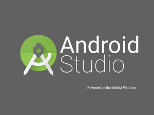
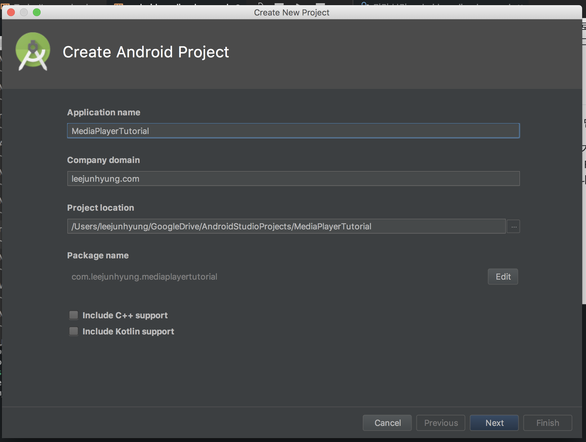
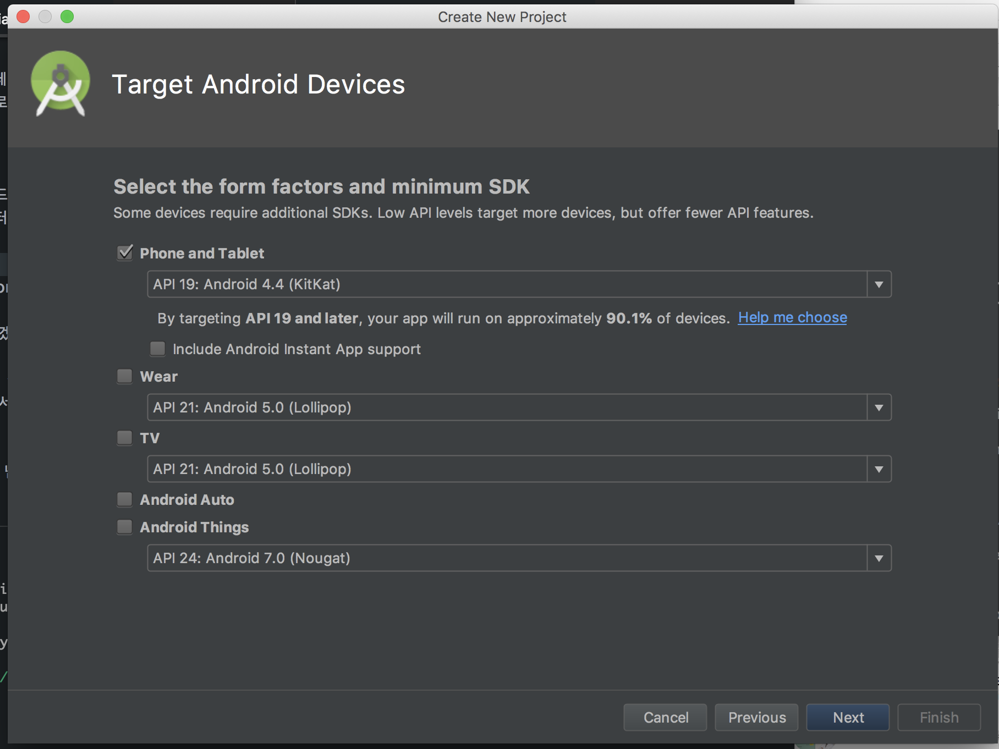
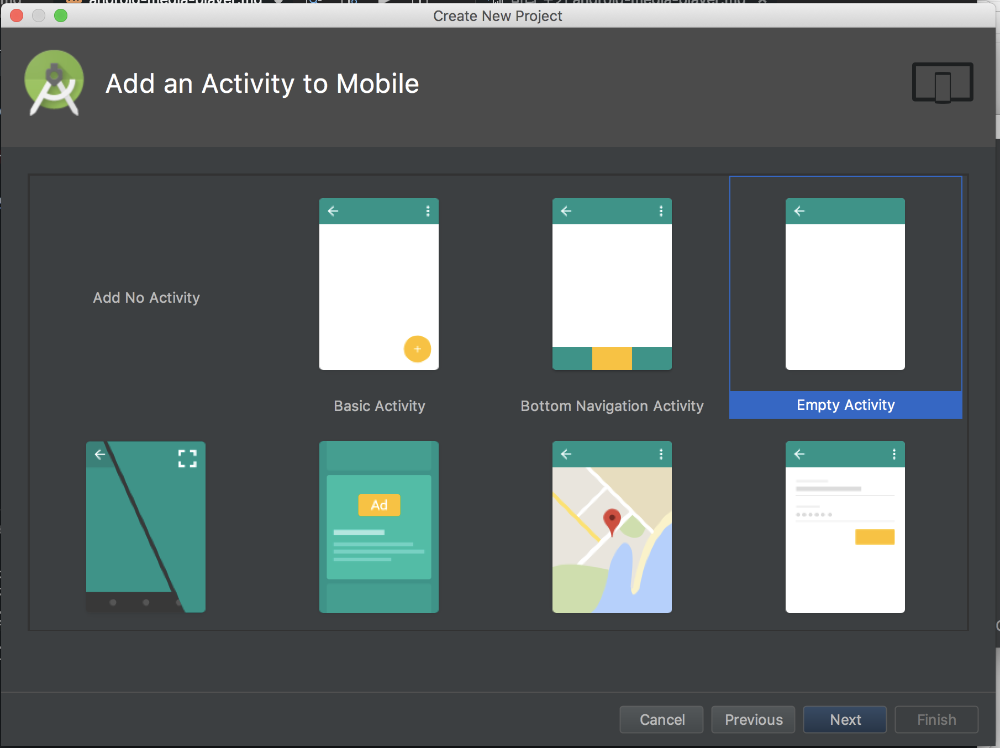
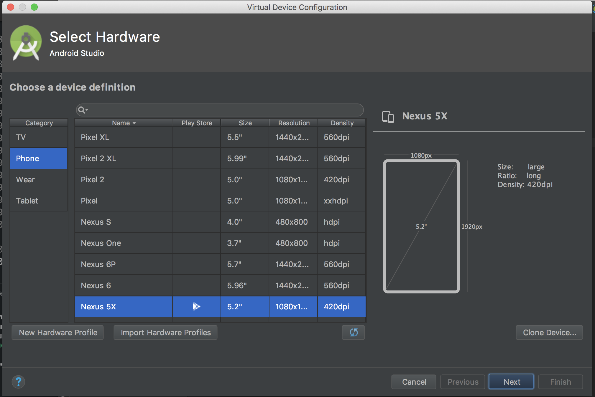
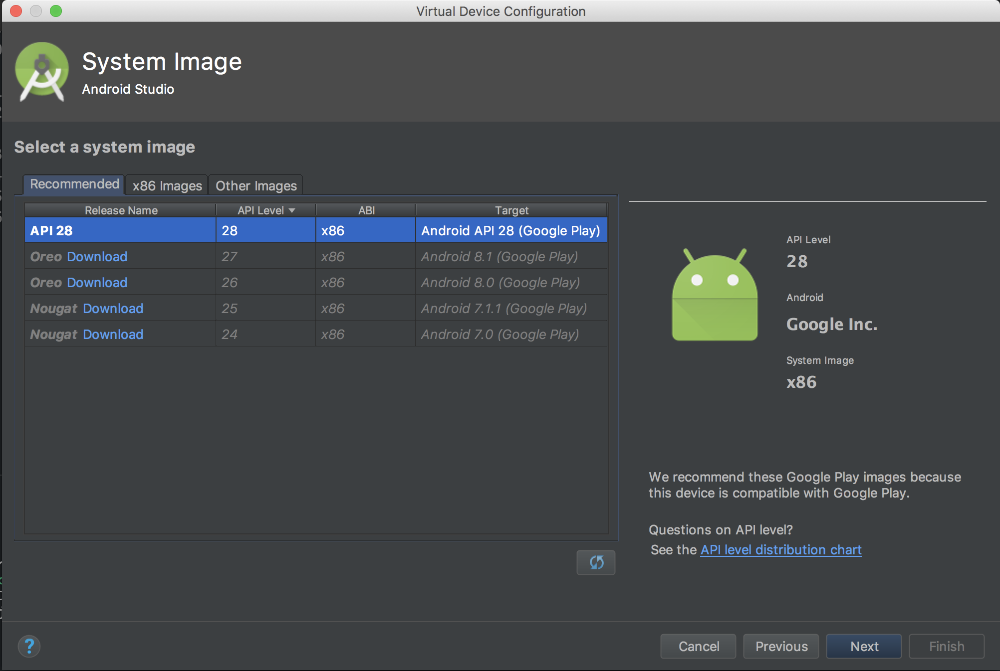
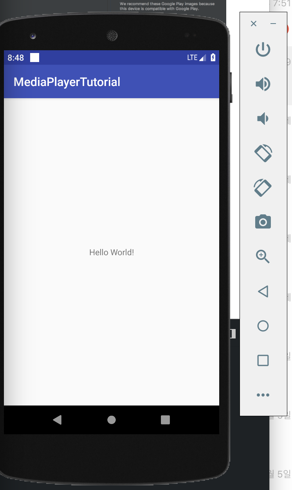
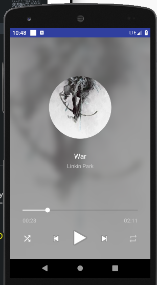

# 안드로이드 MediaPlayer Project

## Why Android?



첫 안드로이드 개발 관련 게시글이네요.

저는 이전까지 React.js 와 Node.js 를 활용한 웹 개발을 주로 공부해왔고, 최근에는 React Native 를 활용한 프로젝트를 진행하기도 했습니다.

React Native 는 React.js 를 주로 사용해왔던 저에게 모바일 앱을 만들 때 가장 쉽게 선택할 수 있는 도구였는데요, 실제로 큰 러닝커브 없이 1 주일도 안 결려서 바로 적응을 했습니다.

문제는 "크로스 플랫폼 개발"이라는 매력적인 이상이 현실 세계와 동떨어진 얘기일 때가 많다는 점이었습니다.

React Native 의 캐치 프레이즈도 "네가 이미 알고 있는 React 를 가지고 Android 와 iOS, 두 개의 플랫폼을 위한 앱을 작성할 수 있다"인데, 실제로 이를 달성하기는 무척 어렵습니다.

왜냐하면 Android 와 iOS 라는 두 플랫폼은 서로 너무나 차이점이 많기 때문입니다.

한 예로 Android 앱들은 FloatingActionButton (화면 하단부에 + 모양으로 표시되는 버튼) 을 활용하지만 iOS 앱들은 대신 상단부에 아이콘을 두는 걸 더 선호하죠.

이렇듯 서로 디자인적으로 지향하는 바도 다르고, 카메라나 블루투스 등을 조작하는 API 도 사뭇 다르며, 사용하는 언어도 다릅니다. (물론 Kotlin 과 Swift 는 닮은 언어라는 얘기도 많지만요)

이 점이 React Native 를 개발할 때면 뼈 아프게 작용하게 되는데, 결국 어떤 컴포넌트를 고르든 Android 와 iOS 그 중간 지점을 고를 수는 없다는게 문제입니다.

만약 그런 목표를 가지고 있다면 if-else 문을 지저분하게 이어 붙일 각오를 해야겠죠.

다음으로는 "표준 라이브러리가 부족하다"는 점이었습니다.

React Native 에도 기본적으로 제공되는 컴포넌트들이 있습니다.

Image/DatePicker/ListView/ScrollView ... 등 꽤 많은 수가 있습니다.

하지만 막상 실제 앱을 디자인하고 기능을 구현하려하면 금방 막혀버리기 일쑤 입니다.

물론 이를 보완하기 위해 다른 오픈소스 라이브러리들이 많이 있다면 좋겠지만 React Native 생태계에서 꽤 유명한 라이브러리라 하더라도 깃허브 Star 숫자가 1000 대에 머무르는 것이 사실입니다.

이러니 어떤 경우에는 백지 상태에서 필요한 기능을 구현해야하는 경우도 생기게 되는데, 이 경우에는 쉽고 빠른 크로스 플램폼 개발이라는 이상과는 크게 멀어지게 되죠.

이렇게 크게 한계를 느끼게 되어 안드로이드 개발에 뛰어들게 되었는데요.

한 달 가량 튜토리얼을 전전하고 씨름해가면서 느낀 점은

- Google 의 Document 는 상세하고, 빠짐없지만 일반 유저가 읽기에는 다소 불친절하다.
- 정말 기본기를 다루는 튜토리얼은 많지만 특정 케이스에 바로 써먹을 수 있는 "실제" 앱 만들기 예시는 조금 부족하다.

였습니다.

그래서 구글의 문서보다는 좀 더 친절하지만, 안드로이드 스튜디오 실행시키기 튜토리얼보다는 좀 더 깊이 있는 그런 시리즈를 써볼 예정입니다.

## 개발 환경 셋업

안드로이드 스튜디오는 이미 설치가 되어있으리라 믿고,

(만약 안드로이드 스튜디오 설치나 기타 입문 강좌가 필요하시다면 [raywenderlich 의 유튜브 채널](https://www.youtube.com/user/rwenderlich/playlists) 에서 "Your First Android Kotlin App" 시리즈를 보고 오시면 됩니다.)

본격적으로 프로젝트를 생성해봅시다.



ApplicationName 은 저 같은 겨우에는 MediaPlayerTutorial 로 했습니다만 다른 것으로 해도 상관은 없습니다.

또 그 아래에 CompanyName 이 있는데, 이 역시 마켓에 앱을 등록하지 않는 한 사용할 일이 없으므로 도메인 형식으로 어떤 이름이든 작성해주시면 되겠습니다.
ex) example.android.com

Project Location 은 이제부터 안드로이드 프로젝트들이 저장될 곳입니다. 한 번 세팅해놓으면 다음부터는 계속 그 폴더에 프로젝트들이 저장된답니다. 편하죠?

그 아래에 Include Kotlin support 는 체크박스를 풀어주세요.

이 시리즈에서는 자바를 사용하도록 하겠습니다.

자바를 사용하는 이유는 제가 코틀린을 잘 못 다루기 때문인 것도 있지만 스택 오버플로우나 구글 공식문서 등 참조할만한 대부분의 코드가 아직은 자바가 월등히 많아서인 것도 있습니다.

아무튼 Next 를 눌러서 다음 화면으로 넘어가죠.



이제 Target Android Devices 인데요,
좀 더 상위 API 를 지원할수록 더 많은 기능을 쓸 수 있지만 하위 호환성이 나빠집니다.

저는 API19 를 최소 API 버전으로 세팅하겠습니다.

다음은 액티비티 설정이네요.



화면 상단의 "Empty Activity"를 고르고 계속 진행합니다.

다음 화면에서는 건드릴 것 없이 바로 프로젝트를 시작해주면 됩니다!

## 첫 실행 결과

> 이 부분은 이미 알고 계시다면 생략하셔도 좋습니다.

이제 프로젝트가 생성되었습니다.

한 번 에뮬레이터를 실행시켜볼까요?

그 전에 에뮬레이터를 추가해줘야합니다.

Tools-AVD Manager 로 들어가서 아래에 "Create Virtual Device..." 메뉴를 선택하면



위와 같은 화면이 나오는데요.

카테고리, 해상도, 크기, 기종 등 다양한 부분을 설정해줄수 있습니다.

다음은 시스템 이미지 설정인데요.



Recommended 탭에서 아무 이미지나 골라서 다운로드하시면 되겠습니다.

저는 API28 을 선택했습니다.

마지막 화면에서 이름을 지어주면 완료!

이제 에뮬레이터에서 코드를 실행시켜볼 수 있게 됐습니다.

상단의 메뉴에서 Run-Run App 을 선택하시거나

혹은 안드로이드 스튜디오의 오른쪽 상단 아이콘이 모여있는 곳에서 초록색 화살표 아이콘을 눌러도 가능합니다.

이제 아까 생성한 가상머신을 고르고 실행을 시켜주면?



헬로 월드가 보이는군요!

좋습니다.

## 목표

일단 목표는 기본적인 음악 재생 앱이 가지고 있는 기능들을 구현하는 것입니다.

완성된 모습을 보면 어떤 앱을 만들지 훨씬 분명하게 알 수 있겠죠?



그러면 기능들을 살펴봅시다.

- 먼저 미디어 파일에서 앨범아트를 불러와서 중간의 동그란 이미지와 배경에 불러올 수 있고,
- 제목과 아티스트를 보여줄 수 있으며,
- seekbar 를 통해 진행 상태를 확인하거나 원하는 지점으로 노래를 스킵할 수 있고,
- 현재 몇 분 가량 재생되었는지 또 전체 재생 시간이 몇 분인지 알 수 있구요,
- 왼쪽 아래 버튼을 누르면 랜덤한 곡을 재생할 수 있으며,
- 오른쪽 버튼을 누르면 반복재생 설정을 할 수 있고,
- 마지막으로 중간의 세 버튼을 통해 이전 곡으로, 재생/멈춤, 다음 곡으로와 같은 기본 기능을 사용할 수 있습니다.

## 시작하기

> 새로운 용어가 굉장히 많이 등장하기 때문에 먼저 구글의 공식 문서 [Media app architecture](https://developer.android.com/guide/topics/media-apps/media-apps-overview) 혹은 MediaSession 을 다룬 [미디엄 포스트](https://medium.com/androiddevelopers/understanding-mediasession-part-1-3-e4d2725f18e4)을 읽고 오시는게 도움이 될 수 있습니다.

먼저 디펜던시 설정부터 합시다.

builde.gradle (Module: app) 파일에 아래와 같이 추가해줍니다.

```gradle
dependencies {
    implementation fileTree(dir: 'libs', include: ['*.jar'])
    implementation "com.android.support:appcompat-v7:$supportLibraryVersion"
    implementation "com.android.support:support-media-compat:$supportLibraryVersion"

    // glide supports v27 of support library so exclude
    implementation ("com.github.bumptech.glide:glide:$glideVersion") {
        exclude group: "com.android.support"
    }
    annotationProcessor "com.github.bumptech.glide:compiler:$glideVersion"
    implementation "jp.wasabeef:glide-transformations:$glideTransformationsVersion"

    // circle image view
    implementation "de.hdodenhof:circleimageview:$circleImageViewVersion"

    // rxjava
    implementation "io.reactivex.rxjava2:rxandroid:$rxandroidVersion"
    implementation "io.reactivex.rxjava2:rxjava:$rxjavaVersion"

    implementation 'com.android.support.constraint:constraint-layout:1.1.3'
    testImplementation 'junit:junit:4.12'
    androidTestImplementation 'com.android.support.test:runner:1.0.2'
    androidTestImplementation 'com.android.support.test.espresso:espresso-core:3.0.2'
}
```

그리고 build.gradle (Project) 파일에는

```gradle
buildscript {
    ext.supportLibraryVersion = '28.0.0-rc01'
    ext.glideVersion = '4.8.0'
    ext.glideTransformationsVersion = '3.3.0'
    ext.circleImageViewVersion = '2.2.0'
    ext.rxjavaVersion = '2.2.1'
    ext.rxandroidVersion = '2.1.0'

    ...
```

와 같이 버전을 명시해줍니다.

Sync 를 마치고 나면 폴더 구성을 아래와 같이 해주세요.

```md
mediaplayer (루트)

- client
- service
  - player
- ui
- utils
```

패키지 구성까지 끝마치셨다면!

service 패키지 아래에 MediaPlaybackService 라는 클래스를 만들어줍니다.

이 클래스는 MediaBrowserServiceCompat 이라는 클래스를 상속합니다.

```java
public class MediaPlaybackService extends MediaBrowserServiceCompat {

}
```

이제 붉은 에러메시지가 뜰텐데요,

안드로이드 스튜디오는 implements methods 라는 기능을 지원합니다.

원하는 클래스 위에 커서를 올려두고 alt + enter (mac 의 경우 option + return)을 누르면 자동으로 method 들을 자동완성해줍니다.

```java
public class MediaPlaybackService extends MediaBrowserServiceCompat {

    @Nullable
    @Override
    public BrowserRoot onGetRoot(@NonNull String s, int i, @Nullable Bundle bundle) {
        return null;
    }

    @Override
    public void onLoadChildren(@NonNull String s, @NonNull Result<List<MediaBrowserCompat.MediaItem>> result) {

    }

}
```

이제 각 method 가 어떤 역할을 하는지 살펴봅시다.

`onGetRoot`는 새로운 BrowserRoot 를 돌려줍니다.

간단히

```java
private static final String MY_MEDIA_ROOT_ID = "media_root_id";

    @Nullable
    @Override
    public BrowserRoot onGetRoot(@NonNull String s, int i, @Nullable Bundle bundle) {
        return new BrowserRoot(MY_MEDIA_ROOT_ID, bundle);
    }
```

와 같이 새로운 id 를 가진 BrowserRoot 를 돌려주면 됩니다.

이제 onLoadChildren 인데요.

이 녀석이 실제로 Media 파일들을 Player 에 전달하는 역할을 합니다.
