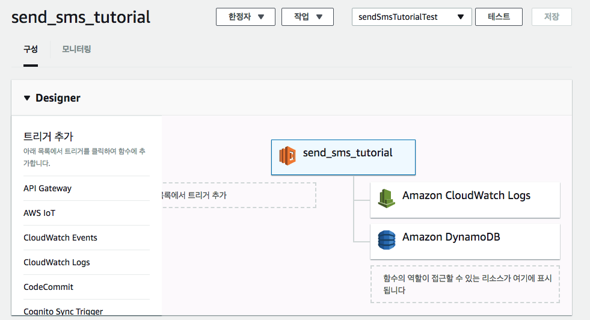

# AWS 고오급 튜토리얼

## hello-world 를 넘어서 2

이 시리즈는 1 편(https://gompro.postype.com/post/1603351)과 이어지는 게시물입니다.

0.  aws lambda 를 위한 vpc 환경 세팅하기

저번 시간에는 람다 코드를 zip 파일로 올리는 것까지 성공했다.

이전 게시물을 잘 따라왔다면 지금쯤 aligo api 사용을 위한 람다가 하나 있을 것이다.



문제는 발송 IP 주소에 제한이 있을 경우 aws 의 유동 IP 정책 때문에 모든 IP 주소를 일일히 발송 IP 리스트에 등록할 수 없다는 것.

이 문제를 해결하기 위해 우리는 VPC(계정 전용 가상 네트워크)를 이용할 것이다.

VPC 는 여러 조합으로 구성될 수 있는데 여기서는 가장 기본적인 퍼블릭 서브넷/프라이빗 서브넷의 한 쌍으로 이루어진 VPC 환경을 구성해보겠다.

먼저 VPC 콘솔로 이동한 다음, [가상 프라이빗 클라우드] 메뉴 아래의 VPCs 를 선택하고, 기본 VPC 외에 추가로 VPC 를 생성해줍시다.

* VPC 생성

첫 번째 단계는 VPC 생성입니다. VPC 의 CIDR block 에는 적절한 block 값(ex 11.0.0.0/16)을 입력해주세요.

2.  서브넷 생성

다음으로 그 아래에 있는 서브넷 메뉴에서 2 개의 서브넷을 생성해줍니다.

서브넷 생성 시에 CIDR block 값은 VPC 의 CIDR block 값에 속하는 값이여야하고, 두 개의 서브넷 간에는 중복되지 않아야 합니다. (ex 서브넷 1: 11.0.1.0/24, 서브넷 2: 11.0.2.0/24)

이름은 서로 구별될 수 있게 ~ public / ~ private 으로 지어주세요.

두 개의 서브넷이 모두 준비가 되었나요?

3.  internet gateway 생성

이제 인터넷 연결을 가능하게할 internet gateway 생성하겠습니다.

생성을 마쳤다면 해당 게이트웨이를 선택한 뒤 VPC 에 연결 메뉴를 클릭해주세요.

4.  라우팅 테이블 생성

다음으로 라우팅 테이블을 설정해봅시다.

서브넷을 생성하고나면 기본적으로 생성되는 라우팅 테이블이 있을 겁니다.

이 테이블을 메인 테이블이라고 합니다.

메인테이블 외에 추가로 다른 라우팅 테이블을 생성해줍니다.

메인테이블을 선택한 뒤 아래 [라우팅] 탭에서 규칙 [편집]을 누르고 대상주소에는 0.0.0.0/0 를, 대상에는 인터넷 게이트웨이의 id 를 넣어주세요.

예시) 대상 주소: 0.0.0.0/0, 대상: igw-xxxxxxx

라우팅 설정이 완료되었다면 다음은 [서브넷 연결]입니다.

메인테이블이 퍼블릭 서브넷(두 개의 서브넷 중 외부 인터넷 연결을 담당할 서브넷)과 연결되도록 편집해주세요.

두 개의 서브넷 중 ~ public 이라고 이름 붙힌 서브넷을 연결해주세요!

5.  NAT gateway 생성

화룡점정입니다. NAT gateway 생성을 누르고 서브넷에는 퍼블릭 서브넷 id 를, 엘라스틱 IP id 는 기존 엘라스틱 IP 가 없을 경우 새 EIP 생성을 눌러 하나 만들어줍니다.

여기서 기억해둬야하는 것은 [탄력적 IP 주소]입니다.

이 주소를 어딘가에 저장해주세요 :)

그 다음에 두 개의 서브넷 중 퍼블릭 서브넷이 아닌 서브넷 (~ private 으로 이름 붙힌 서브넷)의 [라우팅]탭에 대상 주소 0.0.0.0/0, 대상에 NAT 게이트웨이의 id 를 넣어줍니다.

예시) 대상 주소 0.0.0.0/0, 대상: nat-xxxxxxxx

\* 경고 \*

이 방법은 비싸고, 비싸고, 비쌉니다(?).

서울 리전(ap-northeast-2)에서 서비스를 사용할 경우 시간당 약 0.059 달러의 비용이 발생하는데 만약 한달을 사용하게 되면 예상 요금은

`30 * 24 * 0.059 = 42.48 달러 = 45 336.1793 원(2018.02.20 기준)`

네 ... 요금 만만치 않습니다.

그러니 혹시라도 배우는 용도로 사용하고 계신 중이라면 "무조건" 작동을 확인하신다음에 게이트웨이를 파기해주세요.

혹시라도 방치했다가 폭탄 요금이 청구될 수 있습니다.

주의해주세요!

6.  정리

이제 기본적인 구조가 갖춰졌습니다.

여기서 잠깐 AWS 공식문서의 시나리오 그림을 살펴보고 갑시다.


그림이 상당히 복잡해보이지만 중요한 부분은 두 가지 입니다.

1.  Internet gateway(인터넷 게이트웨이)와 연결된 퍼블릭 서브넷을 통해 외부 인터넷 서비스를 이용할 수 있다는 점.

2.  NAT gateway(Network Address Translation)는 직접 외부 인터넷 서비스에 접속할 수 없는 프라이빗 서브넷의 요청을 라우팅한다는 점.

3.  NAT gateway 의 요청은 고정된 IP 주소(Elastic IP)를 통해 요청된다는 점.

이 두 가지 개념의 차이는 마치 공유기와 LAN 선의 개념과도 같습니다.

LAN 선은 실질적으로 서비스를 이용할 수 있는 물리적인 네트워크를 제공하고, 공유기는 공유기를 사용하는 기기들의 요청을 "돌려"주죠.

우리의 람다 서비스 또한 마찬가지입니다. 기본 제공되는 퍼블릭 서브넷과 인터넷 게이트웨이는 앞서도 말했듯이 유동 IP 를 가지고 있습니다.

모든 IP 주소에 대해 일일히 발송 IP 등록을 할 수 없기 때문에 여기서는 NAT gateway 를 이용해서 고정된 주소를 사용하게끔 하는 것이 목표입니다.

람다 메뉴로 돌아와 네트워크 탭에서 VPC 설정을 해줍시다.

VPC - 서브넷 - 보안그룹을 차례로 넣어줍니다.

여기서 서브넷을 추가하실 때 주의하실 점은

"절대로" 퍼블릭 서브넷을 추가하셔서는 안 된다는 점입니다.

이는 AWS 의 공식문서에도 잘 나와있는데

> Important
> If your Lambda function needs Internet access, do not attach it to a public subnet or to a private subnet without Internet access. Instead, attach it only to private subnets with Internet access through a NAT instance or an Amazon VPC NAT gateway.

네. 프라이빗 서브넷 + NAT gateway 혹은 NAT instance 가 연결되어 있는 경우에만 인터넷 요청을 할 수 있습니다.

절대 절대 퍼블릭 서브넷이나 NAT gateway/instance 가 연결되지 않은 프라이빗 서브넷을 서브넷 항목에 추가하시면 안 됩니다.

보안그룹은 기본 보안 그룹이 있으니 따로 생성하지 않아도 됩니다.

자, 저..장!

오 이런 ... VPC 권한이 없다고 하는군요.

이 경우 역할의 정책 리스트에 "AWSLambdaVPCAccessExecutionRole"를 추가해주시면 됩니다.

역할에 대한 정책은 [IAM 대시보드] - [역할]을 들어가서

해당 역할을 선택후 정책 연결을 누르면 됩니다.

이제 바뀐 네트워크 설정이 잘 저장되는군요.

마지막으로 탄력적 IP 의 IP 주소를 알리고 서비스의 발송 IP 목록에 추가해주세요!

테스트를 누르시면 지금쯤 위와 같은 화면이 뜰 것입니다.

수고하셨습니다!

1.  cold start?

여기까지 끝났을 때 정말 끝났다고 생각하셨나요?

아쉽지만 아닙니다.

람다는 기본적으로 호출이 된 후 얼마간 warm 상태를 유지합니다.

이 때는 준비시간 없이 바로바로 호출되므로 응답시간이 굉장히 짧습니다.

그러나 일정 시간이 지나면 cold 상태로 접어듭니다.

이 경우 준비시간이 필요하기 때문에 문자 전송 요청을 보내면 평소보다 짧게는

또 람다를 단독으로 실행할 때보다 VPC 환경에서 실행하게 되면 더 준비시간이 길어집니다.

기존에 100ms 미만의 준수한 반응속도를 보였던 람다도 최대 10 초까지 딜레이되기도 합니다.

어떤 식으로 이런 동작을 해결할 수 있을까요?

의외로 간단합니다.

지속적으로 요청을 보내면 됩니다.

다른 람다를 생성해서 우리의 문자 서비스 람다를 지속적으로 호출하게 되면 계속해서 warm 상태를 유지하므로 걱정할 필요 없이 언제든 빠른 응답속도를 즐길 수 있습니다.

기본적인 아이디어는 "우리의 문자 서비스 람다를 일정한 간격으로 호출하는 람다를 생성하는 것"입니다.

이를 위해서 새로운 람다 함수를 생성하고, 좌측 [트리거 추가] 항목에서 [CloudWatch Events]를 추가해줍니다.

[규칙]에서 예약 표현식 부분을 살펴봅시다.

예약 표현식은 두 가지 방식으로 표현할 수 있습니다.

하나는 rate 방식입니다. 비교적 간단한 스케쥴링에 활용됩니다.

ex) 20 minutes, 2 days

다만 초 단위로 설정할 수는 없습니다. (최소 1 분 간격)

그리고 단수는 단수 형태로 복수는 복수 형태로 써주셔야 합니다.

ex) 1 day / 2 days

다른 방식은 cron 방식으로 비교적 복잡한 스케쥴링이 가능합니다.

ex)

cron(0 10 \* _ ? _) - 매일 오전 10 시(UTC 기준)에 호출

cron(0/10 _ ? _ MON-FRI \*) - 10 분 간격으로 월 ~ 금까지 호출

자세한 사항은 [링크](https://docs.aws.amazon.com/ko_kr/lambda/latest/dg/tutorial-scheduled-events-schedule-expressions.html)에서 확인해주세요.

이제 다른 람다를 호출하는 람다코드를 작성해봅시다.

```js
const AWS = require('aws-sdk')
AWS.config.region = 'ap-northeast-2' // 정확한 리전을 입력해주요.
const lambda = new AWS.Lambda()

exports.handler = (event, context, callback) => {
  const aligoTest = {
    key: process.env.API_KEY,
    userid: process.env.USER_ID,
    sender: process.env.SENDER,
    receiver: 'MESSAGE_RECEIVER',
    msg: 'test',
    testmode_yn: 'Y',
  }
  const params = {
    FunctionName: 'YOUR_LAMBDA_NAME',
    InvocationType: 'RequestResponse',
    LogType: 'Tail',
    Payload: JSON.stringify(aligoTest),
  }

  lambda.invoke(params, (err, data) => {
    if (err) {
      callback(err)
    } else {
      callback(null, data)
    }
  })
}
```

환경변수 설정하는 방법을 모르시겠다구요? 1 편(https://gompro.postype.com/post/1603351)을 참조해주세요.

다른 람다를 호출하는 간단한 방법은 aws-sdk 를 사용하는 것입니다. 방법은 위와 같고 다만 FunctionName 이나 region 을 정확하게 입력하는 것만 주의해주시면 됩니다.

그리고 마지막으로 람다함수 실행이 가능한 역할("AWSLambdaRole")을 IAM-역할-정책에서 추가해주세요.

TADA!

이제 전송결과를 확인하면 주기적으로 설정해놓은 간격으로 문자가 발송(정확히는 테스트 문자)되는 것을 확인할 수 있습니다.

2.  NAT instance ?

저희는 편의상 NAT gateway 를 사용했습니다.

하지만 앞서 말한 비용문제 때문에 부담없이 굴릴 수가 없습니다.

달마다 4 ~ 5 만원씩 지불하면 배보다 배꼽이 더 큰 상황이 벌어지기도 하죠.

물론 비용 측면이 전부는 아니지만 큰 고려사항인 것은 분명하죠.

만약 서버 관리(주기적인 OS 업데이트 등) + 속도(당연히 NAT gateway 가 작은 instance 보다는 속도가 빠릅니다.) 문제보다 비용이 더 크게 다가온다면 NAT instance 를 쓰는 게 더 나을 수도 있습니다.

NAT instance 는 EC2 instance 에 NAT 기능을 추가하면 됩니다.

시작해보죠.

먼저 EC2 대시보드로 들어와서 좌측 [NETWORK&SECURITY] 항목 아래 키페어로 들어가서 미리 키페어를 만들어둡니다.

이 키페어는 인스턴스에 접속 시 사용할 키페어 입니다.

적당한 이름을 넣고 만들어줍시다.

다음은 보안 그룹입니다.

VPC 에서 보안 그룹을 생성할 때와 비슷한 요령으로 하면 되는데 이번에는

인바운드 보안 규칙에

ssh - 0.0.0.0/0 (모든 트래픽)
http - 0.0.0.0/0 (모든 트래픽)
https - 0.0.0.0/0 (모든 트래픽)

일단은 이렇게 넣어주세요.

http/https 트래픽 규칙은 인스턴스를 생성하고 나서

생성된 인스턴스의 프라이빗 IP 주소로 바꿔줘야 합니다.

기본 준비가 됐으니 인스턴스를 만들어봅시다.

좌측 인스턴스 탭에서 인스턴스 시작을 눌러주세요.

1 단계에서는 AMI 를 선택하게 되는데 우리는 좌측 커뮤니티 AMI 에서 amzn-ami-vpc-nat 이라고 검색한 다음 날짜가 가장 최신인 것으로 골라줍니다.

2 단계 인스턴스 유형 선택에서는 t2.micro 를 골라줍니다.

이제 3 단계 인스턴스 세부 정보 구성 단계입니다.

여기서 파란색으로 표시된 네트워크 탭에 우리가 사용하려는 VPC 가 선택되어 있는지 잘 확인해주시고,

아래 서브넷 파트에 "퍼블릭" 서브넷이 선택되어 있는지 잘 확인해주세요.

NAT instance 는 "퍼블릭" 서브넷에 존재하면서 프라이빗 서브넷의 요청을 받아 처리하기 때문에 무조건 퍼블릭 서브넷을 골라주셔야합니다.

그리고 아래 [퍼블릭 IP 자동 할당]에는 활성화를 눌러주세요. (저희는 서브넷을 사용할 예정이니)

4, 5 단계는 가볍게 패스

6 단계 보안그룹은 저희가 사전에 작성해놓은 보안그룹을 추가해줍니다.

7 단계에서 시작을 누르면 키 페어 선택 창이 뜰 것입니다.

우리는 이미 생성해놓은 키페어가 있으므로 그 키페어를 사용하시면 됩니다.

키페어 생성 단계를 스킵하셨더라도 그냥 새 키페어 생성을 누르고 계속 진행하시면 됩니다!

잠깐 기다리면 인스턴스 상태가 pending(노란색)에서 running(초록색)으로 바뀔겁니다.

이제 인스턴스를 우클릭해서 [네트워킹]-[소스/대상확인]을 클릭한 뒤 비활성화해주세요.

그리고 아래 설명란에서 프라이빗 IP 주소를 복사한 뒤, 보안그룹의 인바운드 규칙의 https 유형의 소스란에 붙여넣기 해줍니다.

이제 인스턴스가 인터넷 접속을 할 고정 IP 를 만들어줍시다.

좌측 보안그룹 아래 탄력적 IP 탭에서 새 주소를 할당하고 우클릭하여 주소 연결을 눌러주세요.

리소스 유형은 인스턴스, 인스턴스는 우리가 생성한 인스턴스의 아이디, 프라이빗 IP 는 인스턴스의 프라이빗 IP 값을 넣어줍니다.

이제 이 인스턴스에서 인터넷을 접속할 수 있는지 확인해볼까요?

인스턴스 탭에서 상단을 보면 [인스턴스 시작] 옆에 [연결] 부분이 있을 겁니다.

인스턴스에 연결아래 설명을 잘 읽어봅시다.

아까 키파일을 생성하면서 .pem 파일을 다운로드 받았을 것입니다.

그 경로를 잘 기억해주세요.

그리고 터미널을 켜서 chmod 400 xxxxxxxx.pem 을 입력해줍니다.

이제 마지막 예: 부분의 명령어를 입력하면 연결하시겠냐는 문구가 나옵니다.

yes 를 입력하고 진행하면 로그인이 된 것입니다. 주의하실 점은 xxxx.pem 부분은 만약 사용자 폴더에 pem 파일을 두지 않았다면 모든 경로를 입력해주셔야 됩니다.

예) "./Downloads/xxxxxxx.pem" (다운로드 폴더 아래에 pem 파일이 있을 경우)

이제 사용자가 ec2-user@ip-x-x-x-x 이런식으로 표시될 것입니다.

간단한 http 요청을 넣어봅시다.

1 편에서 했던 것처럼 /remain/ 엔드포인트에 요청을 넣어보세요.

정상적으로 결과값이 반환되나요?

네, 이제 서브넷/라우팅 테이블 설정을 해줍시다.

터미널은 종료해주세요 :)

제 튜토리얼을 잘 따라오셨다면 지금쯤 한 개의 퍼블릭/프라이빗 서브넷이 있을 것입니다.

여기에 추가로 프라이빗 서브넷을 하나 더 만들어주세요.

적절한 CIDR 값을 넣어주고 생성!

이제 라우팅 테이블로 넘어갑시다.

이 테이블은 nat-instance 용 테이블입니다.

[라우팅] 메뉴에서 대상 주소에 0.0.0.0/0 을, 대상에는 인스턴스 id 를 넣어줍니다.

다시 서브넷으로 가서 방금 생성한 서브넷의 라우팅 테이블을 nat-instance 용 테이블로 바꿔주세요.

람다 메뉴로 넘어가볼까요?

람다에서 VPC 설정은 nat instance 가 연결된 "프라이빗" 서브넷을 서브넷 필드에 넣어주고 보안그룹은 헷갈리지 말고 바꿔주세요. (만약 nat gateway 와 nat instance 가 다른 보안그룹을 사용한다면 nat instance 의 보안그룹을 선택)

만약 보안그룹이 서로 맞지 않는다면 요청이 timeout 되게 됩니다.

테스트를 해봅시다.

짜잔~ 음.. 확실히 NAT gateway 보다 초기 부팅 속도가 느리긴하지만 그래도 1 ~ 2 초정도밖에 차이가 안 나는데다가 초기 부팅 단계만 지나가면 속도가 같습니다.

** TROUBLESHOOTING **

만약 위 튜토리얼을 전부 잘 따라갔음에도 람다 에러가 발생한다면 이 항목을 잘 읽어봐주세요.

1.  Timeout 에러

* 혹시 VPC 설정에서 서브넷 항목에 퍼블릭 서브넷을 포함하지는 않았나요?
  서브넷 항목에는 NAT gateway / NAT instance 가 연결된 프라이빗 서브넷 만을 포함해줘야합니다.

* 혹시 VPC 설정에서 선택된 보안그룹이 NAT instance 에 명시된 보안그룹과 다르지는 않은가요? NAT instance 에 적용 중인 보안그룹과 VPC 에 설정된 보안그룹은 같아야합니다.

2.  ssh 접속 관련

* ~ are too open

키 페어가 공개적으로 공개되어있기 때문에 발생하는 문제입니다.
chmod 400 "path/to/xxxxx.pem"을 입력해보세요.

* 접속을 시도해도 아무 것도 뜨지 않고 대기만 해요 ㅜㅜ

이 경우 보안그룹의 인바운드 규칙을 확인해주세요.

인바운드 유형에 ssh 그리고 소스에는 0.0.0.0/0 (모든 트래픽)을 넣어주면 접속이 될 것입니다.

3.  청구서를 받아보고 깜짝 놀랐습니다. 어떡하죠?

* NAT gateway 는 사용량 + 사용시간에 따라 돈을 받습니다.

4.  인증오류 -IP 가 발생합니다.

* 알리고 서비스는 제한된 IP 주소에서만 보낼 수 있습니다.

그러므로 NAT gateway 에 연결된 탄력적 IP 의 주소를 알리고 서비스의 발송 IP 주소란에 추가해주세요.

5.  한글 메시지가 보내지지 않아요.

* 알리고 서비스에서 한글 문자를 보낼 때는 encodeURI 함수를 통해 메시지를 인코딩한 다음 보내주세요.

그런데 사용시간에 따른 요금이 만만치 않습니다. 위에서도 밝혔듯이 한 달에 약 42 달러(서울 기준)정도 들어가므로 비용 문제가 부담되신다면 그냥 NAT instance 를 사용해주세요.

ps. 중간에 작업한 사진 파일이 싹 날아가는 바람에 중간부터 사진 파일이 없네요. 쩝..
세팅 도중 문제가 발생하시면 TROUBLE SHOTTING 부분을 꼼꼼하게 확인해보세요.
