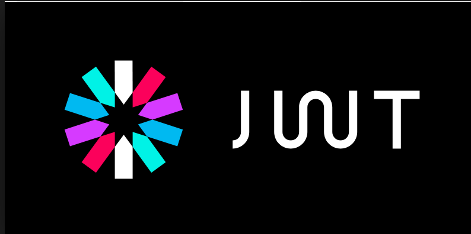
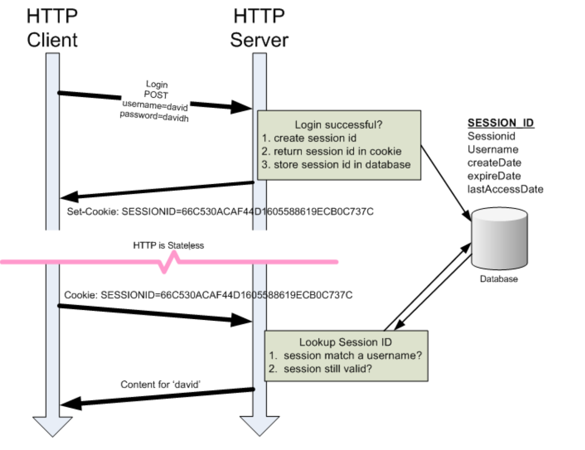
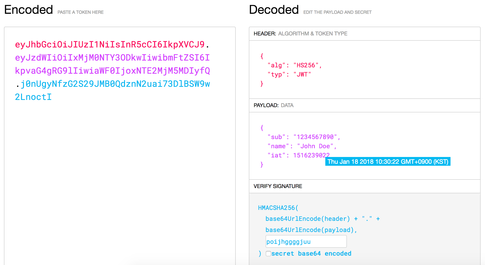

# JWT: Json Web Token 인증 배워보기

## 들어가며

오늘날 일반적인 웹 서버는 클라이언트로부터 오는 api 요청을 응답하기 위한 api 서버입니다. 즉, 클라이언트가 특정한 url 로 api 요청을 하면 서버가 그에 대해 적절한 응답(일반적으로 JSON 객체)을 돌려주게 되는 것입니다. 그렇다면 서버는 어떻게 요청을 보낸 클라이언트가 인증된 사용자인지 알 수 있을까요?

## Http 의 성질

기본적으로 서버와 클라이언트 간의 요청/응답은 http/https 를 통해서 이뤄집니다. 그러나 아쉽게도 이들은 1. 비연결적, 2. 상태없음의 두 가지 특징을 가지고 있습니다. 이 두 가지 특징으로 인해 한 번 클라이언트에서 요청이 들어오고 서버에서 이를 응답하는 사이클이 끝나게 되면 http 연결은 종료되며, 다음에 같은 클라이언트가 요청을 하더라도 상태를 저장하지 않기 때문에 같은 클라이언트인지 서버는 알길이 없습니다.

이 두 가지 특징을 보완하고 신뢰성있는 인증 시스템을 구축하기 세션과 쿠키가 등장하게 됩니다. 세션-쿠키 기반 인증 시스템에서 서버는 우선 각 클라이언트의 요청에 대해 세션을 생성하고 이를 믿을 수 있는 저장 장소(일반적으로 메모리 혹은 데이터베이스)에 저장합니다. 그리고 서버는 클라이언트를 위해 유효기간과 인증 상태 등이 담긴 쿠키를 발급합니다. 다음에 클라이언트가 인증을 요청할 때는 이 쿠키와 함께 요청을 보내게 됩니다.(일반적으로 헤더에 쿠키를 담음) 서버는 쿠키에 담긴 인증정보를 세션에 담긴 정보와 대조하며 사용자가 인증되었음을 확인합니다.

이미지 출처: [http://www.hackingarticles.in/beginner-guide-understand-cookies-session-management/](http://www.hackingarticles.in/beginner-guide-understand-cookies-session-management/)

세션-쿠키 기반 인증은 오랜 기간 사용되어 왔으며, 지금도 소규모 서비스를 운영하는데는 전혀 지장이 없습니다.

## JWT: 장점

그렇다면 왜 우리는 새로운 인증 방식을 배우고 있을까요?
기존의 세션-쿠키 기반 인증 시스템이 몇 가지 문제를 안고 있었기 때문입니다.

첫 번째 문제는 세션의 존재입니다.
위에서 말했듯이 클라이언트가 요청을 보내면 서버는 우선 세션을 생성한 뒤 클라이언트에 쿠키를 발급합니다. 만약 100 명의 클라이언트가 아니라 십만명, 백만명이 요청을 보내면 어떻게 될까요? 굉장히 큰 데이터베이스가 필요할 것입니다. 이는 서버에 상당한 부담을 주게 됩니다.

이미지 출처: [https://community.connection.com/a-windows-server-migration-is-a-big-job/](https://community.connection.com/a-windows-server-migration-is-a-big-job/)

두 번째 문제는 확장성입니다.
만약 데이터베이스 부하를 피하기 위해 메모리에 세션을 저장한 경우 서로 다른 서버 간에 세션을 공유할 방법이 없습니다. 이는 데이터베이스 사용을 강제하게 됩니다.

세 번째는 다양한 클라이언트의 존재입니다.
세션-쿠키 기반 인증 시스템이 널리 사용되던 시절에 클라이언트란 웹 브라우저만을 의미하는 말이었습니다. 그러나 이제는 태블릿, 모바일 웹, 웨어러블 기기 등 수많은 종류의 클라이언트가 존재하고 이 모든 경우를 커버하려면 상당한 노력이 필요합니다.

이미지 출처: [https://www.mufin.com/products/audioid-server/](https://www.mufin.com/products/audioid-server/)

그렇다면 JWT 는 어떻게 이러한 문제들을 해결했을까요?

우선 JWT 란 Json Web Token 의 약자로 JSON 형태의 토큰이라는 의미를 가지고 있습니다. Jwt 의 가장 큰 장점은 self-contained, 즉 토큰 자체에 정보를 가지고 있기 때문에 별도로 데이터베이스를 거치지 않고도 인증이 가능하다는 점입니다. 또 JSON 형태이기 때문에 어떤 클라이언트에서도 간단하게 사용할 수 있습니다. 확장성 또한 별도의 세션 저장이 필요없기 때문에 우월하다고 볼 수 있습니다.

## JWT: 단점

그렇다면 JWT 에는 장점만 있나요?

절대 그렇지 않습니다. JWT 는 기존의 세션-쿠키 기반 인증 시스템의 단점을 어느 정도 해결했지만 JWT 에도 몇 가지 문제점들이 있습니다.

첫 번째는 아까 장점으로 언급했던 self-contained 한 점입니다.
JWT 토큰은 헤더(header), 데이터(payload), 서명(signature)를 합쳐 base64 인코딩하기 때문에 헤더 부분이나 정보에 너무 많은 필드가 들어가게 되면 그에 따라 토큰의 크기 또한 커지게 됩니다. 또 데이터는 암호화가 되지 않습니다. (단순히 base64 인코딩만 하므로) 그러므로 탈취당할 경우 그대로 모든 필드가 노출될 수 있습니다. 이런 점 때문에 JWT 의 데이터에는 절대로 비밀번호나 전화번호 등 사용자의 민감한 정보를 담아서는 안 되며, 보안 프로토콜(https)를 필수적으로 적용해야 합니다.

> 몇 줄 안 되는 정보를 담았음에도 엄청나게 방대한 크기를 자랑하는 토큰 ...

두 번째는 이미 발급된 토큰은 서버측에서 임의로 파기할 수 없다는 점입니다. 기존 세션은 서버에 저장되기 때문에 쉽게 파기할 수 있었습니다. 그러나 JWT 토큰은 클라이언트에 발급된 이후에는 서버에 저장되지 않기 때문에 서버에서 임의로 파기하는 것이 불가능합니다. 그러므로 만약 사용자가 기기를 잃어버려도 토큰이 파기되지 않았다면 다른 악의적인 사용자가 인증된 사용자인 척 서비스를 이용할 수도 있게 됩니다. 그러나 이 문제는 토큰에 짧은 만료 시간(expire time)을 부여함으로써 부분적으로 상쇄할 수 있고, 토큰에 사용자의 접속 Ip 정보를 담고 이를 확인함으로써 악의적인 사용자를 차단할 수 있습니다.(10 분 전에 뉴욕에서 접속한 사용자가 한국에서 요청을 보낼 시 악의적인 유저로 판단)

## 실습하기

JWT 의 생김새나 작동 원리 등을 알아보는 가장 좋은 방법은 직접 토큰을 만들어보고 또 사용해보는 것입니다.

[Jwt.io](https://jwt.io/)에서는 직접 jwt 를 만들어볼 수 있는 플레이그라운드를 제공하니 한 번 직접 만들어보는 건 어떨까요?
