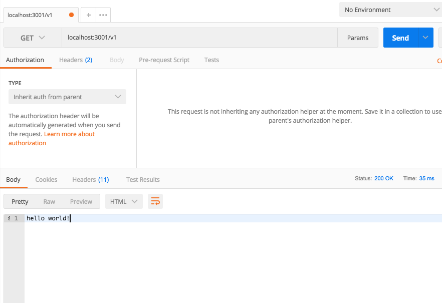
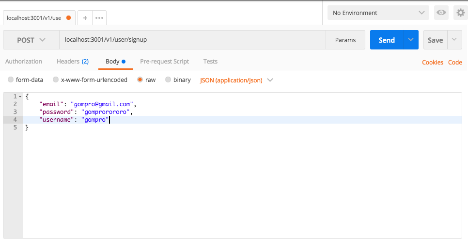
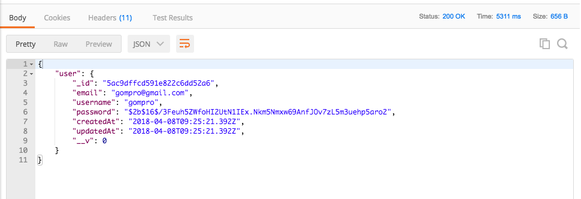
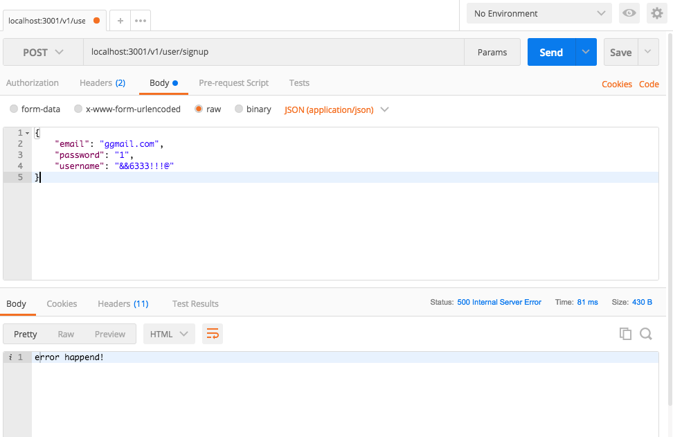
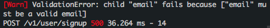
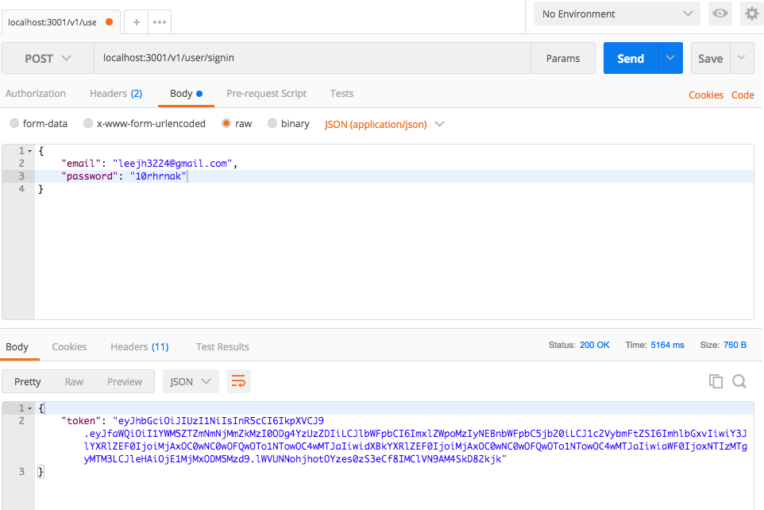
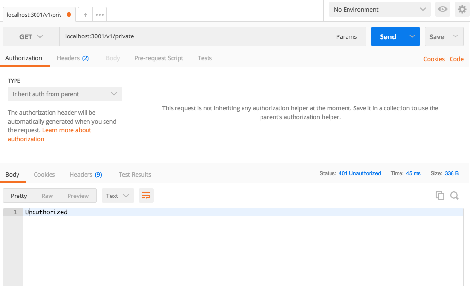
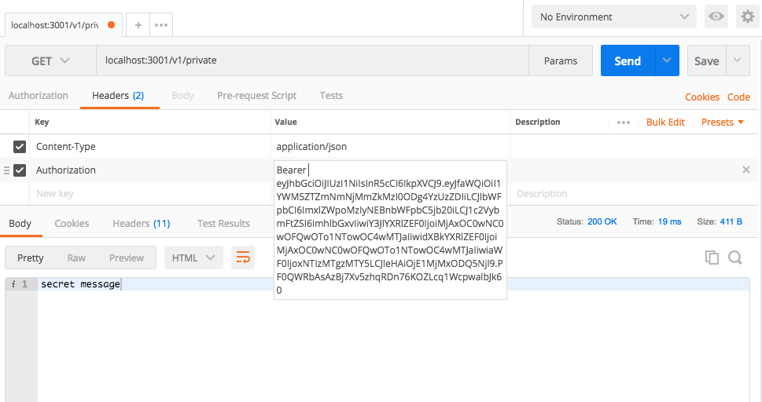

# JWT: Json Web Token 인증 배워보기


## 실전

들어가기 전에

본 포스트는 Typescript/Express/Passport 를 이용해서 Jwt 기반 회원인증 시스템을 구축하는 방법을 설명합니다. Jwt 나 Typescript 가 익숙하지 않다면 조금 어려울 수 있습니다. 최대한 한 줄 한 줄 상세하게 설명하도록 하겠습니다.

저는 패키지 매니저로 npm, 코드 에디터로는 vscode 를 사용하고 있습니다.

개인적으로 typescript 관련 지원이 가장 깔끔해서 vscode 를 적극 추천합니다.

## 기본 설정

먼저 jwt 라는 이름의 디렉토리를 생성해줍니다.

`mkdir jwt`

그리고 `cd jwt`를 통해 jwt 디렉토리로 들어간 다음

`npm init -y`를 통해 package.json 파일을 생성해줍니다.

```json
{
  "name": "jwt",
  "version": "1.0.0",
  "description": "",
  "main": "index.js",
  "scripts": {
    "test": "echo \"Error: no test specified\" && exit 1"
  },
  "keywords": [],
  "author": "",
  "license": "ISC"
}
```

이제 server.ts 를 작성해봅시다.

```js
// src/server.ts
// 환경변수를 가져와주는 모듈
import { config } from 'dotenv'
import { Request, Response, NextFunction, Application } from 'express'
import * as express from 'express'
import * as bodyParser from 'body-parser'
import * as helmet from 'helmet' // 보안을 위한 모듈
import * as logger from 'morgan' // 로깅을 위한 모듈
import * as passport from 'passport'
import chalk from 'chalk' // 로그 하이라이트 모듈

// 아래와 같이 상대경로('./routes') 대신에 절대경로('routes')를 사용하려면
// 환경변수를 설정해야합니다.
import { v1 } from 'routes'
import 'passport/local-signin'
import 'passport/local-signup'
import 'passport/jwt'

// 환경변수 불러오기
config()

// typescript에서는 이런 식으로 변수: 타입 = 값 형태로 타입을 지정합니다.
const app: Application = express()

app.use(logger('dev'))
app.use(helmet())
app.use(bodyParser.urlencoded({ extended: false }))
app.use(bodyParser.json())
app.use(passport.initialize())
app.use('/v1', v1) // 이제 /로 들어오는 모든 요청은 api route에서 처리합니다.

// 에러 핸들링
app.use((err: any, req: Request, res: Response, next: NextFunction) => {
  console.log(`${chalk.red('[Warn]')} ${err}`)
  res.status(500).send('error happend!')
})

export default app
```

그리고 server.ts 에 필요한 모듈을 설치해줍니다.

`npm install --save typescript dotenv express body-parser helmet passport passport-local passport-jwt chalk`

> Typescript 의 경우 추가적으로 type definition 을 다운로드해야합니다.

`npm install --save-dev morgan @types/dotenv @types/express @types/body-parser @types/helmet @types/morgan @types/passport @types/passport-local @types/passport-jwt`

가끔 type 이 package 자체에 들어있는 경우가 있는데, 그런 경우 경고 메시지가 뜨니 그런 경우에는 @types/package 를 지워주세요.

## 라우트 만들기

이제 src 폴더 아래로 server.ts 를 이동시키고, 추가로 routes 폴더를 만들어줍니다.

routes 폴더 아래에는 모든 api route 가 들어가게 됩니다.

routes 폴더 아래에 index.ts 폴더를 만들고 아래와 같이 작성해주세요.

```js
import { Router, Request, Response } from 'express'

// api version
export const v1: Router = Router()

v1.get('/', (req: Request, res: Response) => {
  res.send('hello world!')
})
```

## typescript 셋업

이제 .env 파일을 src 폴더 바깥에 만들어줍니다.

그 다음에

```env
NODE_PATH=src
```

위와 같이 적어줍니다.

이제 본격적으로 서버를 켜기 전에 Typescript 를 사용하기 위한 설정을 해봅시다.

src 폴더 바깥에 tsconfig.json 파일을 만들고 아래와 같이 적어줍니다.

```json
{
  "compilerOptions": {
    "module": "commonjs",
    "target": "es2016",
    "sourceMap": true,
    "moduleResolution": "node",
    "rootDir": "src",
    "forceConsistentCasingInFileNames": true,
    "noImplicitReturns": true,
    "noImplicitThis": true,
    "noImplicitAny": true,
    "strictNullChecks": true,
    "suppressImplicitAnyIndexErrors": true,
    "noUnusedLocals": true,
    "typeRoots": ["node_modules/@types", "./@types"],
    "baseUrl": "./src" // 절대 경로로 사용할 path
  },
  "exclude": ["dist", "node_modules", "**/*.test.ts"]
}
```

이제 src 폴더 아래에 오는 폴더는 src 를 root 로 해서 표시할 수 있습니다.

좋습니다.

개발 서버를 실행시키려면 또 몇 가지 준비가 필요합니다.

`npm install --save-dev nodemon ts-node`

위의 두 가지 모듈을 다운로드 하시고, package.json 의 스크립트에 아래와 같이 추가해줍니다.

> nodemon 과 dotenv, ts-node 를 같이 사용하려면 `nodemon.json`이라는 설정 파일을 만들고 아래와 같이 사용하는 것을 권장합니다.

```json
// nodemon.json
{
  "env": {
    "NODE_PATH": "src",
    "NODE_ENV": "development",
    "JWT_SECRET": "supersecret!!!"
  },
  "exec": ["ts-node"]
}
```

```json
"scripts": {
  "test": "echo \"Error: no test specified\" && exit 1",
  "start": "nodemon src/index.ts --config ./nodemon.json"
}
```

마지막으로 우리의 서버를 port 에 연결시켜줍시다.

src 아래에 index.ts 를 만들고 아래와 같이 추가해줍니다.

```ts
import app from './server'

const port = process.env.PORT || 3001

app.listen(port, () => console.log('listening...'))
```

이제 서버를 실행시켜볼까요?

`npm start`

localhost:3001/v1 으로 접속하면 hello world 가 보이실 겁니다.

## 포스트맨 사용

이렇게 일일이 직접 들어가서 확인하는 방법도 있지만 api testing 을 위한 더 좋은 툴도 많습니다.

포스트맨을 다운로드 해줍시다.

> 현재 크롬 확장 프로그램이 아닌 독립된 애플리케이션을 다운로드 받을 수 있으니 앱을 다운로드 받으시길 추천드립니다. 크롬 확장 프로그램으로 사용하더라도 기능에는 이상이 없는 것 같습니다.

[포스트맨 다운로드](https://www.getpostman.com/apps)

포스트맨을 한 번 사용해볼까요?



## 몽고디비 셋업

다음 차례로 유저 모델을 만들고 몽고디비를 연결하도록 하겠습니다.

src 폴더 아래에 models 폴더를 만들고 User.ts 파일을 만들어줍니다.

```ts
import { Schema, model } from 'mongoose'
import * as bcrypt from 'bcrypt' // 암호화 모듈

import { UserDocument } from 'interface/User'

// UserModel의 methods들에 대한 type definition
export interface UserModel extends UserDocument {
  generateHash: (password: string) => string
  validatePassword: (password: string) => boolean
}

const userSchema = new Schema(
  {
    email: {
      type: String,
      required: true,
      unique: true, // email 필드가 id 역할을 하게 되므로 unique 속성을 주었습니다.
    },
    username: {
      type: String,
      required: true,
    },
    password: {
      type: String,
      required: true,
    },
  },
  // createdAt과 updatedAt 필드를 생성해줌
  { timestamps: true },
)

// 비밀번호를 hash로 저장합니다.
userSchema.methods.generateHash = function(password: string): string {
  return bcrypt.hashSync(password, bcrypt.genSaltSync(16))
}

// hash와 비밀번호를 비교하는 함수
userSchema.methods.validatePassword = function(password: string): boolean {
  return bcrypt.compareSync(password, this.password)
}

export default model<UserModel>('User', userSchema)
```

이제 필요한 모듈을 다운로드 해줍니다.

`npm install --save mongoose bcrypt`

`npm install --save-dev @types/mongoose @types/bcrypt`

다음으로 src 폴더 아래에 interface 폴더를 만들고 우리의 UserModel 에 대한 document 타입을 추가해줍시다.

```ts
// src/interface/User.ts
import * as mongoose from 'mongoose'

export type IUser = {
  _id: string
  email: string
  password?: string
  username: string
  // mongoose version key
  // https://stackoverflow.com/questions/12495891/what-is-the-v-field-in-mongodb
  __v?: number
}

export type UserDocument = mongoose.Document & IUser
```

typescript 에서 위와 같이 type 선언을 해주면 자동완성 기능을 사용할 수 있습니다.

이제 새로운 유저 도큐먼트를 만들때마다 그 안에 작성된 필드가 자동완성되는 것을 확인할 수 있을 것입니다.

또 bcrypt 모듈을 통해 암호를 평문이 아닌 hash 형태로 저장하므로 보안을 도모할 수 있습니다.

유저 모델을 만들었으니 이제 실제로 디비를 연결해봅시다.

models 폴더 아래에 db.ts 를 생성하고 아래와 같이 작성합니다.

```ts
import * as mongoose from 'mongoose'

export const connect = (db: string) => {
  // <T>을 통해 type 검사를 off할 수 있습니다. (type assertion)
  // mongoose의 Promise가 native js Promise를 사용하게 됩니다.
  ;(<any>mongoose).Promise = global.Promise

  return mongoose
    .connect(`mongodb://localhost:27017/${db}`)
    .then(() => console.log('db is ready'), err => console.log(err))
}

// api testing을 위한 함수
export const disconnect = () => {
  mongoose.connection.close()
}
```

이제 index.ts 로 가서 디비를 연결하는 코드를 추가해줍시다.

```ts
import app from './server'
import * as db from 'models/db'

const port = process.env.PORT || 3001

db.connect('fork') // fork라는 디비를 사용
app.listen(port, () => console.log('listening...'))
```

이제 실행!

```bash
{ MongoNetworkError: failed to connect to server [localhost:27017] onfirst connect [MongoNetworkError: connect ECONNREFUSED 127.0.0.1:27017]
```

위와 같은 에러가 발생하시나요?

이 경우 mongod 명령어를 사용해 몽고디비를 켜시고 다시 서버를 실행시켜보세요.

만약 몽고디비가 설치돼있지 않으시고, 직접 디비를 설치하고 설정하는 게 불편하시다면 [mlab](https://mlab.com/)을 사용하셔도 됩니다.

mlab 사용법이 궁금하신 분들은 [MongoDB 서버 준비하기](https://backend-intro.vlpt.us/2/01.html)를 참고해주시기 바랍니다.

몽고디비를 실행시킨 상태에서 정상적으로 서버를 실행시켰다면 `db is ready` 문구가 보이실 겁니다.

## passport starategy(전략) 설정하기

node.js 인증 라이브러리 중 가장 유명한 녀석은 passport 입니다.

기본적인 로컬 인증 뿐만 아니라 오늘 다룰 jwt 인증 그리고 facebook, google 등 소셜 인증까지 가능한 만능 인증 라이브러리죠.

passport 는 인증을 위해 전략이라는 것을 사용합니다.

그리고 전략이란 어떤 식으로 인증을 처리할 것인가를 말하는 것이죠.

우리는 local-signup, local-signin 그리고 jwt 전략을 만들어서 인증을 진행할 것입니다.

먼저 src 폴더 아래에 passport 폴더를 만들어줍니다.

그리고 가장 먼저 local-signup.ts 파일을 작성해줍니다.

```ts
import User from 'models/User'
import * as passport from 'passport'
import { Strategy as LocalStrategy } from 'passport-local' // passport-local 전략
import { Request } from 'express'

passport.use(
  'local-signup', // 각 전략마다 이름을 지어줄 수 있습니다. 만약 생략한다면 local이라는 이름을 사용하게 됩니다.
  new LocalStrategy(
    {
      usernameField: 'email', // 우리는 username 대신에 email을 사용합니다.
      passReqToCallback: true, // req 객체를 callback 함수에 넘깁니다.
      session: false, // 세션은 따로 사용하지 않습니다.
    },
    async (req: Request, email: string, password: string, next: any) => {
      try {
        // 먼저 이미 가입된 유저가 있는지 확인합니다.
        const user = await User.findOne({ email })

        // 이미 가입된 유저가 있다면 다음 미들웨어에 요청을 넘깁니다.
        if (user) {
          // next 함수는 첫 인자로 에러, 두 번째 인자로 유저를 받습니다.
          return next('user exists!', false)
        }

        // 요청 객체의 body에서 username을 가져옵니다.
        const { username } = req.body
        const newUser = new User()
        newUser.email = email
        newUser.username = username
        // methods는 이런 식으로 document 단위에서 사용할 수 있습니다.
        newUser.password = newUser.generateHash(password)

        await newUser.save()

        // 중요: jsonwebtoken은 payload로 js object만 받기 때문에
        // mongoose 도큐먼트의 toOject 함수를 통해 object로 바꿔줍니다.
        return next(null, newUser.toObject())
      } catch (error) {
        return next(error, false)
      }
    },
  ),
)
```

전략은 어렵지 않습니다.

이미 가입된 유저가 있다면 에러를 발생시키고,

새로운 유저를 저장할 때는 비밀번호를 generateHash 함수를 통해 암호화된 비밀번호로 저장하며,

다음 미들웨어로 유저를 넘길 때는 toOjbect 함수를 통해서 일반적인 js object 로 바꿔줍니다.

다음 단계로 넘어가기 전에 서버에 이 전략을 사용한다는 사실을 알려줍시다.

server.ts 에 다음의 한 줄을 추가해줍니다.

```ts
...
// 아래와 같이 상대경로('./routes') 대신에 절대경로('routes')를 사용하려면
// 환경변수를 설정해야합니다.
import { v1 } from 'routes'
import 'passport/local-signup' // local-signup 전략을 사용!

config()
...
```

훌륭합니다!

## 유저 라우트 생성하기

이제 라우트 폴더 아래에 user 폴더를 만들고 index.ts 파일을 작성해봅시다.

```ts
import { Router } from 'express'
import * as passport from 'passport'

const router: Router = Router()

router.post(
  '/signup',
  // passport의 authenticate 함수는 미들웨어입니다.
  // 이 라우트로 요청이 들어오면 전략에 따라 처리한 뒤 req.user에 user 정보를 저장하고,
  // 다음 미들웨어로 유저 정보를 전달합니다.
  // session: false 옵션은 유저를 세션을 통해 serialize 하지 않겠다는 것을 패스포트에 알려줍니다.
  passport.authenticate('local-signup', { session: false }),
  (req: Request, res: Response) => {
    // 생성된 유저를 확인!
    res.json({
      user: req.user,
    })
  },
)

export default router
```

그리고 user 라우트를 routes/index.ts 로 불러옵시다.

```ts
import { Router, Request, Response } from 'express'

// 유저 라우트를 불러옵니다.
import userService from './user'

// api version
export const v1: Router = Router()

// 이제 /v1/user 요청은 유저 라우트에서 처리합니다.
v1.use('/user', userService)

v1.get('/', (req: Request, res: Response) => {
  res.send('hello world!')
})
```

이제 유저가 POST /v1/user/signup 으로 요청을 보내면 우리가 방금 만든 passport 의 local-signup 전략에 의해서 처리가 됩니다.

한 번 실험해볼까요?

postman 을 켜시고

Body 로 표시된 부분에 아래처럼 raw 를 선택하시고 필터에서 text 대신에 JSON(application)을 선택해줍니다.



어떤가요? 아래와 같은 결과가 나오시나요?



혹시 아래와 같은 에러가 발생한다면 다음과 같이 조치해주세요.

```js
1. [Warn] Error: Unknown authentication strategy "local-signup"
=> passport 파일을 서버에 import 하지 않은 경우입니다.

server.ts에 import 'passport/local-signup'를 추가해주세요.

2. [Warn] Error: Failed to serialize user into session
=> passport.authenticate 미들웨어에 { session: false } 옵션을 넘겨주지 않은 경우 발생하는 에러입니다.

router.post(
  '/signup',
  passport.authenticate('local-signup', { session: false }), // 이렇게 옵션을 넘겨주세요.
  (req: Request, res: Response) => {
    // 생성된 유저를 확인!
    res.json({
      user: req.user,
    })
  },
)
```

저는 컴퓨터에 몽고디비를 설치했으므로 한 번 직접 확인해보겠습니다.

터미널에 mongo 라고 입력하고

`use fork` => 지정한 디비명

`db.users.find()` 명령어를 실행하면 우리가 생성한 유저를 확인할 수 있습니다.

## 파라미터 검증하기

이제 유저 가입까지 완료했군요.

다음 단계인 로그인으로 넘어가기 전에 파라미터 검증이라는 주제에 대해 얘기해봅시다.

아까 우리가 이메일과 유저네임 그리고 패스워드 필드에 입력한 값을 살펴봅시다.

만약 이메일에 ewgob4og92f9723y4h 와 같이 이메일이 아닌 전혀 이상한 값을 주고, 패스워드에도 1111 처럼 보안이 약한 비밀번호를 줘도 유저가 생성이 가능하다면 큰 문제가 되겠죠?

또 만약 sql 인젝션([위키백과](https://ko.wikipedia.org/wiki/SQL_%EC%82%BD%EC%9E%85))을 통해 디비를 공격하거나 수상한 행동을 한다면 어떨까요?

그러므로 우리는 클라이언트로부터 넘어온 body 의 값을 100% 신뢰할 수는 없습니다.

그렇기 때문에 signup 전략을 실행하기 전에 요청의 body 를 검증하고 만약 유효하지 않다면 에러를 일으키는 검증 미들웨어가 있으면 좋겠죠.

node.js 의 또 다른 프레임워크인 hapi.js 에는 joi 라는 검증 모듈이 있습니다.

이 joi 를 사용해서 파라미터를 검증하는 미들웨어를 작성하도록 하겠습니다.

src 폴더 아래에 middlewares 폴더를 만들고 validateBody.ts 파일을 작성합니다.

```ts
import { Request, Response, NextFunction } from 'express'
import * as Joi from 'joi'

export const validateBody = async (
  req: Request,
  res: Response,
  next: NextFunction,
) => {
  const schema = Joi.object({
    // 이메일인지를 검사
    email: Joi.string().email(),
    // 최소 1글자에서 최대 12글자, 영어 대소문자, 숫자 및 한글만 가능
    username: Joi.string()
      .min(1)
      .max(12)
      .regex(/^[a-z0-9가-힇]+$/i),
    // 최소 8글자에서 최대 64글자, ASCII 테이블에 있는 문자만 입력가능
    password: Joi.string()
      .min(8)
      .max(64)
      .regex(/^[ -~]+$/i),
  })

  // 바디를 검증
  const result = Joi.validate(req.body, schema)

  // 만약 에러가 있다면 에러 핸들링 미들웨어로 넘김
  if (result.error) {
    return next(result.error)
  }

  // 이상이 없다면 계속 진행
  return next()
}
```

이제 모듈을 설치해주세요.

`npm install --save joi`

`npm install --save-dev @types/joi`

joi 의 사용방법은 간단합니다. 위와같이 필요한만큼 validarot 를 연결한 뒤 validate 함수를 통해 검증하고 만약 에러가 있다면 에러 처리 미들웨어로 넘깁니다.

이제 이 미들웨어를 우리의 signup 에 적용해볼까요?

```ts
import { Router, Request, Response } from 'express'
import * as passport from 'passport'

import { validateBody } from 'middlewares/validateBody'

const router: Router = Router()

router.post(
  '/signup',
  validateBody, // local-signup 전략을 실행하기 전에 먼저 파라미터를 검증함
  passport.authenticate('local-signup', { session: false }),
  (req: Request, res: Response) => {
    // 생성된 유저를 확인!
    res.json({
      user: req.user,
    })
  },
)

export default router
```

다시 포스트맨을 켜고 한 번 바디의 필드에 이상한 값을 줘봅시다.

어떤 결과가 나오는지 살펴보죠.




이메일 필드가 유효한 이메일이 아니라는 걸 알아챘네요!

## local-signin 전략 추가

이제 signin 전략을 만들어봅시다.

signin 전략도 signup 전략과 크게 다르지는 않습니다.

passport 폴더 아래에 local-signin.ts 파일을 만들어주세요.

```ts
import User from 'models/User'
import * as passport from 'passport'
import { Strategy as LocalStrategy } from 'passport-local'
import { Request } from 'express'

passport.use(
  'local-signin', // 이름
  new LocalStrategy(
    {
      usernameField: 'email',
      passReqToCallback: true,
      session: false,
    },
    async (req: Request, email: string, password: string, next: any) => {
      try {
        // 이메일을 통해 유저를 찾고,
        const user = await User.findOne({ email })
        if (user) {
          // 비밀번호를 검증한 다음
          const { password } = req.body
          const isValidPassword = user.validatePassword(password)

          // 비밀번호가 맞다면 유저를 다음 미들웨어로 넘기고
          // 아니라면 에러를 보낸다.
          return isValidPassword
            ? next(null, user.toObject())
            : next('wrong password', false)
        }

        // 유저가 이메일을 통해 검색되지 않으면 잘못된 이메일 혹은 존재하지 않는 유저
        return next('wrong email', false)
      } catch (error) {
        return next(error, false)
      }
    },
  ),
)
```

이번에도 server.ts 파일에 추가해줍니다.
아까 passport/local-signup 전략을 추가했던 바로 아래에 local-signin 전략을 추가해줍니다.

user 라우트에 POST /signin 을 추가해주세요. POST /signup 과 거의 동일한 모양입니다.

```ts
...
router.post(
  '/signin',
  validateBody,
  passport.authenticate('local-signin', { session: false }),
  (req: Request, res: Response) => {
    // 생성된 유저를 확인!
    res.json({
      user: req.user,
    })
  },
)
...
```

그리고 포스트맨을 통해 확인해주세요.

이전에 가입한 이메일과 비밀번호를 통해 로그인을 시도해봅시다.

아까처럼 req.user 객체를 볼 수 있다면 성공한 겁니다.

## JWT 토큰 생성

자, 이렇게 인증이 성공했습니다.

인증이 성공했다면 다음 단계는 무엇일까요?

바로 토큰 발급입니다.

우리는 jsonwebtoken 이라는 모듈을 이용해서 인증이 성공한 유저에게 토큰을 발급하는 미들웨어를 작성하도록 하겠습니다.

먼저 jwt 를 발급하는 함수를 만들어줍니다.

src 폴더 아래에 lib 폴더를 만들고, generateToken.ts 를 작성해줍니다.

```ts
import * as jwt from 'jsonwebtoken'

import { IUser } from 'interface/User' // 이전에 만든 유저 타입

const secret = <string>process.env.JWT_SECRET // 환경변수에 설정

// jwt의 payload는 평범한 객체로 우리의 경우 User 타입의 객체이다.
// typescript에서 함수는 파라미터와 리턴값 모두에 타입을 부여할 수 있다.
// 이 함수의 경우 promise를 리턴하므로 아래와 같이 작성하였다.
export const generateToken = (payload: IUser): Promise<any> => {
  return new Promise((resolve, reject) => {
    jwt.sign(
      payload, // 토큰의 정보
      secret, // 비밀키
      { expiresIn: '30 minutes' }, // 30분 후에 만료되는 토큰
      (err: any, token: string) => {
        if (!err) {
          resolve(token)
        } else {
          reject(err)
        }
      },
    )
  })
}
```

그리고 generateToken 함수를 이용해 실제로 토큰을 넘겨주는 미들웨어를 만들어봅시다.

middlewares 폴더 아래에 getToken.ts 파일을 작성해줍시다.

```ts
import { Request, Response, NextFunction } from 'express'

import { IUser } from 'interface/User' // 유저 타입
import { generateToken } from 'lib/generateToken' // 토큰 생성 함수

export const getToken = async (
  req: Request,
  res: Response,
  next: NextFunction,
) => {
  const user = req.user as IUser // type assertion

  delete user.password // 비밀번호와 같은 민감함 정보는 토큰의 payload에 담아서는 안 됩니다!
  delete user.__v // mongoose가 도큐먼트마다 생성하는 버전키

  const payload = user

  try {
    const token = await generateToken(payload)

    return res.json({
      token,
    })
  } catch (error) {
    return next(error)
  }
}
```

여기서 주의할 점은 위와 같이 password 같은 민감한 정보는 절대 payload 에 담아서는 안 된다는 점입니다.

다시 한 번 강조하지만 token 은 base64 로 인코딩된 정보입니다. 암호화된 것이 아니기 때문에 만약 토큰에 비밀번호 등의 정보가 들어간 채로 탈취당한다면 유저의 소중한 정보를 노출하게 됩니다. 꼭 delete 를 이용해 지워주세요.

이제 user 라우트를 업데이트해줍시다.

```js
// routes/user/index.ts
import { Router } from 'express'
import * as passport from 'passport'

import { validateBody } from 'middlewares/validateBody'
import { getToken } from 'middlewares/getToken'

const router: Router = Router()

router.use(validateBody) // 공통된 미들웨어를 묶어서 사용

router.post(
  '/signin',
  passport.authenticate('local-signin', { session: false }),
  getToken, // getToken 미들웨어 추가
)

router.post(
  '/signup',
  passport.authenticate('local-signup', { session: false }),
  getToken,
)

export default router
```

포스트맨에 한 번 POST /v1/user/signin 요청을 보내보세요.

만약 [Warn] Error: secretOrPrivateKey must have a value 이런 에러가 발생한다면

nodemon.json 에 아래와 같이 JWT_SECRET 필드가 있는지 확인해주세요!

```json
{
  "env": {
    "NODE_PATH": "src",
    "NODE_ENV": "development",
    "JWT_SECRET": "supersecret!!!!"
  },
  "exec": ["ts-node"]
}
```

요청이 성공한다면 아래와 같이 토큰을 볼 수 있을 것입니다.



## jwt 토큰 인증 미들웨어 작성

이제 인증에 성공한 유저는 토큰을 발급받습니다.

그렇다면 유저는 어떻게 이 토큰을 활용하게 될까요?

일반적으로 웹 애플리케이션 서버에는 인증된 사용자만이 요청할 수 있는 요청들이 있습니다.

예를 들면 글쓰기/수정/삭제 권한 같은 것들은 로그인되지 않은 사용자에게 부여되지 않는 권한들이죠.

서버측에서는 이런 요청들에 대해 jwt 토큰을 보냈는지 아닌지를 검증하여 사용자의 인증 여부를 판단할 수 있습니다.

이제 jwt 전략을 만들고 jwt 토큰 인증 미들웨어로 사용해봅시다.

먼저 인증된 사용자만 사용할 수 있는 private 라우트를 만들어봅시다.

라우트 폴더 아래의 index.ts 에 private 라우트를 추가해줍니다.

```ts
v1.get('/private', (req: Request, res: Response) => {
  res.send('secret message')
})
```

그리고 다음으로 passport 폴더 아래에 jwt.ts 파일을 작성해줍니다.

```ts
import { Request } from 'express'
import User from 'models/User'
import * as passport from 'passport'
import { Strategy as JwtStrategy, ExtractJwt } from 'passport-jwt'

import { IUser } from 'interface/User'

const secret = process.env.JWT_SECRET

// jwt 토큰에는 iat(언제 발급되었는가), exp(만료시간 정보) 필드가 있습니다.
// User 타입에 추가로 두 가지 필드를 추가해줍니다.
interface tokenPayload extends IUser {
  iat: string
  exp: string
}

passport.use(
  // 이름 부분을 이렇게 따로 적어주지 않으면 기본 이름인 jwt를 사용하면 됩니다.
  new JwtStrategy(
    {
      secretOrKey: secret,
      jwtFromRequest: ExtractJwt.fromAuthHeaderAsBearerToken(), // Authorization 헤더의 Bearer 뒷 부분에서 토큰을 추출합니다.
      passReqToCallback: true,
    },
    async (req: Request, payload: tokenPayload, next: any) => {
      try {
        const user = await User.findById(payload._id) // 토큰의 payload의 _id정보를 통해 유저의 존재 유무를 파악합니다.
        return user ? next(null, user) : next('user not found', false)
      } catch (error) {
        return next(error, false)
      }
    },
  ),
)
```

그리고 아까의 priavte 라우트에 미들웨어로 추가해줍니다.

```ts
v1.get(
  '/private',
  passport.authenticate('jwt', { session: false }), // jwt 미들웨어를 앞에 세움
  (req: Request, res: Response) => {
    res.send('secret message')
  },
)
```

마지막으로 server.ts 에 jwt 전략을 추가해줍니다.

이제 세 가지 전략을 사용하고 있습니다.

```ts
import 'passport/local-signup'
import 'passport/local-signin'
import 'passport/jwt'
```

포스트맨으로 요청을 한 번 보내봅시다.



미들웨어가 잘 작동하고 있군요.

secret message 를 보려면 어떻게 해야될까요?

먼저 signin 요청을 통해 token 을 발급받고,

그 token 을 GET /v1/private 요청을 할 때 Authorization 헤더에 추가해주면 됩니다.



참고로 Authorization 헤더는 Bearer TOKEN 의 형태로 구성됩니다. 형식을 잘 지켜주세요.


드디어 jwt 인증이 끝났군요.

## 끝마치며

jwt 인증을 이해하는 것은 크게 어렵지 않습니다. 다만 이러한 인증 시스템을 실제로 적용할 때는 몇 가지 고민되는 지점이 있기 마련입니다.

첫 번째는 Refresh Token 입니다. 일반적으로 모바일 기기의 경우 한 번 로그인한 뒤에 오랫동안 로그인이 유지되기 때문에 긴 생명주기를 가지는 refresh token 이 필요한 경우가 있습니다.

일반적으로 refresh token 은 짧은 주기를 가지는 access_token 과 같이 사용하며, 디비에 저장해놓고 토큰 만료 시 refresh token 이 만료되지 않았을 경우 다시 로그인을 요구하지 않고 묵시적으로 access_token 을 갱신시켜주는 방식으로 많이 사용됩니다.

두 번째는 client side store 입니다. jwt 토큰을 클라이언트에 저장할 때면 localstorage 에 저장할 지 혹은 cookie 에 저장할 지 고민하게 됩니다. 하지만 일장일단이 있기 때문에 서비스의 성격에 맞게 고를 수밖에 없습니다.

[참고][where to store your jwts – cookies vs html5 web storage](https://stormpath.com/blog/where-to-store-your-jwts-cookies-vs-html5-web-storage)

다음 편은 jwt 인증에 대해 쓰게 된다면 react 와 redux-saga 를 이용한 클라이언트 사이트 jwt-authentication 이 될 것 같습니다.

모르는 점이나 수정이 필요한 부분이 있다면 댓글로 남겨주세요!!
