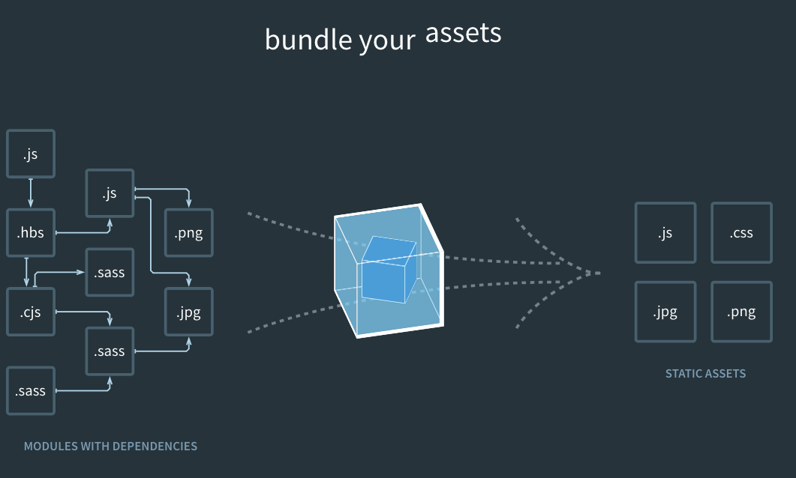

# 직접 설정해보는 Webpack4 / Babel7



## Intro

이 글은 Babel 과 Webpack 그리고 Docker/Docker-compose 를 이용해서 개발 환경을 설정하는 방법을 다룹니다.

개별적인 주제에 대한 설명보다는 최대한 코드 위주로 진행할 생각입니다.

그렇기 때문에 개별 주제에 관심이 있으시다면 중간 중간에 나오는 링크의 글을 먼저 읽어주세요.

## 초기 세팅

```bash
  // 폴더 이름은 modern-nodejs로 하겠습니다.
  mkdir modern-nodejs
  cd modern-nodejs
```

이제 package.json 과 index.js 를 작성해줍시다.

```js
  yarn init -y 혹은 npm init -y

  // index.js
  import express from 'express'

  const port = process.env.PORT || 3030
  const app = express()

  app.listen(port, () => console.log(`listening on port ${port}`))
```

다음으로 package.json 에 시작 스크립트를 추가해줍니다.

```json
{
  "name": "modern-nodejs",
  "version": "1.0.0",
  "main": "index.js",
  "scripts": {
    "start": "node index.js"
  },
  "license": "MIT"
}
```

이 상태에서 터미널에 yarn start 를 입력하고, index.js 를 실행시키면

```bash
  SyntaxError: Unexpected token import
    at createScript (vm.js:80:10)
    at Object.runInThisContext (vm.js:139:10)
    at Module._compile (module.js:588:28)
    at Object.Module._extensions..js (module.js:635:10)
    at Module.load (module.js:545:32)
```

이런 에러가 발생합니다.

node.js 의 현재 버전(v9.8.0)은 import 구문을 지원하지 않기 때문입니다.

node.js 의 버전을 확인하려면

```bash
  node --version # v9.8.0
```

이제 바벨을 설정할 차례가 됐습니다.

## Babel 설정

바벨은 자바스크립트 트랜스파일러입니다.

바벨에 대해서는 [이전글](https://gompro.postype.com/post/1696324)에서도 다룬 바 있습니다.

주의) 바벨 설정은 7 버전이 나온 현재 이전과 부분적인 차이가 존재합니다.

여기서는 최신(7.0.0-beta.40) 기준으로 글을 작성했습니다.

코드로 돌아가봅시다.

그 전에 필요한 모듈을 인스톨하겠습니다.

```bash
  yarn global add nodemon # 혹은 yarn add nodemon --dev
  yarn add @babel/core @babel/node @babel/preset-env --dev
  yarn add express # express 프레임워크

  혹은

  npm install nodemon -g # 혹은 npm install nodemon --save-dev
  npm install @babel/core @babel/node @babel/preset-env --save-dev
  npm install express --save # express 프레임워크
```

nodemon 은 파일을 관찰(watch)하고 있다가 변경점이 발생하면 자동으로 애플리케이션을 재시작해주는 편리한 도구입니다.

저같은 경우 여러 node 프로젝트를 작업하므로 global 로 인스톨했지만 개발 디펜던시로 인스톨하더라도 상관없습니다.

그리고 바벨을 사용하기 위한 세 가지 모듈

@babel/core @babel/node @babel/preset-env 이 필요합니다.

각 모듈에 대해 간략하게 얘기하면

@babel/core: 바벨의 핵심 파일, 바벨의 다른 모듈들이 종속성을 가집니다.
@babel/node: 바벨의 CLI 도구 중 하나입니다.
@babel/preset-env: 바벨의 preset 중 하나로 es6+ 이상의 자바스크립트를 각 브라우저/노드 환경에 맞는 코드로 변환시켜줍니다.

이제 .babelrc 파일을 프로젝트 폴더(modern-nodejs) 바로 아래에 만들어줍니다.

```rc
  {
    "presets": ["@babel/preset-env"]
  }
```

마지막으로 package.json 의 실행스크립트를 수정해줍니다.

```json
  "start": "nodemon index.js --exec babel-node"
```

어때요 잘 실행되시나요?

개발 환경을 위한 바벨 설정은 여기서 마치고 웹팩 얘기를 좀 하겠습니다.

## Webpack

```text
At its core, webpack is a static module bundler for modern JavaScript applications. When webpack processes your application, it recursively builds a dependency graph that includes every module your application needs, then packages all of those modules into one or more bundles.
```

웹팩은 모던 자바스크립트 애플리케이션을 위한 모듈 번들러입니다.

웹팩은 필요한 모든 모듈을 대상으로 재귀적으로(recursively) 디펜던시 그래프를 빌드하며 그를 하나 이상의 번들로 묶습니다.

웹팩 공식 문서:
[웹팩 공식문서](https://webpack.js.org/concepts/)

## Webpack 4 에 대해

gulp 와 grunt 의 뒤를 이어 등장한 Webpack 은 등장 이후 크게 몸집을 불리며 create-react-app 의 공식 모듈 번들러가 되었습니다. 다만 웹팩에는 치명적인 약점이 있었는데, 그 중 하나가 바로 '설정'이 복잡하다는 것이었습니다. 설정이 많다는 것은 좋게 보면 다양한 입맛을 맞춰줄 수 있다는 뜻이지만 초보 개발자 혹은 웹팩에 익숙하지 않은 사람에게는 러닝커브만 증가시키는 요인이 됩니다.

이때 parcel 이 등장합니다. parcel 홈페이지에 가보면 parcel 은 스스로를 'Blazing fast, zero configuration web application bundler'라고 칭합니다. 기존에 웹팩이 퍼포먼스적인 측면과 많은 설정 부분에서 약점을 보였던 것을 대놓고 공략한 것이지요.

이에 위기감을 느낀듯 웹팩은 버전 4 를 내놓으며 전보다 더 빠르고, 설정 파일 없는 빌드(zero-configuration)가 가능하다고 홍보했습니다.

변경점 등이 궁금하신 분은 아래 링크를 눌러주세요.
[webpack 4: released today!!](https://www.google.co.kr/search?q=webpack+4&spell=1&sa=X&ved=0ahUKEwiXgf_9it_ZAhUCp5QKHdPZCpQQBQgjKAA&biw=1578&bih=886)

## Webpack 사용

Webpack 을 사용하려면 두 가지 모듈이 필요합니다.

```bash
  yarn add webpack webpack-cli --dev
  혹은
  npm install webpack webpack-cli --save-dev
```

이제 package.json 파일에 새로운 스크립트를 추가해줍니다.

```json
  "build": "webpack"
```

```bash
  $ webpack
  Hash: 37f368b81972a75638bd
  Version: webpack 4.1.1
  Time: 76ms
  Built at: 2018-3-9 20:54:25

  WARNING in configuration
  The 'mode' option has not been set. Set 'mode' option to 'development' or 'production' to enable defaults for this environment.

  ERROR in Entry module not found: Error: Can't resolve './src' in '/Users/leejunhyung/Google 드라이브/modern-nodejs'
  error An unexpected error occurred: "Command failed.
```

이런! 오류가 발생했네요.

WARNING 부분을 자세히 읽어보니 mode 가 설정이 안 됐다고 하는 군요.

그리고 ERROR 는 entry module 이 발견되지 않았다고 하면서 './src'를 찾을 수 없다고 합니다.

먼저 mode 는 webpack4 에서 새롭게 추가된 기능으로, 기존에 수많은 플러그인과 로더를 사용해야만 가능했던 설정이 기본설정으로 포함해서 사용자는 'development/production'만 명시하면 됩니다.

차이를 살펴볼까요?

시작 스크립트를 아래와 같이 바꿔줍니다.

```json
  "build": "webpack --mode development"
```

그리고 src 폴더를 만들어 index.js 파일을 옮겨주세요.

웹팩 4 는 3 혹은 그 이전버전과는 달리 따로 entry 포인트를 명시해주지 않아도 알아서 src 의 index.js 파일을 찾습니다.

참 편리하죠.

다시 build!

```bash
$ webpack --mode development
Hash: c588ebcf5a88c55035e5
Version: webpack 4.1.1
Time: 1848ms
Built at: 2018-3-9 20:59:42
  Asset      Size  Chunks                    Chunk Names
main.js  1.84 MiB    main  [emitted]  [big]  main
Entrypoint main [big] = main.js
   [0] util (ignored) 15 bytes {main} [built]
   [1] util (ignored) 15 bytes {main} [built]
[./node_modules/express/lib sync recursive] ./node_modules/express/lib sync 160 bytes {main} [built]
[./node_modules/webpack/buildin/global.js] (webpack)/buildin/global.js 509 bytes {main} [built]
[./node_modules/webpack/buildin/module.js] (webpack)/buildin/module.js 519 bytes {main} [built]
   [2] http (ignored) 15 bytes {main} [built]
   [3] buffer (ignored) 15 bytes {main} [optional] [built]
   [4] crypto (ignored) 15 bytes {main} [optional] [built]
[./src/index.js] 157 bytes {main} [built]
    + 283 hidden modules

WARNING in ./node_modules/express/lib/view.js
81:13-25 Critical dependency: the request of a dependency is an expression
 @ ./node_modules/express/lib/view.js
 @ ./node_modules/express/lib/application.js
 @ ./node_modules/express/lib/express.js
 @ ./node_modules/express/index.js
 @ ./src/index.js

ERROR in ./node_modules/destroy/index.js
Module not found: Error: Can't resolve 'fs' in '/Users/leejunhyung/Google 드라이브/modern-nodejs/node_modules/destroy'
 @ ./node_modules/destroy/index.js 14:17-30
 @ ./node_modules/send/index.js
 @ ./node_modules/express/lib/response.js
 @ ./node_modules/express/lib/express.js
 @ ./node_modules/express/index.js
 @ ./src/index.js

ERROR in ./node_modules/etag/index.js
Module not found: Error: Can't resolve 'fs' in '/Users/leejunhyung/Google 드라이브/modern-nodejs/node_modules/etag'
 @ ./node_modules/etag/index.js 22:12-25
 @ ./node_modules/express/lib/utils.js
 @ ./node_modules/express/lib/application.js
 @ ./node_modules/express/lib/express.js
 @ ./node_modules/express/index.js
 @ ./src/index.js

ERROR in ./node_modules/express/lib/view.js
Module not found: Error: Can't resolve 'fs' in '/Users/leejunhyung/Google 드라이브/modern-nodejs/node_modules/express/lib'
 @ ./node_modules/express/lib/view.js 18:9-22
 @ ./node_modules/express/lib/application.js
 @ ./node_modules/express/lib/express.js
 @ ./node_modules/express/index.js
 @ ./src/index.js

ERROR in ./node_modules/mime/mime.js
Module not found: Error: Can't resolve 'fs' in '/Users/leejunhyung/Google 드라이브/modern-nodejs/node_modules/mime'
 @ ./node_modules/mime/mime.js 2:9-22
 @ ./node_modules/send/index.js
 @ ./node_modules/express/lib/response.js
 @ ./node_modules/express/lib/express.js
 @ ./node_modules/express/index.js
 @ ./src/index.js

ERROR in ./node_modules/send/index.js
Module not found: Error: Can't resolve 'fs' in '/Users/leejunhyung/Google 드라이브/modern-nodejs/node_modules/send'
 @ ./node_modules/send/index.js 23:9-22
 @ ./node_modules/express/lib/response.js
 @ ./node_modules/express/lib/express.js
 @ ./node_modules/express/index.js
 @ ./src/index.js

ERROR in ./node_modules/express/lib/request.js
Module not found: Error: Can't resolve 'net' in '/Users/leejunhyung/Google 드라이브/modern-nodejs/node_modules/express/lib'
 @ ./node_modules/express/lib/request.js 18:11-25
 @ ./node_modules/express/lib/express.js
 @ ./node_modules/express/index.js
 @ ./src/index.js
```

또 다른 에러가 발생했군요. 이번에는 node_modules 가 빌드 과정에 포함됨으로써 생긴 문제입니다.

이 문제를 해결하려면 `webpack-node-externals`라는 플러그인이 필요합니다.

```bash
  yarn add webpack-node-externals --dev
  혹은
  npm install webpack-node-externals --save-dev
```

그리고 webpack.config.js 파일을 만들어줍니다.(프로젝트 폴더 바로 아래에 만듭니다)

```js
// 설정파일
const nodeExternals = require('webpack-node-externals')

module.exports = {
  target: 'node',
  externals: [nodeExternals()],
}
```

만약에 webpack.config.js 가 아닌 이름의 파일을 설정 파일로 쓰고 싶다면 아래와 같이 할 수 있습니다.

```json
"build": "webpack --mode development --config 설정파일명"
```

다시 build!

혹시 dist 폴더가 생긴걸 눈치채셨나요?

이제 웹팩은 따로 output 을 설정하지 않아도 dist 에 main.js 의 이름으로 번들을 생성합니다.

```js
/******/ (function(modules) { // webpackBootstrap
/******/ 	// The module cache
/******/ 	var installedModules = {};
/******/
/******/ 	// object to store loaded and loading wasm modules
/******/ 	var installedWasmModules = {};
/******/
/******/ 	// The require function
/******/ 	function __webpack_require__(moduleId) {
/******/
/******/ 		// Check if module is in cache
/******/ 		if(installedModules[moduleId]) {
/******/ 			return installedModules[moduleId].exports;
```

대략 이런 모습의 파일일 것입니다.

mode 를 production 으로 바꾸면 어떻게 될까요?

```json
"build": "webpack --mode production"
```

한 줄로 압축돼서 나타나는군요.

이는 webpack 에 모드를 명시함으로써 production 모드에서 일반적으로 사용되는 uglifyjs 플러그인을 통해 코드 압축을 실행했기 때문입니다.

멋지네요!

만약 entry 나 output 을 다르게 설정하고 싶다면 webpack.config.js 파일을 아래와 같이 수정해주면 됩니다.

```js
const nodeExternals = require('webpack-node-externals')
const path = require('path')

module.exports = {
  target: 'node',
  externals: [nodeExternals()],
  entry: './src', // 원하는 경로로 바꿔주세요.
  output: {
    path: path.resolve(__dirname, 'dist'), // 원하는 경로로 바꿔주세요.
    filename: 'main.js', // 원하는 파일명으로 바꿔주세요.
  },
}
```

다음 편에서는 프로덕션 환경의 Mongodb/Redis/Nginx 설정을 위한 Dockerfile 작성으로 돌아오겠습니다. 감사합니다!
