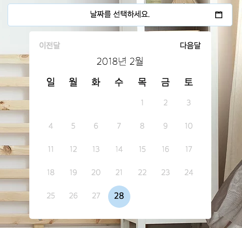

# 한글 date picker(달력) for wix

Wix 는 분명 매력적인 플랫폼이다.

피피티를 꾸미듯 드래그 앤 드롭만으로 디자인을 꾸미고 손쉽게 요소를 추가하는 건 굉장한 이점이다.

하지만 좋은 점만 있었다면 모두 Wordpress 대신 Wix 를 사용하지 않았을까?

Wix 를 근 한 달 가량 사용하면서 가장 뼈저리게 느낀건 '내가 원하는 기능'은 없다는 점이었다.

이번에 날짜를 선택하는 폼을 만들면서 다시 한 번 그런 느낌을 받게 됐는데, wix 의 datepicker 에 가장 중요한 다국어 지원이 없었다.

그래서 wix forum 도 뒤져보고, Event calender 앱도 알아봤지만 모두 만족스럽지 못했다.

해결책을 찾던 도중,

그러다가 [Wix 달력 스페인어 지원은 안 되나요?](https://www.wix.com/code/home/forum/questions-answers/again-calendar-in-spanish) 라는 게시물을 보게 되었는데,

이 게시글을 읽어보면 알겠지만 wix 는 공식적으로 다국어를 지원하지 않는다.

다만 위 글을 읽어보면 중간에 wix html component 를 사용해보라는 얘기가 넌지시 나온다.

[wix html component](https://support.wix.com/en/article/working-with-the-html-component-in-wix-code) 는 부족한 wix 의 기능을 보완하기 위해 wix 가 지원하는 일종의 코드조각으로, 이 기능을통해 custom datepicker 를 사용할 수 있습니다.

html component 의 사용법은 링크에 있으니 참고하길 바랍니다.



jquery ui 를 사용해서 만든 datepicker 인데 대략 위와 같이 생겼습니다.

사용법은 아래 코드를 복사하고 html component 의 코드 부분에 붙여넣으면 됩니다.

```html
<html>

<head>
  <script src="//ajax.googleapis.com/ajax/libs/jquery/1.10.2/jquery.min.js"></script>
  <script src="//ajax.googleapis.com/ajax/libs/jqueryui/1.11.1/jquery-ui.min.js"></script>
  <link rel="stylesheet" href="https://code.ionicframework.com/ionicons/2.0.1/css/ionicons.min.css" />
</head>

<body>
  <div class="wrapper">
    <input type="text" id="datepicker" placeholder="날짜를 선택하세요." readonly="true" />
    <i class="ion-calendar"></i>
  </div>
  <style>
    * {
      box-sizing: border-box;
      font-family: 'NanumGothic, sans-serif';
    }
    body {
      margin: 0;
    }
    /* placeholder color */
    input:-ms-input-placeholder {
      color: #000;
    }
    input::-webkit-input-placeholder {
      color: #000;
    }
    input::-moz-placeholder {
      color: #000;
    }
    input::-moz-placeholder {
      color: #000;
    }
    .wrapper {
      position: relative;
      width: 445px;
      height: 45px;
      margin: 10px;
    }
    .ion-calendar {
      position: absolute;
      right: 20px;
      top: 14px;
    }
    /* input */
    #datepicker {
      border: 1px solid #c6e2f7;
      border-radius: 5px;
      width: 100%;
      height: 100%;
      font-size: 16px;
      text-align: center;
      cursor: pointer;
    }
    #datepicker:hover {
      background-color: #eaf7ff;
    }
    #datepicker:focus {
      outline: none;
    }
    /* calendar table */
    .ui-datepicker {
      display: none;
      background-color: #fff;
      border-radius: 5px;
      margin-top: 10px;
      margin-left: 42.5px;
      margin-right: 42.5px;
      padding: 20px;
      width: 360px;
    }
    #datepicker:focus>.ui-datepicker {
      display: block;
    }
    .ui-datepicker-prev,
    .ui-datepicker-next {
      cursor: pointer;
    }
    .ui-datepicker-next {
      float: right;
    }
    .ui-state-disabled {
      cursor: auto;
      color: hsla(0, 0%, 80%, 1);
    }
    .ui-datepicker-title {
      text-align: center;
      padding: 10px;
      font-weight: 100;
      font-size: 20px;
    }
    .ui-datepicker-calendar {
      width: 100%;
    }
    /* day of week cell */
    .ui-datepicker-calendar>thead>tr>th {
      padding: 5px;
      font-size: 20px;
      font-weight: 400;
    }
    /* day cell */
    .ui-datepicker-calendar>tbody>tr>td {
      border-radius: 100%;
      width: 44px;
      height: 44px;
      cursor: pointer;
      padding: 5px;
      font-weight: 100;
      text-align: center;
    }
    .ui-datepicker-calendar>tbody>tr>td:hover {
      background-color: #c6e2f7;
    }
    .ui-datepicker-calendar>tbody>tr>td>a {
      color: #000;
      font-size: 18px;
      font-weight: 400;
      text-decoration: none;
    }
    /* past days */
    .ui-datepicker-calendar>tbody>tr>.ui-state-disabled:hover {
      cursor: auto;
      background-color: #fff;
    }
    /* media */
    @media(max-width: 445px) {
      .wrapper {
        width: calc(100vw - 20px);
      }
      .ui-datepicker {
        margin-right: 0;
        margin-left: 0;
        padding: 10px;
        width: calc(100vw - 20px);
        margin: 10px auto;
      }
      .ui-datepicker-calendar>tbody>tr>td {
        width: 38px;
        height: 38px;
      }
    }
  </style>
  <script>
    $.datepicker.setDefaults({
      closeText: "닫기",
      prevText: "이전달",
      nextText: "다음달",
      currentText: "오늘",
      monthNames: ["1월", "2월", "3월", "4월", "5월", "6월",
        "7월", "8월", "9월", "10월", "11월", "12월"
      ],
      monthNamesShort: ["1월", "2월", "3월", "4월", "5월", "6월",
        "7월", "8월", "9월", "10월", "11월", "12월"
      ],
      dayNames: ["일요일", "월요일", "화요일", "수요일", "목요일", "금요일", "토요일"],
      dayNamesShort: ["일", "월", "화", "수", "목", "금", "토"],
      dayNamesMin: ["일", "월", "화", "수", "목", "금", "토"],
      weekHeader: "주",
      dateFormat: "yy년 m월 d일",
      firstDay: 0,
      isRTL: false,
      showMonthAfterYear: true,
      yearSuffix: "년"
    })
    $("#datepicker").datepicker({
      minDate: 0,
      /* to use in wix */
      onSelect: function (selected, event) {
        console.log(selected);
        /*
         * wix-send-messages from html component
         * https://support.wix.com/en/article/working-with-the-html-component-in-wix-code
         */
        window.parent.postMessage(selected, "*");
      }
    })
  </script>
</body>

</html>
```
